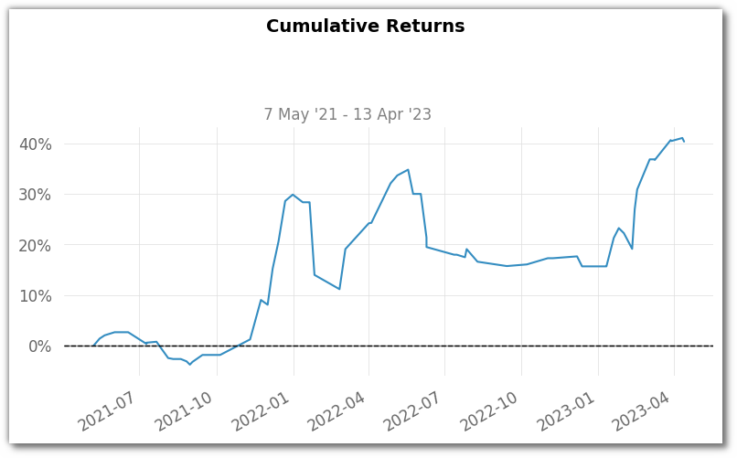
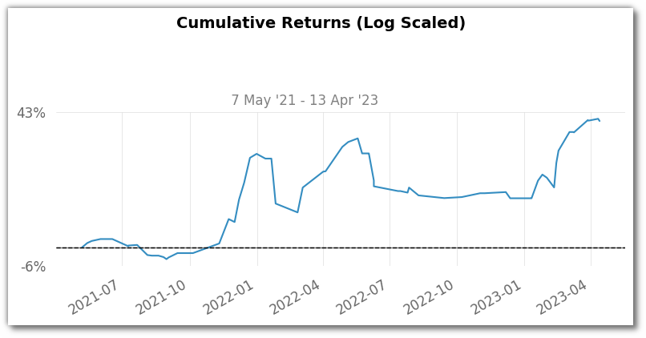
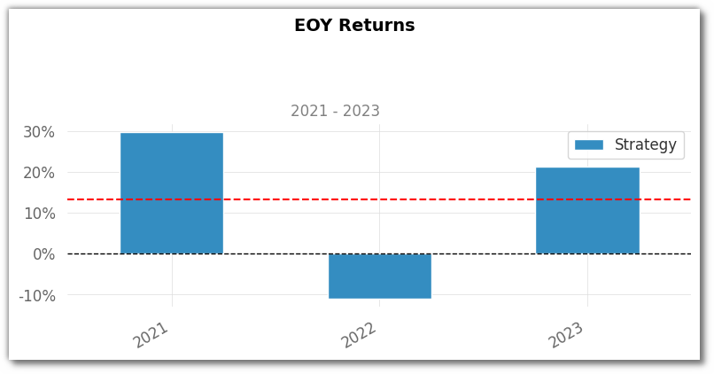
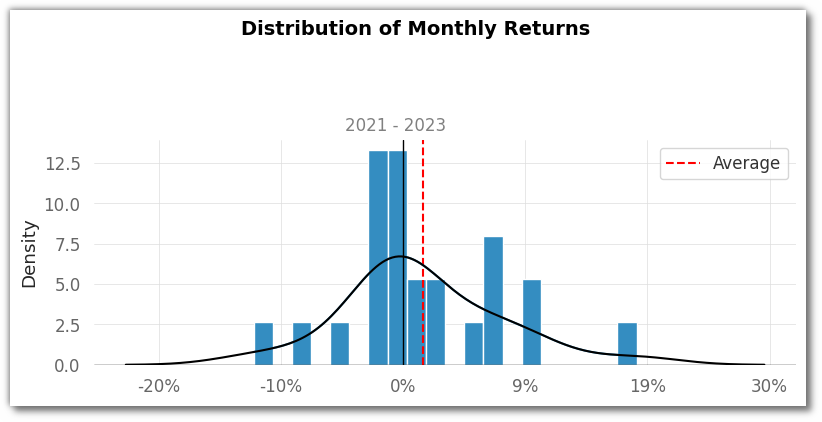
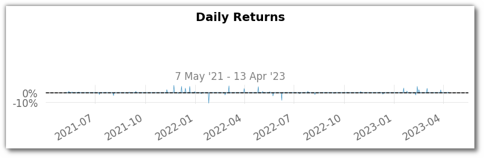
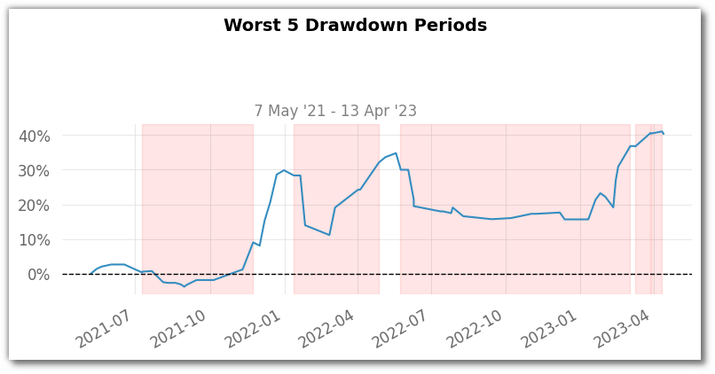
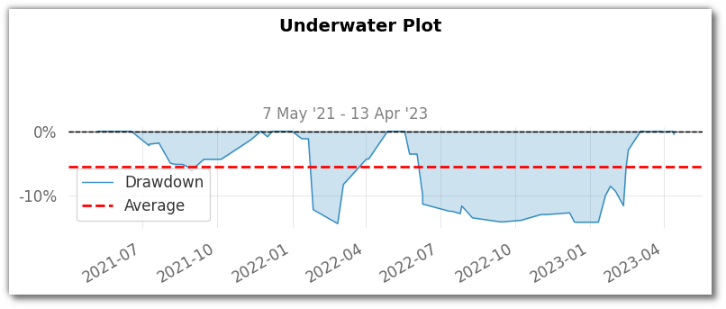
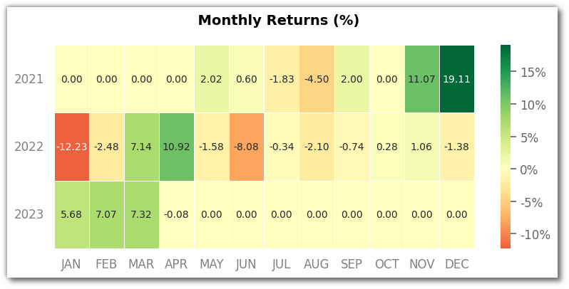

# Pyalgotrading Analytics

- ### Cumulative Returns:
    - The **Cumulative Returns** chart illustrates how our strategy's returns value has evolved over time in percentage. 
    - Positive values indicate gains, while negatives reflect losses. Bigger positive returns are more favourable. 
    - Keep in mind, this chart focuses on gains and losses, excluding risk and timing considerations.
    - There are 2 sub categories of cumulative returns chart depending on the scale we are using. One is **normal scaled** and other is **log scaled**
      - []
      - []
   
- ### End of Year Returns (EoY):
    - The **End of Year Returns** chart showcases our strategy's annual performance as a percentage. 
    - It quantifies its overall performance, considering gains or losses throughout each year.
    - [

- ### Distributions of Monthly Returns (Histogram)
    - In the **Monthly Returns Distribution Histogram**, we see the frequency distribution of different levels of returns over consecutive months. 
    - This histogram helps us understand the range and patterns in monthly returns, shedding light on our strategy's volatility and performance trends.
    - []

- ### Daily Returns:
    - The **Daily Returns Chart** portrays the percentage change in our strategy's returns between trading days. 
    - It provides insights into short-term volatility, trend analysis, and risk assessment.
    - []

- ### Rolling Volatility (6 months)
    - A **Rolling Volatility (6 months)** Plot showcases the changing volatility of an investment over time using a rolling window of six months. 
    - This plot reveals how the investment's price fluctuations vary as the window moves across the dataset. 
    - It provides insights into short-term volatility patterns, helping investors understand how the investment's risk level evolves in response to different market conditions.

- ### Rolling Sharpe (6 months)
    - A **Rolling Sharpe (6 months)** Plot illustrates the dynamic changes in the Sharpe ratio over time using a rolling window of six months. 
    - The plot shows how the risk-adjusted performance of an investment fluctuates as the window moves through the dataset. 
    - This visualization helps investors understand how the Sharpe ratio varies with changing market conditions and provides insights into the investment's consistency and risk-return trade-offs over short-term periods.

- ### Rolling Sortino (6 months)
    - A **Rolling Sortino (6 months)** Plot visualizes the variation in the Sortino ratio over time using a rolling window of six months. 
    - This plot demonstrates how the investment's risk-adjusted performance, considering only downside volatility, changes as the window progresses through the data. 
    - It offers insights into how the Sortino ratio evolves with market conditions, helping investors assess the investment's ability to generate favorable risk-adjusted returns over short-term intervals.

- ### Worst 5 Drawdown Periods
    - A **Worst 5 Drawdown Periods** plot displays the top five periods during which the strategy experienced the largest declines from peak to trough. 
    - This visualization helps strategists understand the most significant loss-making episodes in the strategy's run. 
    - It shows the magnitude and duration of these drawdowns, providing insights into the strategy's risk and potential vulnerabilities.
    - []

- ### Underwater Plot:
    - The **Underwater Plot** visually narrates our strategy's performance concerning its past peaks. 
    - It showcases how much our returns value has dropped from its highest point over time. 
    - This aids in visualising periods of drawdown and recovery, offering insights into historical risk and resilience.
    - []

- ### Monthly Returns (Heatmap):
    - The **Monthly Returns Heatmap** offers a colour-coded view of our strategy's performance across months. 
    - Shades of green indicate positive returns, while shades of red signify losses. 
    - This visual tool helps spot trends and patterns, aiding in identifying strong and weak performance periods.
    - []

- ### Return Quantiles

