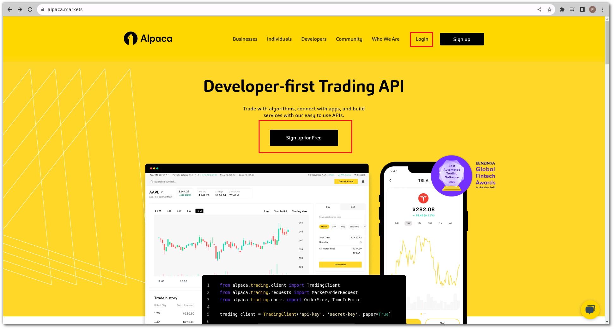

# Alpaca

---

Alpaca is a technology company that offers a modern, developer-friendly trading platform designed for algorithmic and automated trading in the financial markets, particularly focused on equities and cryptocurrencies. The company provides APIs (
Application Programming Interfaces) that allow developers and traders to access market data, execute trades, and build their own algorithmic trading strategies.

Key features and offerings of Alpaca include:

1. **APIs and SDKs**: Alpaca offers APIs and software development kits (SDKs) that enable developers to programmatically access real-time and historical market data, as well as execute trades on various exchanges.

2. **Algorithmic Trading**: Alpaca's platform is tailored for algorithmic trading strategies, where traders can automate trading decisions based on predefined conditions and rules.

3. **Paper Trading**: Alpaca provides a simulated environment called "paper trading," allowing traders to test their strategies in a risk-free setting before deploying them with real money.

4. **Market Data**: The platform offers access to real-time and historical market data, which is crucial for building and testing trading strategies.

5. **Order Execution**: Traders can use Alpaca's API to execute trades on supported exchanges. This includes submitting market, limit, and stop orders.

6. **Customizable Dashboards**: Alpaca provides customizable dashboards and interfaces to monitor trading activity and portfolio performance.

7. **Brokerage Services**: Alpaca acts as a brokerage, providing services that allow traders to execute their strategies on supported exchanges.

8. **Regulatory Compliance**: Alpaca operates within the regulations of the financial industry, ensuring compliance with rules and requirements.

Alpaca's platform aims to democratize algorithmic trading by providing accessible tools and resources for both individual traders and developers. It's worth noting that the landscape of algorithmic trading and financial technology is constantly
evolving, so it's a good idea to check Alpaca's official website for the most current information about their offerings and services.

## How to get API keys for trading in Alpaca?

---

- #### Create your Alpaca Account
    - Go to the official website of [Alpaca](https://alpaca.markets/)
    - Click on `sign up for free` to create an alpaca account

  {target=_blank}

---

- #### Go to the Home Page of your Account
    - After creating your account, login to access the home page
    - Look for `View API Keys` on the right side under the `Quick Trade` block

  {target=_blank}

---

- #### View API keys or Generate API keys
    - Click on `View API Keys` and then click on `Regenrate` to regenerate fresh keys

  
  

---

- #### Get the `Secret Key` and `API Key`
    - After regenerating you will get a fresh API key under the `Key` section and a secret key under the `Secret` section

  

## Advantages of Binding Alpaca with your Account

- You can run your strategy on American exchanges like NASDAQ or NYSE,
- Binding Alpaca helps you access the historical data as well as live data of all the stocks from Alpaca.
- It will also help you backtest, live trade and paper trade on AlgoBulls using these credentials.

## How to connect Alpaca with Python Build Account?

Connecting your Alpaca account to Python Build can be done in two ways: OAuth and Non-OAuth.

- **OAuth Method**:
  Follow the simple steps mentioned [here](./connecting_alpaca.md) to connect using OAuth.

- **Non-OAuth Method**:
  For the Non-OAuth method, you can follow the steps mentioned [here](./non_auth_alpaca.md)

!!! Note "NOTE: We have discontinued the Non-OAuth method in accordance with Alpaca’s recommendations. Please use the OAuth method for seamless integration and improved security. Be mindful of this update as you proceed with your integrations."
  
