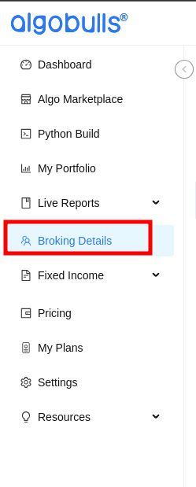
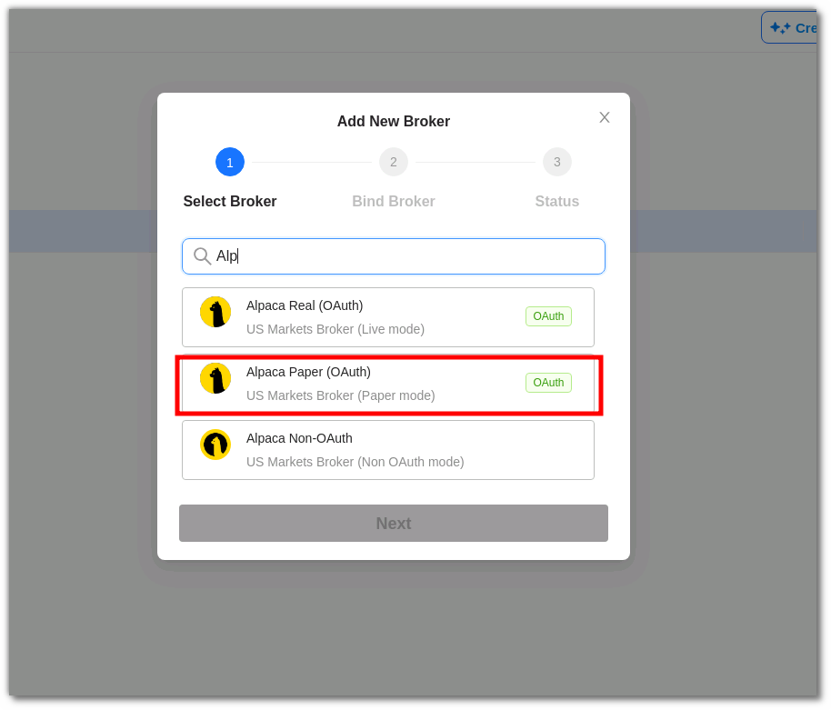
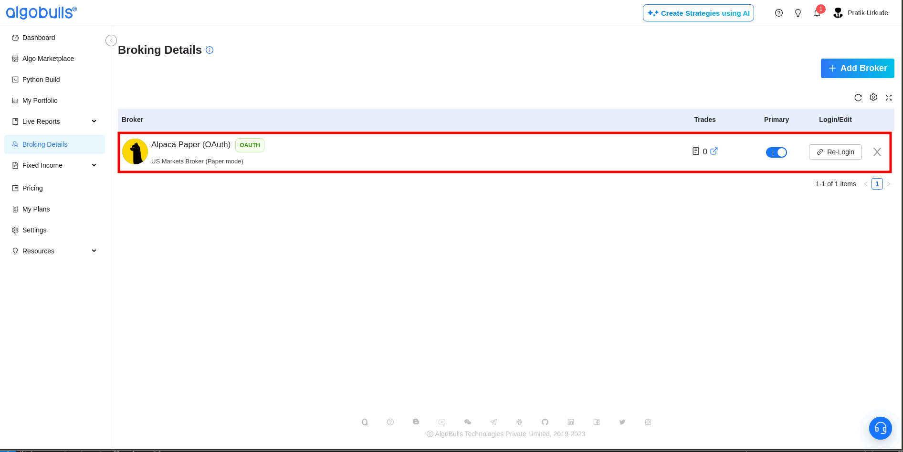

# Binding Alpaca with Python Build 

## Alpaca and PythonBuild 

---

This comprehensive guide streamlines the process, allowing you to seamlessly connect Alpaca with PythonBuild Account. Elevate your trading experience with our visual analytics feature, and fine-tune your strategy until it meets your satisfaction. Gain expert approval for live trading and deploy it across 30+ supported brokers without the need for complex broker integration logic.

Select **[Broking Details](https://app.algobulls.com/broking?query=e30%3D){target=_blank}** from the navigation bar on the left to know more.

## An overview

---
- Navigate to the `Broking Details` sections 
- here you will see all the brokers you are connected with and their active status under `primary` column

## How to set up Alpaca for trading in Python Build with OAuth?
---

- #### Add Broker
    - Click on `Add Broker`. 
  
  

---
- #### Search for Alpca 
    - After clicking on Add Broker you will see a pop-out window with a search bar
    - **Alpaca Paper:** Opt for this for paper trading.
    - **Alpaca Real:** Opt for this for real trading.
  
  

---
- #### Provide Permission to connect Alpaca with Python Build`
Before this step, please make sure you have an Alpaca account. For assistance [click here](./broker_alpaca_guide.md)
    
  - After clicking `Alpaca Paper` you will be redirected to Alpaca website for permission
  - Click `Allow` to Bind your Alpaca account with a Python Build account.
  
  

  - on successful authorisation, you will see the broker in the broker column 
    
  

