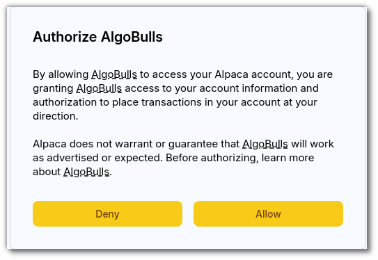

# OAuth

---

Embark on a streamlined and secure journey as you bind your Alpaca broker with AlgoBulls through OAuth integration. This seamless process ensures a robust connection between your accounts, allowing for efficient data exchange and trading activities. With OAuth binding, you can experience the convenience of a secure link without compromising on the integrity of your financial operations. Follow our comprehensive guide to effortlessly set up OAuth binding and unleash the full potential of AlgoBulls with Alpaca integration.

## An overview

---

- Navigate to the `Broking Details `page on the AlgoBulls platform.
- Here you will see all the brokers you have connected and their current statuses.

  

## How to set up Alpaca for trading in AlgoBulls with OAuth?
---
Before this step, please make sure you have an Alpaca account. [Click here](https://alpaca.markets/) to visit the Alpaca site for creating your account.

### Add Broker

- Click on `Add Broker`.

---

### Search for Alpaca

- On the pop-up window that appears, you have a search bar for finding your desired broker.

- Type `Alpaca` in the search dialog box
- Click on `Alpaca Paper (OAuth)` for choosing your Alpaca Paper Account.
- Click on `Alpaca Live (OAuth)` for choosing your Alpaca Live Account.

---

### Provide Permission

- After clicking on `Alpaca Paper (OAuth)` or `Alpaca Live (OAuth)`, you will be redirected to the Alpaca website for permission.
- You will be asked to login if you are not already logged in.
- On the dialog box that appears, click `Allow`. This will bind your Alpaca account with the AlgoBulls account.

- On successful authorisation, you will be redirected to the AlgoBulls platform and you will be able to see your broker on the `Broking Details `page.

!!! Note "WARNING: We have discontinued the Non-OAuth method in accordance with Alpaca’s recommendations. Please use the OAuth method for seamless integration and improved security. Be mindful of this update as you proceed with your integrations."

