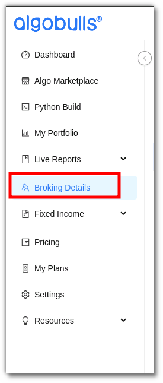
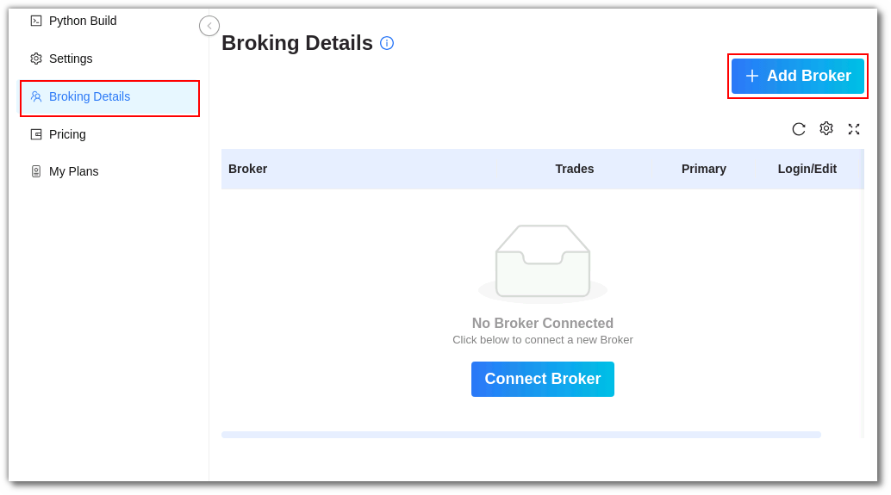
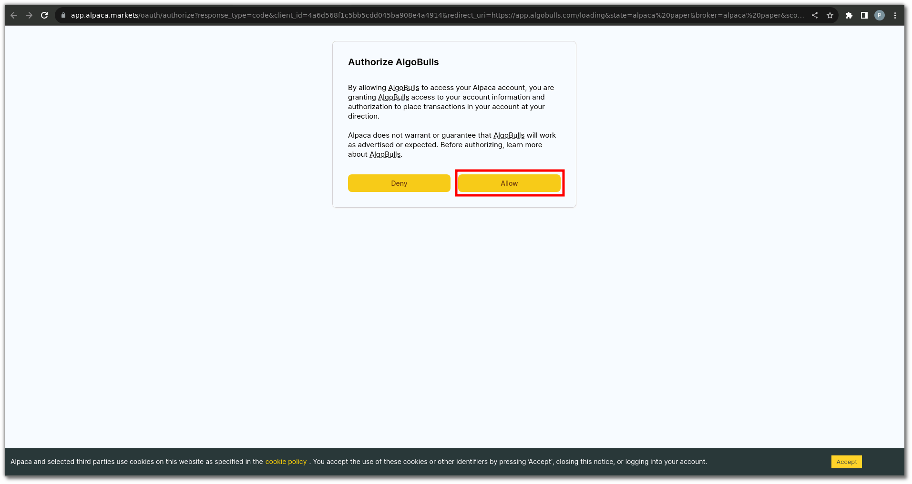
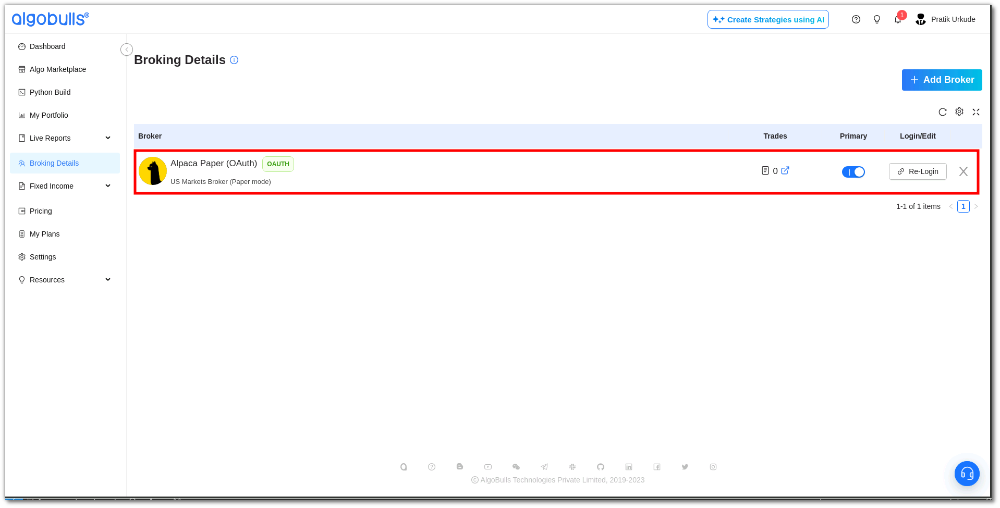

# Binding Alpaca with Python Build Web

## Alpaca and PythonBuild Web

---

This comprehensive guide streamlines the process, allowing you to seamlessly connect Alpaca with PythonBuild. Elevate your trading experience with our visual analytics feature, and fine-tune your strategy until it meets your satisfaction. Gain expert approval for live trading and deploy it across 30+ supported brokers without the need for complex broker integration logic.

Select **[Broking Details](https://app.algobulls.com/broking?query=e30%3D){target=_blank}** from the navigation bar on the left to know more.

## An overview

---

**Broker:** This section shows how many Broker are currently active in your account. 

## How to set up Alpaca for trading in pyBuild ?
---

- #### click on Add Broker tab
  

---
- #### Search for Alpca in search tab
  
---
- #### Select Alpaca Paper Mode or Live Mode
     

**Alpaca Paper:** Opt this for paper trading.

**Alpaca Real:** Opt this for real trading.

---
- #### Provide permission to connect alpaca with pyBuild`
    

    

Before this step, ensure you have an Alpaca account. For assistance[click here](./broker_alpaca_guide.md)

---
