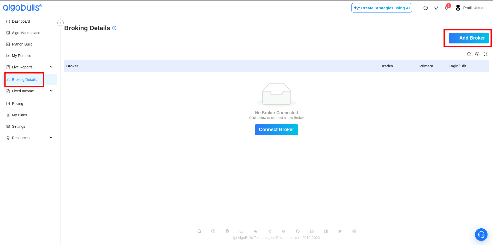
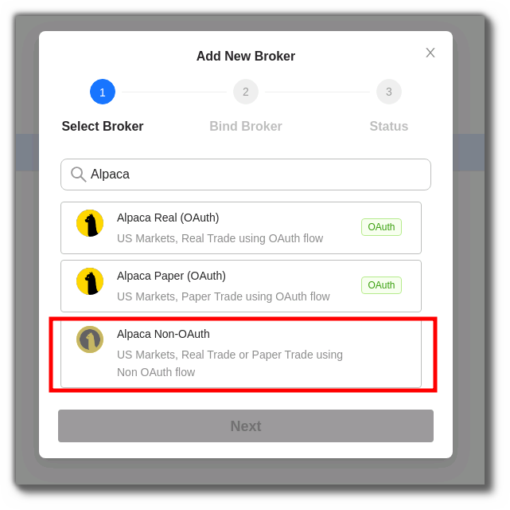
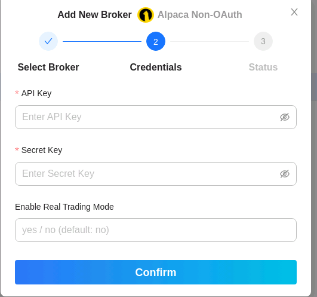
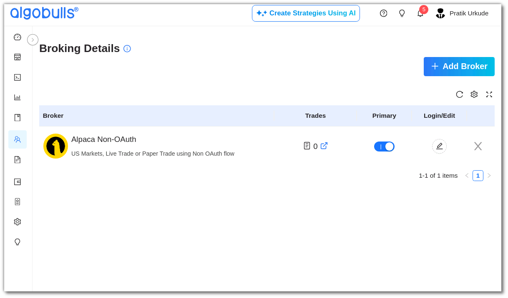

# Binding Alpaca with Python Build

## Alpaca and Python Build

---

This guide streamlines the process, allowing you to seamlessly connect Alpaca with Python Build Account. Elevate your trading experience with our visual analytics feature, and fine-tune your strategy until it meets your satisfaction.

## An overview

---

- Navigate to the `Broking Details` section on the AlgoBulls platform.
- Here you will see all the brokers you are connected with and their active statuses under `primary` column
  

## How to set up Alpaca for trading in Python Build with Non-OAuth?
---
Before this step, please make sure you have an Alpaca account. For assistance [click here](./broker_alpaca_guide.md)

### Add Broker

- Click on `Add Broker`.

---

### Search for Alpaca

- After clicking on Add Broker you will see a pop-out window with a search bar.
- Type `Alpaca` in the search box and choose `Alpaca Non-OAuth` from the search results.

---

### Provide API And Secret key

- After clicking `Alpaca Non-OAuth` you will see a dialog box requesting your API and Secret key
- Enter your `API key` And `Secret key` here.
- Click `confirm` to bind the Alpaca account with your Python Build account.

- On successful authorisation, you will see the broker in the broker column.

