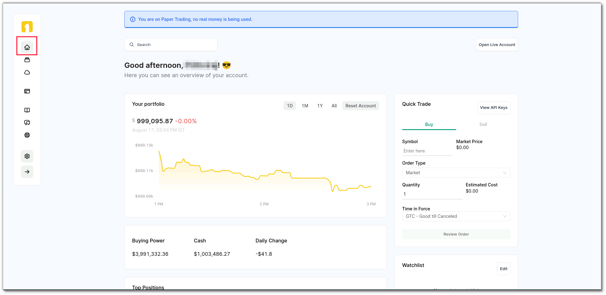
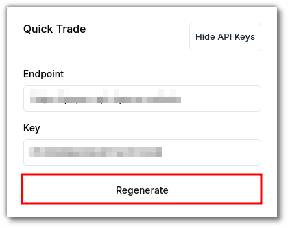
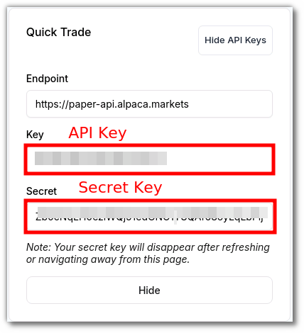
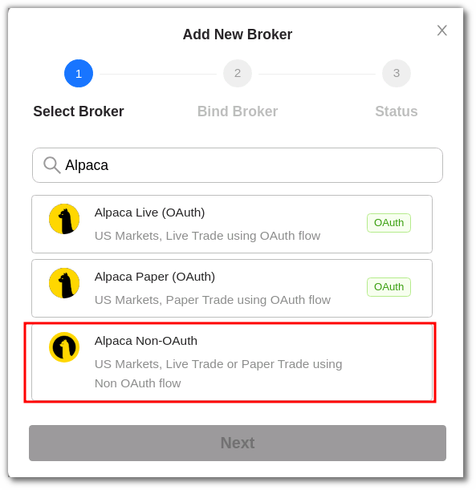
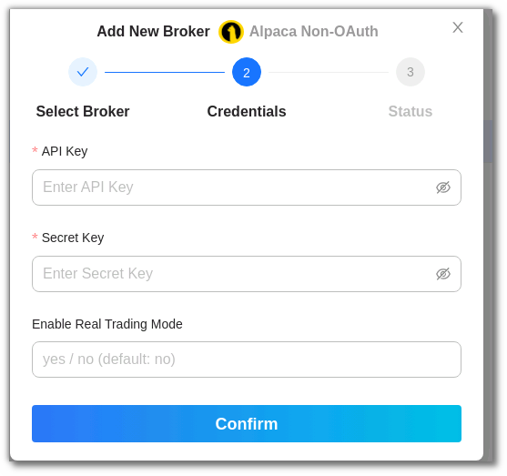

# Non-OAuth

!!! failure "We have discontinued the Non-OAuth method in accordance with Alpaca’s recommendations. Please use the OAuth method for seamless integration and improved security. Be mindful of this update as you proceed with your integrations."

If you are seeking an alternative to OAuth, the Non-OAuth binding option provides a straightforward and reliable approach to connect your Alpaca broker with AlgoBulls. This method ensures a direct and effective link between your accounts, maintaining the simplicity and efficiency that defines the AlgoBulls experience. Discover the step-by-step process to establish Non-OAuth binding and gain immediate access to the powerful synergy between AlgoBulls and Alpaca, facilitating seamless trading and data synchronisation.

## How to set up Alpaca for trading in AlgoBulls with Non-OAuth?
---
Before trying to bind your broker, please make sure you have an Alpaca account or follow the steps given below to create your account.
 

### Create your Alpaca Account
- Go the the official  [Alpaca website](https://alpaca.markets/)
- Click on `sign up for free`.
- Follow the steps there and add your details to create the account.

{target=_blank}

---

### API keys
- After creating your account, login to access the homepage.
    
{target=_blank}
    
- Click on `View API Keys` on the right side under the `Quick Trade` block.

    

   
- Click on regenerate to create `API` and `Secret` Key.
    

- On regenerating, you will get fresh API keys under the `Key` section and a secret key under the `Secret` section.

    

---

### Add Broker

- Click on `Add Broker`.

---

### Search for Alpaca Non-OAuth

- On the pop-up window that appears, you have a search bar for finding your desired broker..
- Type `Alpaca `in the search box and choose `Alpaca Non-OAuth` from the search results.

---

### Provide API And Secret key

- After clicking `Alpaca Non-OAuth`, you will see a dialog box requesting your API and Secret key.
- Enter your keys there and click `Confirm` to bind Alpaca with your AlgoBulls account.

- On successful authorisation, you will be redirected to the AlgoBulls platform and you will be able to see your broker on the `Broking Details` page.

