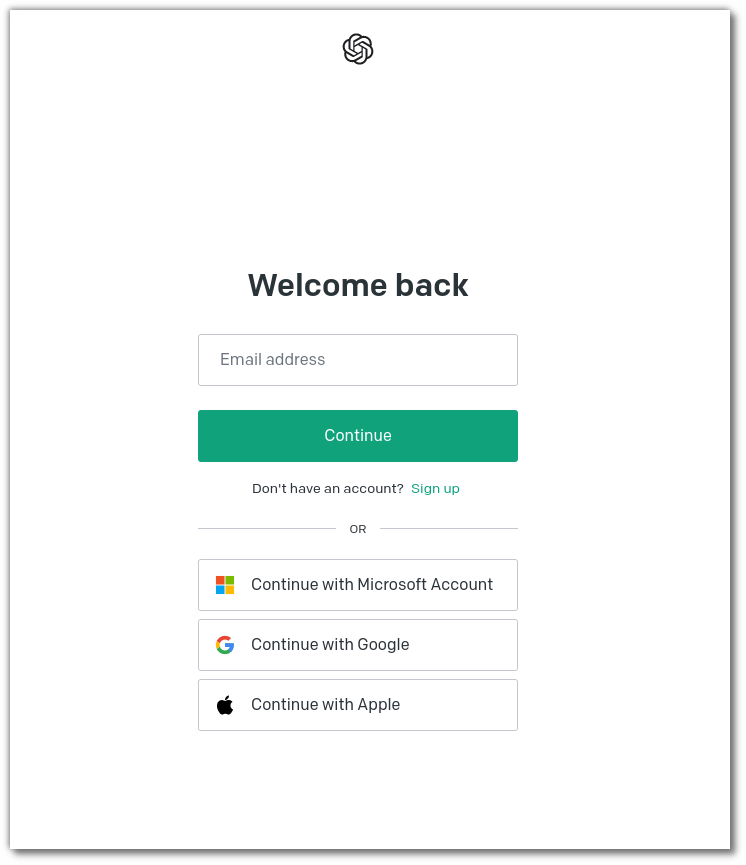
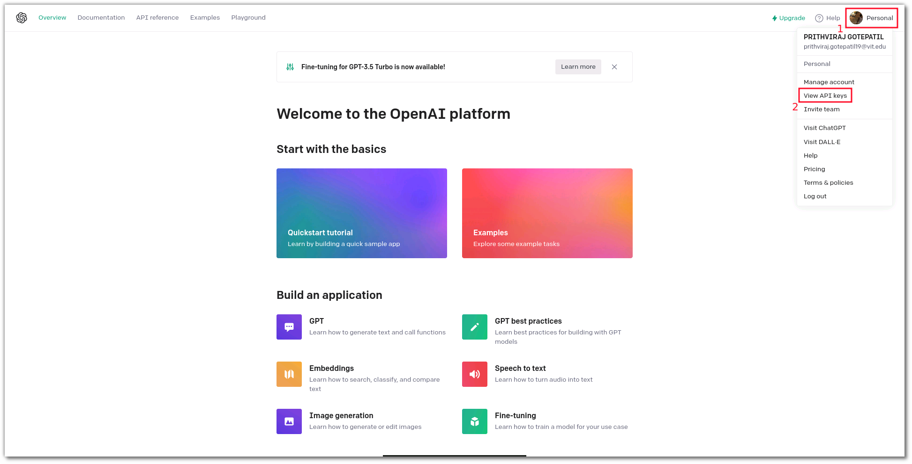
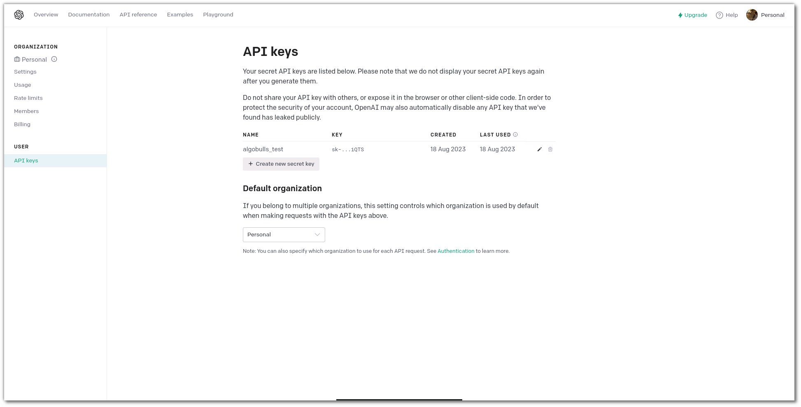
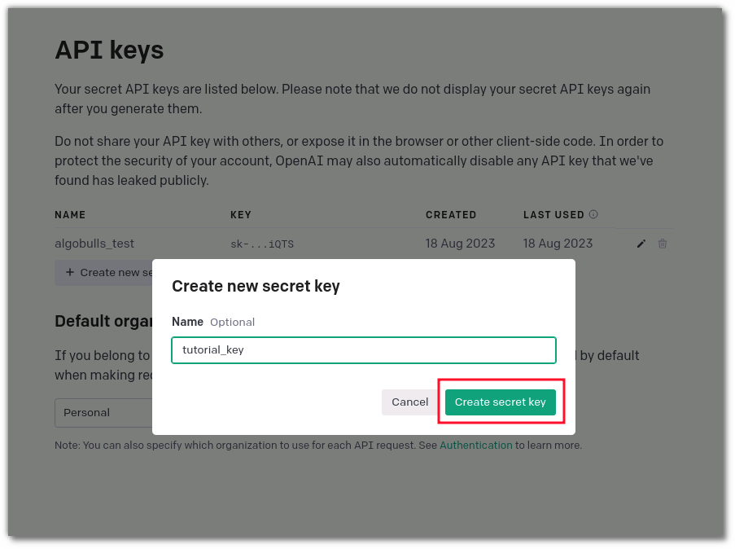
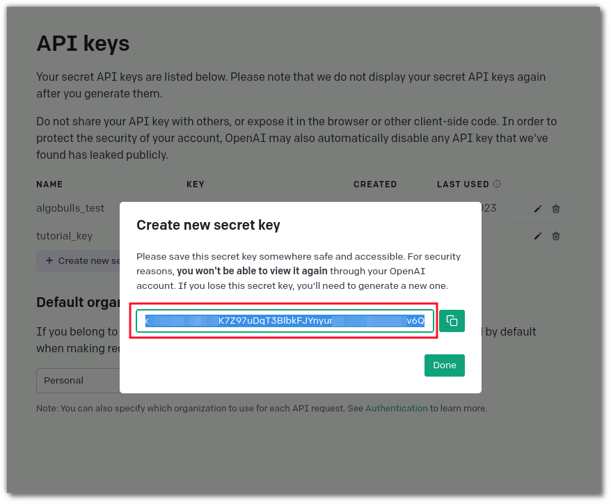

[//]: # (# Generate Strategy using Generative AI)

# OpenAI

## What is Chat-GPT ?
Generative AI involves creating new content using machine learning. A key method is GANs, where a generator creates data and a discriminator evaluates its realism. Another method is VAEs, which encode and decode data. ChatGPT is a specific AI model using generative text, like a conversation. It can understand context, answer questions, and generate text in a human-like manner. It finds use in various fields, from text generation to customer service, but also raises concerns about accuracy and responsible use.

## Why we use Chat-GPT ?
ChatGPT can assist in generating code for algorithmic trading strategies. It can translate strategy ideas into code snippets, provide coding guidance, and help with customization. However, human expertise is essential to validate, optimize, and manage risks in the complex realm of algorithmic trading.

## How to get Chat-GPT API keys ?

To get your chat GPT API keys, you can watch the video given below

{target=_blank}

**Or**

You can simply follow the steps here:

### Step 1 - Login/Signup
Login or Signup in your open AI account, you can use gmail account, microsoft account or apple account to signup.
    

### Step 2 - Open Your Profile
Once you are on the home page of your account, you can select your profile on top-right corner, and then select the option **View API Keys** from the drop-down menu.

### Step 3 - Generate New Secret Keys
Now that you are in the API Keys section, you will have to create a new key. 

### Step 4 - Get Secrete Keys
On clicking **Create new secret key** a pop-up will appear, where you can enter the **key name**, which is for your reference to remember multiple secret keys, once done, there will be another section where you can copy the open-ai secret keys.

### Step 5 - Ready to go with AlgoBulls
Once you have copied your secret key then you can now save it on your AlgoBulls Account for accessing the Phoenix Copilot feature to create a strategy, and there you go.  
To know how to save keys and start with generating strategies using Chat-GPT, click [here](../python_build/python-build-code-gen-ai.md)  
Happy Trading !