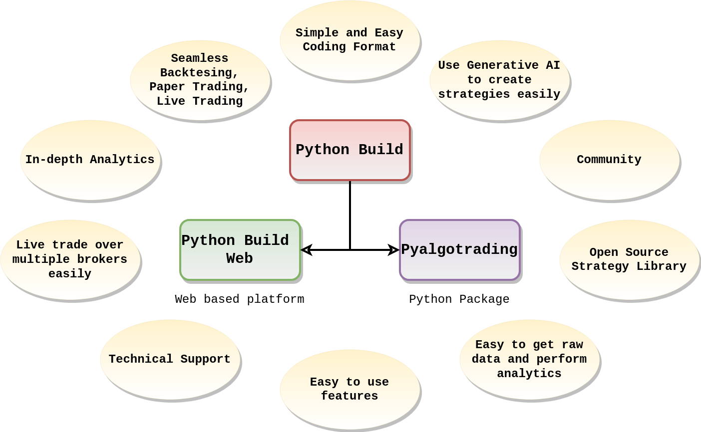
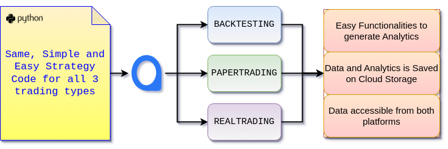

# Python Build

## AlgoBulls

Welcome to AlgoBulls, the AI-driven trading platform that unveils uncharted dimensions within algorithmic trading. Our mission is to enhance your expertise in formulating and executing personalized trading strategies using our pioneering product.
- **Python Build**. 

---

## Introducing **Python Build**: Your Gateway to Algorithmic Trading

**Python Build** your ultimate companion for meticulously crafting and seamlessly executing trading strategies with the finesse of a seasoned professional. Tailored to accommodate both adept traders and newcomers, this platform provides an array of sophisticated tools that empower you to make well-informed decisions and trade with unwavering confidence in the dynamic financial markets.

When it comes to strategy development, **Python Build** enables you to dive into coding, backtesting, and deploying your trading strategies with remarkable ease. Through an intuitive interface, you gain the power to precisely define when to enter and exit trades, manage multiple instruments, and execute actions based on informed insights.

The adaptability of **Python Build** truly stands out through its cohesive strategy format, adaptable to diverse trading types. Whether you're immersed in backtesting, paper trading, or live trading, the same strategy code suffices for all three, simplifying the user experience.

The library offers parallel functionalities for all these scenarios (backtesting, paper trading, and live trading) during strategy execution or analytics generation. This harmonized approach ensures a seamless transition among these modes, eliminating the need for intricate adjustments. Furthermore, it streamlines the creation of progressive logs, enabling you to monitor your progress and anticipate completion times. For real-time updates, live logs are also available, enhancing transparency and command over your trading endeavors.

**Python Build**'s strength lies in its ability to integrate seamlessly with real-time market data sources, historical data, and trading platforms. Its adaptable nature allows you to connect with a variety of data providers and broker APIs, enabling you to access the information you need to make well-informed trading decisions.

---

## Powerful Statistics & Visual Analytics 

  

In the pursuit of successful trading, **Python Build** equips you with advanced visual tools for strategy analytics. By harnessing these tools, you gain a deeper understanding of your strategies' performance. You can effectively manage risks and fine-tune your strategies to optimize their potential for success. These visualization tools facilitate data-driven decision-making and provide a clearer perspective on the intricacies of your trading activities.

---
## Multiple Platforms to use Python Build

To support our diverse community of users, we have the options of two dynamic platforms for our users to use Python Build - **pyalgotrading** and **Python Build Web**

[Explore our Python Package: Pyalgotrading](#){ .md-button .md-button--primary }

[Dive into the amazing Features of our Web-App: Python Build Web](#){ .md-button }

---

## Community

Moreover, AlgoBulls isn't just about platforms; it's about community. Share, learn, and collaborate with traders and developers. Code your strategies or explore ours – AlgoBulls is where innovation meets trading expertise.

By joining the thriving **Python Build** community, you tap into a rich network of traders and developers. This community serves as a platform for collaboration, where you can seek guidance, share valuable insights, and collectively refine your trading strategies. The synergy of diverse perspectives helps you approach trading challenges from various angles, fostering growth and improvement.

Join us on this journey as AlgoBulls revolutionizes algorithmic trading!

In a nutshell, **Python Build** transcends being a mere product; it serves as your all-encompassing passage to honing the craft of algorithmic trading. Boasting a user-friendly interface, an array of functionalities, and seamless integration capabilities, it emerges as a prized possession for traders regardless of their proficiency. By streamlining the intricacies of strategy crafting, integration, execution, and analysis, **Python Build** bestows upon you the ability to maneuver the realm of trading with unwavering confidence and remarkable precision.

## Open Source Strategy Library

We maintain a open source GitHub repo [pyalgostrategypool](https://github.com/algobulls/pyalgostrategypool){target=_blank} of fully working algorithmic trading strategies. You can use these strategies for Backtesting, Paper Trading or Live Trading across multiple brokers, and across multiple exchanges. The same code works in all trading modes.

!!!tip "Keep an eye on our GitHub repo"
    Our team periodically updates the library to add more strategy Python codes

For those who are new to algorithmic trading or **Python Build**, exploring the included example strategies is a fantastic way to get started. These example strategies are pre-built trading scenarios that demonstrate different trading strategies and concepts. By studying and experimenting with these examples, you can gain a deeper understanding of how **Python Build** functions and how strategies are constructed.

Here's what you can do with the example strategies:

- **Analyze Structure**: Examine the code structure, including how strategies are defined, conditions are set, and actions are executed.
- **Modify and Experiment**: Once you're comfortable with the example strategies, tailor them to your preferences. Adjust parameters, conditions, and actions to see how these modifications affect trading outcomes.
- **Learn Strategies**: Each example strategy may represent a different trading approach, such as trend-following or mean-reversion. By studying these examples, you can learn about various trading strategies and their underlying principles.

Remember that the example strategies serve as a foundation for your learning journey. As you become more familiar with the library, you can start building and customizing your own strategies based on your trading preferences and insights.

In conclusion, the installation process gets you ready to start using **Python Build**, while the documentation and example strategies empower you to explore the library's capabilities and apply them to real trading scenarios. Whether you're a newcomer or an experienced trader...

---
## Limitations of **Python Build**

In the exciting world of algorithmic trading, **Python Build** stands as a formidable tool, offering a range of benefits and considerations for traders and developers. Let's also know the limitations to help you make an informed decision.

  

1. **Python Speed Limitations:** While versatile, Python isn't the fastest language for computation. This might pose challenges with complex strategies requiring extensive calculations. Our team is working on porting a majority of the codebase on Cython to help with the speedup, while maintaining the simplicity of Python. We may explore other avenues like GPUs in the future.
2. **Cloud Cold-Start Speed Limitations:** We execute every strategy on a dedicated virtual server in the cloud. While this is great as every strategy is executed in a separate secure environment with dedicated resources, it takes time to fetch the dedicated resource on the cloud before the strategy execution can start. This results in an initial small delay while starting a strategy.

!!! tip "Note"
    Our team is working round the clock to make these limitations a thing of the past.

---
## References:

To fully unleash the potential of **Python Build**, dive into its comprehensive documentation. This documentation serves as your roadmap, offering detailed insights into the product's features, functionalities, and capabilities. The documentation is your go-to resource for understanding how to effectively harness the power of **Python Build**. It includes:

- **[Code Examples](https://github.com/algobulls/pyalgostrategypool){target=_blank}**: Real code snippets and examples that showcase how to implement specific strategies, functions, and techniques using **Python Build**.
- **[Python Cookbook for Algorithmic Trading](https://github.com/PacktPublishing/Python-Algorithmic-Trading-Cookbook){target=_blank}**: A Python Cookbook for Algorithmic Trading, explaining in-depth about strategy creation and execution from scratch using Python. Explore the technical content of the book on [GitHub](https://github.com/PacktPublishing/Python-Algorithmic-Trading-Cookbook).

