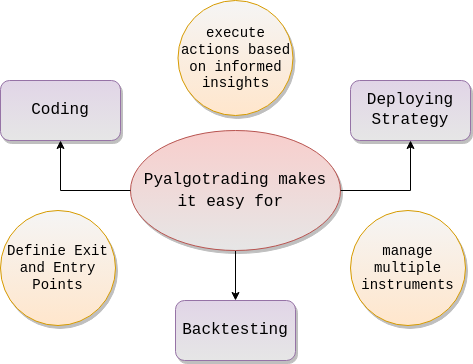

# Python Build

## AlgoBulls

Welcome to AlgoBulls, the AI-backed trading platform that unlocks new dimensions in algorithmic trading. We're here to amplify your experience of creating & trading on your very own trading strategies using our innovative product - **Python Build**. 

---

## Introducing **Python Build**: Your Gateway to Algorithmic Trading

**Python Build** is your comprehensive partner for crafting and executing trading strategies with the skill of a professional. It caters to both experienced traders and newcomers, providing a suite of tools that empower you to make well-informed decisions and trade confidently in the financial markets.

  

When it comes to strategy development, **Python Build** enables you to dive into coding, backtesting, and deploying your trading strategies with remarkable ease. Through an intuitive interface, you gain the power to precisely define when to enter and exit trades, manage multiple instruments, and execute actions based on informed insights.

[//]: # (
)

[//]: # (  )

[//]: # (
)

The versatility of **Python Build** shines through its unified strategy format, applicable across various trading types. Whether you're engaging in backtesting, paper trading, or real trading, you can use the same strategy code for all 3 making it easier for the user.   

The library provides comparable functionalities for all three scenarios (BT, PT and RT) when executing the strategy or generating the analytics. This unified approach allows you to transition seamlessly between these modes, with no need for intricate adjustments. Additionally, it facilitates the generation of progressive logs, allowing you to track your progress and anticipate completion times. You can also get the live logs that update in real-time, enhancing transparency and control over your trading activities.

  

**Python Build**'s strength lies in its ability to integrate seamlessly with real-time market data sources, historical data, and trading platforms. Its adaptable nature allows you to connect with a variety of data providers and broker APIs, enabling you to access the information you need to make well-informed trading decisions.

## Powerful Statistics & Visual Analytics 

  

In the pursuit of successful trading, **Python Build** equips you with advanced visual tools for strategy analytics. By harnessing these tools, you gain a deeper understanding of your strategies' performance. You can effectively manage risks and fine-tune your strategies to optimize their potential for success. These visualization tools facilitate data-driven decision-making and provide a clearer perspective on the intricacies of your trading activities.

## Multiple Platforms to use Python Build

To support our diverse community of users, we have the options of two dynamic platforms for our users to use Python Build - **pyalgotrading** and **Python Build Web**

-   :material-clock-fast:{ .lg .middle } __pyalgotrading__

    ---

    Official Python Package which can be used in Jupyter Notebooks or integrated into your existing Python codebase. 

    [:octicons-arrow-right-24: Getting started](#)

-   :fontawesome-brands-markdown:{ .lg .middle } __Python Build Web__

    ---

    Web App to ease your way into the world of algorithmic trading by just using your browser or Android app. No need to install Python or any other software locally.

    [:octicons-arrow-right-24: Reference](#)
- 

---

## Community

Moreover, AlgoBulls isn't just about platforms; it's about community. Share, learn, and collaborate with traders and developers. Code your strategies or explore ours – AlgoBulls is where innovation meets trading expertise.

By joining the thriving **Python Build** community, you tap into a rich network of traders and developers. This community serves as a platform for collaboration, where you can seek guidance, share valuable insights, and collectively refine your trading strategies. The synergy of diverse perspectives helps you approach trading challenges from various angles, fostering growth and improvement.

#### Join us on this journey as AlgoBulls revolutionizes algorithmic trading!

In summary, **Python Build** is more than a mere product; it's your comprehensive gateway to mastering the art of algorithmic trading. Its user-friendly interface, diverse functionalities, and integration capabilities make it a valuable asset for traders at all levels of expertise. By simplifying the complexities of strategy creation, integration, execution and analysis, **Python Build** empowers you to navigate the world of  trading with confidence and precision.

## Open Source Strategy Library

We maintain a open source GitHub repo [pyalgostrategypool](https://) of fully working algorithmic trading strategies. You can use these strategies for Backtesting, Paper Trading or Live Trading across multiple brokers, and across multilpe exchanges. The same code works in all trading modes.

!!!tip "Keep an eye on our GitHub repo"
    Our team periodically updates the library to add more strategy Python codes

For those who are new to algorithmic trading or **Python Build**, exploring the included example strategies is a fantastic way to get started. These example strategies are pre-built trading scenarios that demonstrate different trading strategies and concepts. By studying and experimenting with these examples, you can gain a deeper understanding of how **Python Build** functions and how strategies are constructed.

Here's what you can do with the example strategies:

- **Analyze Structure**: Examine the code structure, including how strategies are defined, conditions are set, and actions are executed.
- **Modify and Experiment**: Once you're comfortable with the example strategies, tailor them to your preferences. Adjust parameters, conditions, and actions to see how these modifications affect trading outcomes.
- **Learn Strategies**: Each example strategy may represent a different trading approach, such as trend-following or mean-reversion. By studying these examples, you can learn about various trading strategies and their underlying principles.

Remember that the example strategies serve as a foundation for your learning journey. As you become more familiar with the library, you can start building and customizing your own strategies based on your trading preferences and insights.

In conclusion, the installation process gets you ready to start using **Python Build**, while the documentation and example strategies empower you to explore the library's capabilities and apply them to real trading scenarios. Whether you're a newcomer or an experienced trader...

## Limitations of **Python Build**

In the exciting world of algorithmic trading, **Python Build** stands as a formidable tool, offering a range of benefits and considerations for traders and developers. Let's also know the limitations to help you make an informed decision.

  

1. **Python Speed Limitations:** While versatile, Python isn't the fastest language for computation. This might pose challenges with complex strategies requiring extensive calculations. Our team is working on porting a majority of the codebase on Cython to help with the speedup, while maintaining the simplicity of Python. We may explore other avenues like GPUs in the future.
2. **Cloud Cold-Start Speed Limitations:** We execute every strategy on a dedicated virtual server in the cloud. While this is great as every strategy is executed in a separate secure environment with dedicated resources, it takes time to fetch the dedicated resource on the cloud before the strategy execution can start. This results in an initial small delay while starting a strategy.

!!! tip "Note"
    Our team is working round the clock to make these limitations a thing of the past.

## References:
To fully unleash the potential of **Python Build**, dive into its comprehensive documentation. This documentation serves as your roadmap, offering detailed insights into the products features, functionalities and capabilities. The documentation is your go-to resource for understanding how to effectively harness the power of **Python Build**. It includes:

[//]: # (TODO: @prithvi to fix the 1,2,3 pointers below)
- **[Comprehensive Guides](python_build_comprehensive_guide.md){target=_blank}**: Step-by-step guides that walk you through various aspects of strategy development, deployment, integration, and analysis.
- **[Test with Python Build](testing.md){target=_blank}**: A detailed reference guide that provides information about each function, method, and module available in **Python Build**.
- **[Code Examples](../strategies/index.md){target=_blank}**: Real code snippets and examples that showcase how to implement specific strategies, functions, and techniques using **Python Build**.
- **[Python Cookbook for Algorithmic Trading](https://github.com/PacktPublishing/Python-Algorithmic-Trading-Cookbook){target=_blank}**: A Python Cookbook for Algorithmic Trading, explaining in depth about the strategy creation and execution from scratch using Python. Explore the technical content of the book on [GitHub](https://github.com/PacktPublishing/Python-Algorithmic-Trading-Cookbook).