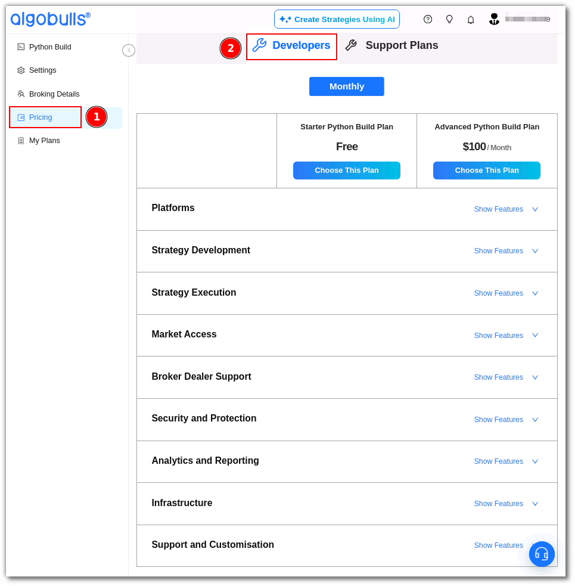

# Prerequisites

---
You will need the following to perform this tutorial:

1. ### **[AlgoBulls Account](https://www.algobulls.com/){target=_blank}**
    You will need this account to upload and test your strategies. You can create your account for FREE on [algobulls website](https://app.algobulls.com/user/register){target=_blank}, to access the features and developer key you need to follow the below steps.
    - **Step 1**: Activate the [Advanced Developer Plan](https://app.algobulls.com/pricing?section=Developers){target=_blank} from the **Pricing** menu
        [](imgs/purchase_plan.png)
    - **Step 2**: Get the [Developer Key](https://app.algobulls.com/settings?query=eyJpc0xpdmUiOiJ0cnVlIn0%3D&section=developerOptions){target=_blank} from the **Settings** section
        [](imgs/developer_key.png)
    !!! Note "Please Note"
         For security reasons, the **developer key** will get reset everytime you log out from your AlgoBulls account.
    Once you get the developer key, you can access the AlgoBulls platform using `pyalgotrading` functions.   

    ---

2. ### **[Python 3.10+](https://www.python.org/downloads/){target=_blank}**
  The pyalgotrading platform can run all strategies that conform to Python 3.8 or higher. We recommend Python 3.10 or higher. 

    !!! Tip "Python Tips"
        * It is a good idea to set up a virtual environment first while installing Python 3.10.
        * Once Python is installed, most packages are easily installed in your venv using `pip install` command
    
    ---

3. ### **[Pyalgotrading Package](https://pypi.org/project/pyalgotrading/){target=_blank}**  
  You just need to install `pyalgotrading` and you are all set to create & execute your fully automated trading strategies. You can install the `pyalgotrading` packages using the command given below.
    ``` 
    pip install pyalgotrading
    ``` 

    ---

4. ### **[Jupyter Notebook](https://jupyter.org/install){target=_blank}**
  You will use a Jupyter Notebook to connect to the AlgoBulls platform. You will upload the strategy, test your strategy (Backtesting, Paper Trading or Real Trading), and fetch logs using the notebook.  
       Install the jupyter notebook using the following command.  
       ```
       pip install jupyter
       ```

    !!! Tip "Pro Tip"
           You don't really need Jupyter Notebook in case you are an experienced pyalgotrading user. You can directly integrate it in your application.

    ---

[//]: # (Add this as an admonition for "Productivity Boost Tip" - Use =IDE like Pycharm or VSCode to boost your productivity while coding trading strategies. It is not mandatory as you can use plain text editors also for your Python code.)
!!! Tip "Enhancing Productivity"
      * For boosting your productivity in building strategies and executing them using pyalgotrading, you can make use of python IDEs of your choice, like
           - **[Pycharm](https://www.jetbrains.com/pycharm/download/){target=_blank}**
           - **[VS Code](https://code.visualstudio.com/){target=_blank}**
