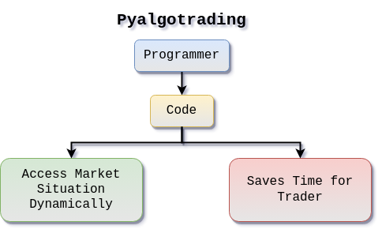
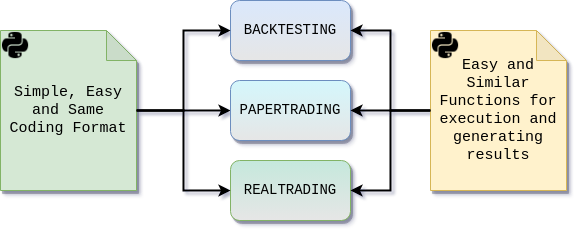

# Introducing **pyalgotrading**: Your Gateway to Algorithmic Trading

## What is **pyalgotrading**?

**pyalgotrading** is more than just a Python library; it serves as your comprehensive partner for crafting and executing trading strategies with the skill of a professional. It caters to both experienced traders and newcomers, providing a suite of tools that empower you to make well-informed decisions and trade confidently in the financial markets.
<p align="center">
  
</p>

When it comes to strategy development, **pyalgotrading** enables you to dive into coding, backtesting, and deploying your trading strategies with remarkable ease. Through an intuitive interface, you gain the power to precisely define when to enter and exit trades, manage multiple instruments, and execute actions based on informed insights.
<p align="center">
  
</p>

The versatility of **pyalgotrading** shines through its unified strategy format, applicable across various trading types. Whether you're engaging in backtesting, paper trading, or real trading, the library provides comparable functions for all three scenarios. This unified approach allows you to transition seamlessly between these modes, with no need for intricate adjustments. Additionally, the library facilitates the generation of progressive logs, allowing you to track your progress and anticipate completion times. You can also print live logs that update in real-time, enhancing transparency and control over your trading activities.
<p align="center">
  
</p>

**pyalgotrading**'s strength lies in its ability to integrate seamlessly with real-time market data sources, historical data, and trading platforms. Its adaptable nature allows you to connect with a variety of data providers and broker APIs, enabling you to access the information you need to make well-informed trading decisions.

By joining the thriving **pyalgotrading** community, you tap into a rich network of traders and developers. This community serves as a platform for collaboration, where you can seek guidance, share valuable insights, and collectively refine your trading strategies. The synergy of diverse perspectives helps you approach trading challenges from various angles, fostering growth and improvement.

<p align="center">
  
</p>

In the pursuit of successful trading, **pyalgotrading** equips you with advanced visual tools for strategy analytics. By harnessing these tools, you gain a deeper understanding of your strategies' performance. You can effectively manage risks and fine-tune your strategies to optimize their potential for success. These visualization tools facilitate data-driven decision-making and provide a clearer perspective on the intricacies of your trading activities.

In summary, **pyalgotrading** is more than a mere library; it's your comprehensive gateway to mastering the art of algorithmic trading. Its user-friendly interface, diverse functionalities, and integration capabilities make it a valuable asset for traders at all levels of expertise. By simplifying the complexities of strategy development, deployment, integration, and analysis, **pyalgotrading** empowers you to navigate the world of trading with confidence and precision.

## Pros and Cons of **pyalgotrading**

In the exciting world of algorithmic trading, **pyalgotrading** stands as a formidable tool, offering a range of benefits and considerations for traders and developers. Let's dive into the pros and cons of this versatile library to help you make an informed decision.
<p align="center">
  
</p>

### Pros of **pyalgotrading**:

1. **Simplified Strategy Coding:** **pyalgotrading** introduces a user-friendly coding format, making strategy creation accessible to all. Whether you're a trading veteran or a newcomer, this simplicity ensures quick implementation of trading ideas without steep learning curves.

2. **Powered by Algobulls:** The integration with Algobulls unlocks the potential of the AlgoBulls platform. The best part? It's absolutely free for developers. This partnership opens doors to testing and deploying strategies in a live trading environment, amplifying the scope of possibilities.
   
3. **Python Syntax Advantage:** Leveraging Python as the core language brings familiarity to the table. Widely known and understood, Python's syntax is a boon for data analysis. The library's compatibility with Jupyter further enhances data-driven insights.

### Cons of **pyalgotrading**:

1. **Python's Speed Limitation:** While versatile, Python isn't the fastest language for computation. This might pose challenges with complex strategies requiring extensive calculations.

2. **Potential for Bugs:** Being a relatively new library, occasional bugs could emerge. However, the **pyalgotrading** technical team is dedicated to swift bug resolution, ensuring a smoother user experience.

3. **Initial Flexibility Trade-off:** In its pursuit of user-friendliness, **pyalgotrading** might sacrifice some flexibility found in more complex libraries. This trade-off aims to strike a balance between ease of use and customization.

## Starting with **pyalgotrading** Library

### Installation:

To embark on your journey with **pyalgotrading**, the first step is installing the library using pip. This process ensures that you have the necessary tools at your disposal to start crafting and executing trading strategies. Follow these instructions:

1. Open your terminal or command prompt.
2. Type the following command and press Enter:
    ```
    pip install **pyalgotrading**
    pip install quantstats==0.0.59
    pip install pandas==1.5.3
    ```

The first line installs the **pyalgotrading** library, while the subsequent lines install compatible versions of quantstats and pandas libraries. These are important dependencies that contribute to the functionality and analytical capabilities of **pyalgotrading**.

### Documentation:
To fully unleash the potential of **pyalgotrading**, dive into its comprehensive documentation. This documentation serves as your roadmap, offering detailed insights into the library's features, functions, and capabilities. The documentation is your go-to resource for understanding how to effectively harness the power of **pyalgotrading**. It includes:

- **[Comprehensive Guides](**pyalgotrading**_comprehensive_guide.md){target=_blank}**: Step-by-step guides that walk you through various aspects of strategy development, deployment, integration, and analysis.
- **[Test with pyalgotrading](testing.md){target=_blank}**: A detailed reference guide that provides information about each function, method, and module available in **pyalgotrading**.
- **[Code Examples](../strategies/index.md){target=_blank}**: Real code snippets and examples that showcase how to implement specific strategies, functions, and techniques using **pyalgotrading**.
- **[Python Cookbook for AlgoTrading](https://github.com/PacktPublishing/Python-Algorithmic-Trading-Cookbook){target=_blank}**: A python cook book for Algotrading, explaining in depth about the strategy creation and execution using python.

#### **Example Strategy:**

For those who are new to algorithmic trading or **pyalgotrading**, exploring the included example strategies is a fantastic way to get started. These example strategies are pre-built trading scenarios that demonstrate different trading strategies and concepts. By studying and experimenting with these examples, you can gain a deeper understanding of how **pyalgotrading** functions and how strategies are constructed.

Here's what you can do with the example strategies:

- **Analyze Structure**: Examine the code structure, including how strategies are defined, conditions are set, and actions are executed.
- **Modify and Experiment**: Once you're comfortable with the example strategies, tailor them to your preferences. Adjust parameters, conditions, and actions to see how these modifications affect trading outcomes.
- **Learn Strategies**: Each example strategy may represent a different trading approach, such as trend-following or mean-reversion. By studying these examples, you can learn about various trading strategies and their underlying principles.

Remember that the example strategies serve as a foundation for your learning journey. As you become more familiar with the library, you can start building and customizing your own strategies based on your trading preferences and insights.

In conclusion, the installation process gets you ready to start using **pyalgotrading**, while the documentation and example strategies empower you to explore the library's capabilities and apply them to real trading scenarios. Whether you're a newcomer or an experienced trader...

