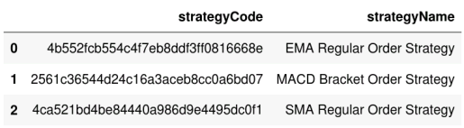

# Test your Strategy

### **Previously...**
You have uploaded your strategy to the AlgoBulls platform.

---
### **Now...**
Using the uploaded strategy, you can now try:
* Backtesting
* Paper Trading
* Real Trading 

---

### **Before you start...**
Open a Jupyter Notebook.

The steps you will follow are:

1. Establish a connection to the AlgoBulls Platform.
2. Display all Strategies you have in your account.
3. Select the SMA strategy.
4. Optionally, print the strategy once.
5. Select instrument(s).
6. Submit/Run a Backtest, Paper Trade or Real Trade job.
7. Check Job Status.
8. Fetch Logs (even while the job is running).
9. Fetch Reports. (PnL, Statistics, Order History)

---
### **Let's Start...**
Run the following code snippets into the Jupyter Notebook one by one (or all together).

#### Import statements

```python
from pyalgotrading.algobulls import AlgoBullsConnection
from datetime import datetime as dt
from pyalgotrading.constants import *
```

---
#### Establish a connection to the AlgoBulls Platform

```python
algobulls_connection = AlgoBullsConnection()
algobulls_connection.get_authorization_url()
```
The output of the above step is:

`Please login to this URL with your AlgoBulls credentials and get your developer access token: https://app.algobulls.com/user/login`

You will need to log in to your AlgoBulls account and fetch the access token from:

Settings -> General -> Developer Options

([See How](https://help.algobulls.com/member/Settings/general-settings/#developer-options))

Once you have the access token, set it in the code as shown here:

```python
algobulls_connection.set_access_token('4365817b795770ea31040a21ad29c8e78b63ad88')
```

Replace the token you have copied with the token in the code above.

---
#### Display all strategies in your account
---

```python
all_strategies = algobulls_connection.get_all_strategies()
all_strategies
```

An example of the output will be:


#### Select the SMA strategy

Select the last entry of the `strategyCode` column and display it.
```python
strategy_code = all_strategies.iloc[-1]['strategyCode']
strategy_code
```

---
#### Print your Strategy code

You can print your strategy code once to verify if this is the correct code. This step is optional.

```python
strategy_details1 = algobulls_connection.get_strategy_details(strategy_code)
print(strategy_details1)
```

---
#### Search for instruments (based on a search query)

Now display a few instruments with some keyword. The example below uses 'SBIN' as the keyword.

```python
instruments = algobulls_connection.search_instrument('SBIN')
instruments
```

--- 
#### Select an instrument

From the output, select the instrument on which you wish to test your strategy. For this example, select the first one.
```python
instrument = instruments[0]['value']
instrument
```

---
#### Submit a Job

Delete previous trades
```python
algobulls_connection.delete_previous_trades(strategy=strategy)
```

Set the **parameters** for the strategy
```python
parameters={
    'timeperiod1': 5,
    'timeperiod2': 12
}
```

Click on each of the tabs to see the relevant code snippet.


> **Backtesting**
    ```python
    algobulls_connection.backtest(
            strategy=strategy_code,         # strategy code
            start='2020-7-1 | 09:15',       # start date-time of strategy ('YYYY-MM-DD | HH:MM')
            end='2020-7-7 | 15:30',         # end date-time of strategy ('YYYY-MM-DD | HH:MM')
            instruments='NSE:SBIN',         # name of the instrument
            lots=1,                         # number of lots per trade
            parameters=parameters,          # parameters required for the strategy
            candle='15 minutes',            # candle size eg : '1 Day', '1 hour', '3 minutes'
            delete_previous_trades=True,    # delete the previous trades for papertrading (default is true),
            initial_funds_virtual=10000     # virtual funds allotted before the paper trading starts (default is 1e9)
    )
    ```


> **Paper Trading**
    ```python
    algobulls_connection.papertrade(
            strategy=strategy_code,         # strategy code
            start='09:15',                  # start time of strategy (HH:MM)     
            end='15:30',                    # end time of strategy (HH:MM)
            instruments='NSE:SBIN',         # name of the instrument
            lots=1,                         # number of lots per trade
            parameters=parameters,          # parameters required for the strategy
            candle='15 minutes',            # candle size eg : '1 Day', '1 hour', '3 minutes'
            delete_previous_trades=True,    # delete the previous trades for papertrading (default is true)
            initial_funds_virtual=10000     # virtual funds allotted before the paper trading starts (default is 1e9)
    )
    ```

> **Real Trading**
    ```python
    algobulls_connection.realtrade(
            strategy=strategy_code,         # strategy code
            start='09:15',                  # start time of strategy (HH:MM)     
            end='15:30',                    # end time of strategy (HH:MM)
            instruments='NSE:SBIN',         # name of the instrument
            lots=1,                         # number of lots per trade
            parameters=parameters,          # parameters required for the strategy
            candle='15 minutes',            # candle size eg : '1 Day', '1 hour', '3 minutes'
            brokerId=53                     # ID of the broker for real trade
    )
    ```


---
#### Fetch Job Status

Click on each of the tabs to see the relevant code snippet.

> **Backtesting**
    ```python
    algobulls_connection.get_backtesting_job_status(strategy_code)
    ```
    
> **Paper Trading**
    ```python
    algobulls_connection.get_papertrading_job_status(strategy_code)
    ```
    
> **Real Trading**
    ```python
    algobulls_connection.get_realtrading_job_status(strategy_code)
    ```
    
You can stop a submitted job anytime.

---
#### Stop a Job

Click on each of the tabs to see the relevant code snippet.

> **Backtesting**
    ```python
    algobulls_connection.stop_backtesting_job(strategy_code)
    ```
    
> **Paper Trading**
    ```python
    algobulls_connection.stop_papertrading_job(strategy_code)
    ```
    
> **Real Trading**
    ```python
    algobulls_connection.stop_realtrading_job(strategy_code)
    ```

You can fetch the logs in the middle of a job to monitor the progress.

---
#### Fetch logs of an ongoing/stopped/completed job

Click on each of the tabs to see the relevant code snippet.

> **Backtesting**
    ```python
    logs = algobulls_connection.get_backtesting_logs(strategy_code)
    print(logs)
    ```
    
> **Paper Trading**
    ```python
    logs = algobulls_connection.get_papertrading_logs(strategy_code)
    print(logs)
    ```
    
> **Real Trading**
    ```python
    logs = algobulls_connection.get_realtrading_logs(strategy_code)
    print(logs)
    ```
    
You can fetch the PnL report, statistics and order history for a job.
    
---
#### Fetch PnL Reports

Click on each of the tabs to see the relevant code snippet.

> **Backtesting**
    ```python
    algobulls_connection.get_backtesting_report_pnl_table(strategy_code, show_all_rows=True)
    ```
    
> **Paper Trading**
    ```python
    algobulls_connection.get_papertrading_report_pnl_table(strategy_code, show_all_rows=True)
    ```
    
> **Real Trading**
    ```python
    algobulls_connection.get_realtrading_report_pnl_table(strategy_code, show_all_rows=True)
    ```

---
#### Fetch Report Statistics

Click on each of the tabs to see the relevant code snippet.

> **Backtesting**
    ```python
    algobulls_connection.get_backtesting_report_statistics(
        strategy_code,          # strategy code
        mode='quantstats',      # package used to generate statistics
        report='full',          # format of the report
        html_dump=True          # save report as html file
    )
    ```
    
> **Paper Trading**
    ```python
    algobulls_connection.get_papertrading_report_statistics(
        strategy_code,          # strategy code
        mode='quantstats',      # package used to generate statistics
        report='full',          # format of the report
        html_dump=True          # save report as html file
    )
    ```
    
> **Real Trading**
    ```python
    algobulls_connection.get_realtrading_report_statistics(
        strategy_code,          # strategy code
        mode='quantstats',      # package used to generate statistics
        report='full',          # format of the report
        html_dump=True          # save report as html file
    )
    ```
   
--- 
#### Fetch Order History

Click on each of the tabs to see the relevant code snippet.

> **Backtesting**
    ```python
    order_history = algobulls_connection.get_backtesting_report_order_history(strategy_code)
    print(order_history)
    ```
    
> **Paper Trading**
    ```python
    order_history = algobulls_connection.get_papertrading_report_order_history(strategy_code)
    print(order_history)
    ```

> **Real Trading**
    ```python
    order_history = algobulls_connection.get_realtrading_report_order_history(strategy_code)
    print(order_history)
    ```

!!! Note
    - Order History for Real Trading is not supported by brokers.
    - Order History for Backtesting, Paper Trading and Real Trading is supported by the **AlgoBulls Virtual Brokers**.

---
### What's Next...

You can now explore more by creating and uploading more complex strategies.

You can also check out the [Strategy Coding Guidelines](codeguide.md).
