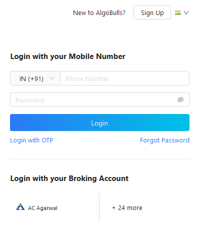
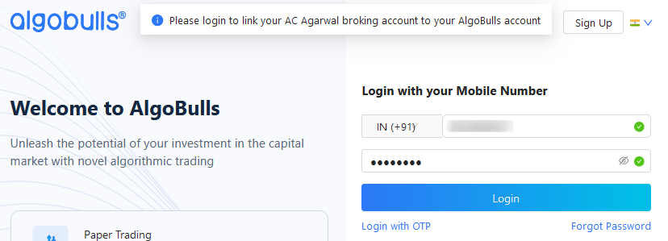
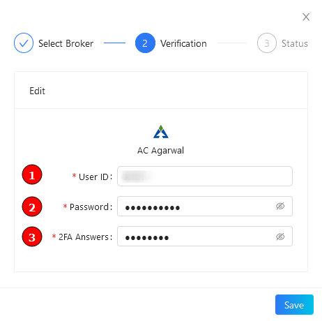
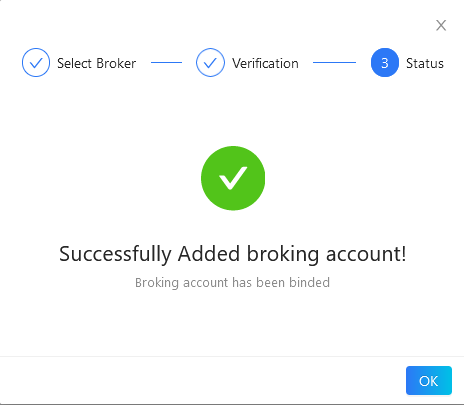
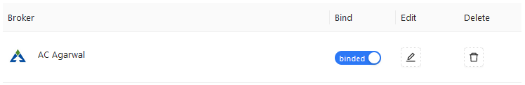

# AC Agarwal
---

* Official Website: [https://www.acagarwal.com/](https://www.acagarwal.com/)

* Trading Website: [https://www.acagarwal.com/](https://www.acagarwal.com/)

* Markets Supported: India

## Login and Setup your AC Agarwal Account 
---
This section will take you through the step-wise instructions to log in, setup, and bind your broker into your AlgoBulls Account.

### Before you Start
---
Keep the following information available before you start:

1) AlgoBulls Account Credentials

* Phone Number

* Password

2) Broking Account Credentials

* User ID

* Password

* 2FA Answers (your DOB in ddmmyyyy format)

### Let's Start
---
* Visit the AlgoBulls [Login Page](https://app.algobulls.com/user/login) and click on 'Ac Agarwal' under **Login with your Broking Account**

* If you do not see your broker name, then click on **+ x more** where x is the number of brokers

* Type **Ac Agarwal** in the Search Box. and then click on the Broker Link that is shown in the search results

Now Login to your AlgoBulls account. Provide data for the following fields and then click the **Login** button

* Phone Number: The Phone Number you have used to Register/Sign-Up to the AlgoBulls website.

* Password: The password you have given to Register/Sign-Up to the AlgoBulls website.

* You will be re-directed to the Verification Page. Provide data for the following fields:

(1). User ID: The ID given to you by your broker

(2). Password: The password given to you by the broker

(3). 2FA Answers: The 2-factor authentication answer you have given (your DOB in ddmmyyyy format)

* If the verification is successful, you will see the following message

## Bind your Broking Account
---
The following steps will help you to make sure you have binded your broker account

* Visit the AlgoBulls [Broker Settings Page](https://app.algobulls.com/account/broking)

* Bind your account using the Toggle button marked below

## Support
---
For Help and Support, contact us on +91 80692 30300 or [email us](mailto:support@algobulls.com).
