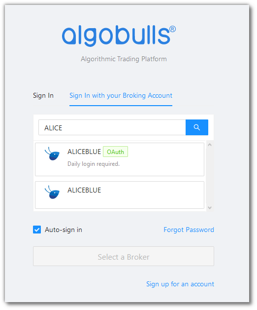
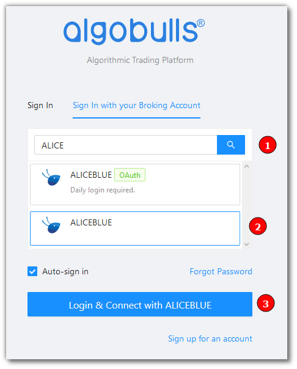
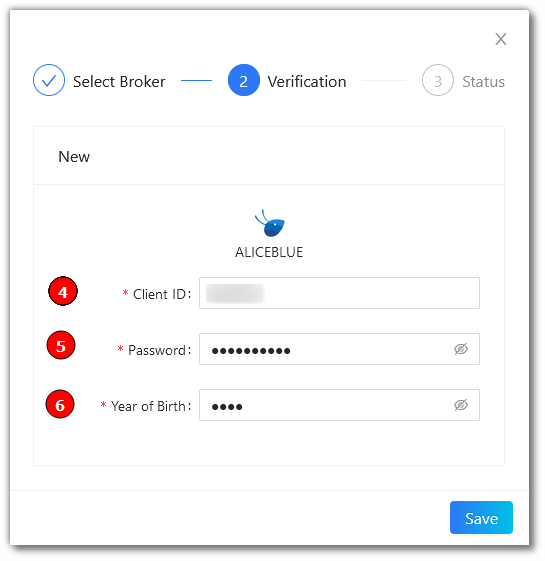
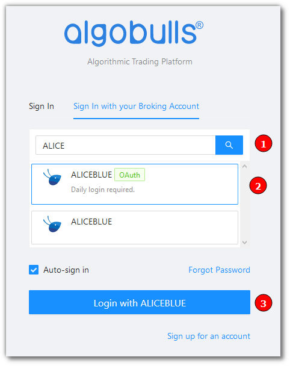
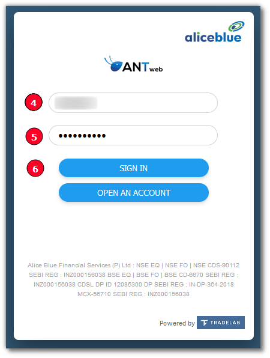
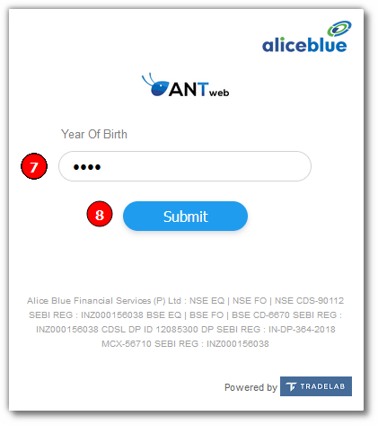
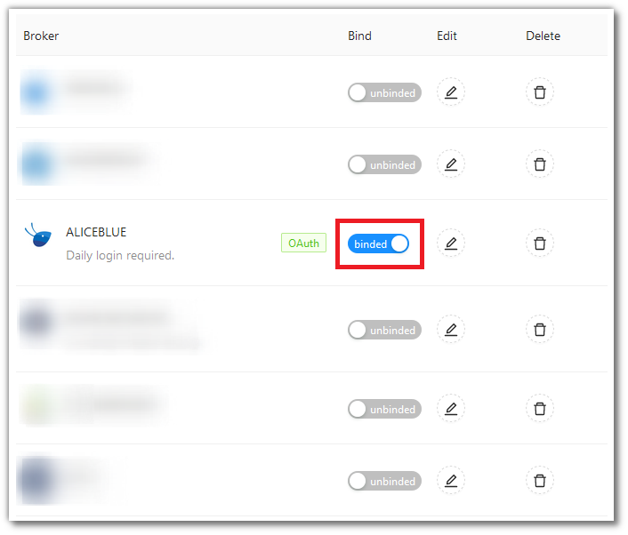

# AliceBlue
---
* Official Website: [https://aliceblueonline.com/](https://aliceblueonline.com/)

* Trading Website: [https://ant.aliceblueonline.com/](https://ant.aliceblueonline.com/)

* Markets Supported: India

## Login and Setup your AliceBlue Account
---
This section will take you through the step-wise instructions to log in, setup, and bind your broker into your AlgoBulls Account.

### Before you Start
---
Keep the following information available before you start:

1) AlgoBulls Account Credentials

* Phone Number

* Password

2) Broking Account Credentials

* ClientID
      
* Password
      
* Year of Birth

### Let's Start
---
* Visit the AlgoBulls [Login Page](https://app.algobulls.com/user/login) and click on **Sign In with your Broking Account**

* Type the first few characters of your Broker Name 

As seen here, AliceBlue supports 2 ways of logging in:

1. non-OAuth Method 

2. OAuth Method.
     
Both are explained below

### Login with non-OAuth Method
---
(1). Type the first few characters of your Broker Name

(2). Select the **ALICEBLUE** broker

(3). Click on the **Login & Connect with ALICEBLUE** button

Now Login to your AlgoBulls account. Provide data for the following fields and then click the **Login** button

* Phone Number: The Phone Number you have used to Register/Sign-Up to the AlgoBulls website.

* Password: The password you have given to Register/Sign-Up to the AlgoBulls website.

* You will be re-directed to the Verification Page. Provide data for the following fields:

(4). Client ID: The ID given to you by your broker

(5). Password: The password given to you by the broker

(6). Year of Birth: The year of birth you have given while creating the broker account

* If the verification is successful, you will see the following message

### Login with OAuth Method
---
(1). Type the first few characters of your Broker Name

(2). Select the **ALICEBLUE OAuth** broker

(3). Click on the **Login with ALICEBLUE** button

* You will be re-directed to the broker login page. Provide data for the following fields:

(4). Client ID: The ID given to you by your broker

(5). Password: The password given to you by the broker

(6). Click **SIGN IN**

(7). Year of Birth: The year of birth you have given while creating the broker account

(8). Click **Submit**

* If the sign-in is successful, you will re-directed back to the AlgoBulls website

## Bind your Broking Account
---
The following steps will help you to make sure you have binded your broker account

* Visit the AlgoBulls [Broker Settings Page](https://app.algobulls.com/account/broking)

* Bind your account using the Toggle button marked below

## Support
---
For Help and Support, contact us on +91 80692 30300 or [email us](mailto:support@algobulls.com).
