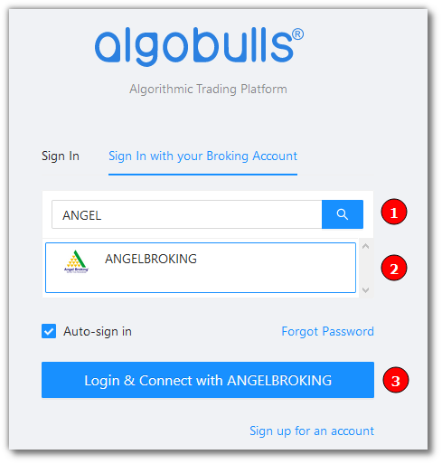
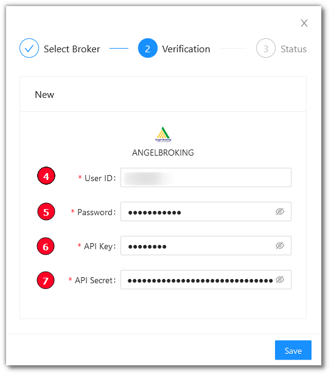
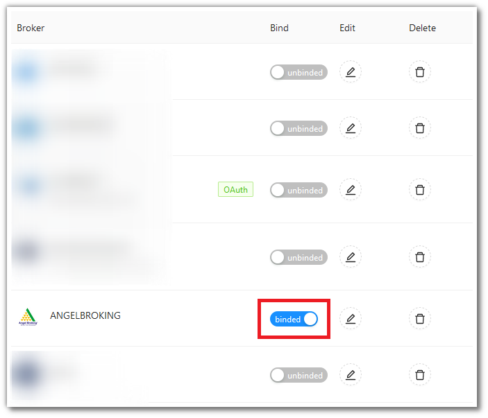

# Angel Broking
---
* Official Website: [https://www.angelbroking.com/](https://www.angelbroking.com/)

* Trading Website: [https://trade.angelbroking.com/](https://trade.angelbroking.com/)

* Markets Supported: India

## Login and Setup your Angel Broking Account 
---
This section will take you through the step-wise instructions to log in, setup, and bind your broker into your AlgoBulls Account.

### Before you Start
---
Keep the following information available before you start:

1) AlgoBulls Account Credentials

* Phone Number

* Password

2) Broking Account Credentials

* User ID
      
* Password
      
* API Key

* API Secret

!!! note
    * To know more about API Key and Secret, see the following video:

<iframe width="560" height="315" src="https://www.youtube.com/embed/75vlLNRD3IA" frameborder="0" allow="accelerometer; autoplay; clipboard-write; encrypted-media; gyroscope; picture-in-picture" allowfullscreen></iframe>

### Let's Start
---
* Visit the AlgoBulls [Login Page](https://app.algobulls.com/user/login) and click on `Sign In with your Broking Account`

(1). Type the first few characters of your Broker Name

(2). Select the `ANGELBROKING` broker

(3). Click on the `Login & Connect with ANGELBROKING` button

Now Login to your AlgoBulls account. Provide data for the following fields and then click the `Login` button

* Phone Number: The Phone Number you have used to Register/Sign-Up to the AlgoBulls website.

* Password: The password you have given to Register/Sign-Up to the AlgoBulls website.

* You will be re-directed to the Verification Page. Provide data for the following fields:

(4). User ID: The ID given to you by your broker

(5). Password: The password given to you by the broker

(6). API Key: The API Key given to you by your broker

(7). API Secret: The API Secret given to you by your broker

* If the verification is successful, you will see the following message

## Bind your Broking Account
---
The following steps will help you to make sure you have binded your broker account

* Visit the AlgoBulls [Broker Settings Page](https://app.algobulls.com/account/broking)

* Bind your account using the Toggle button marked below

## Support
---
For Help and Support, contact us on +91 80692 30300 or [email us](mailto:support@algobulls.com).
