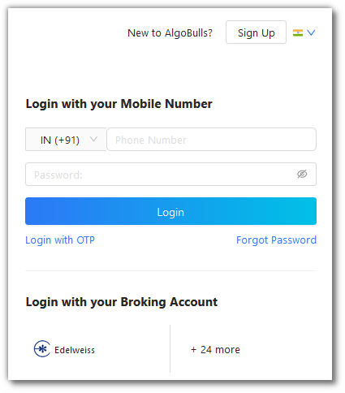
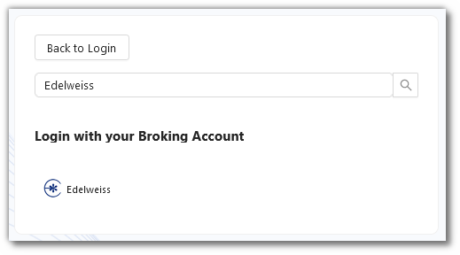
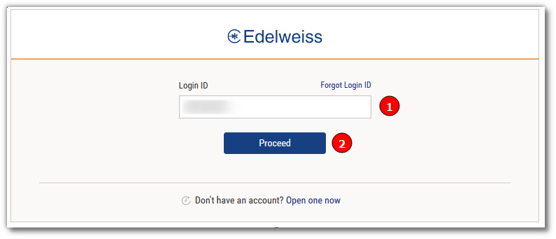
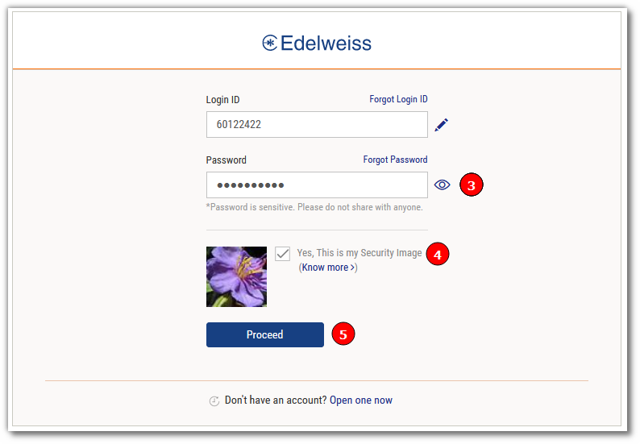
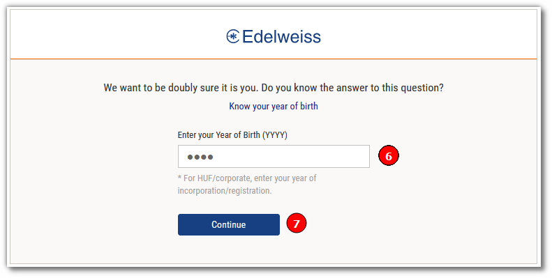
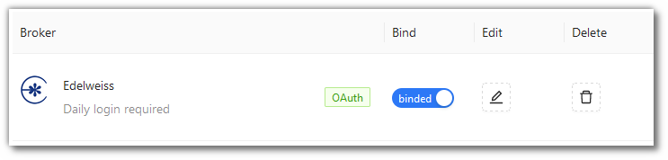

# Edelweiss
---

* Official Website: [https://www.edelweiss.in](https://www.edelweiss.in)

* Trading Website: [https://www.edelweiss.in/login](https://www.edelweiss.in/login)

* Markets Supported: India

## Important Point(s) to Note
---
* It is required to login **once** daily (at the start of the trading day).

## Login and Setup your Edelweiss Account 
---
This section will take you through the step-wise instructions to log in, setup, and bind your broker into your AlgoBulls Account.

### Before you Start
---
Keep the following information available before you start:

1) AlgoBulls Account Credentials

* Phone Number

* Password

2) Broking Account Credentials

* Login ID

* Password

* Year of Birth

### Let's Start
---
* Visit the AlgoBulls [Login Page](https://app.algobulls.com/user/login) and click on 'Edelweiss' under `Login with your Broking Account`

* If you do not see your broker name, then click on `+ x more` where x is the number of brokers

* Type `Edelweiss` in the Search Box. and then click on the Broker Link that is shown in the search results

(1). Type your Login ID

(2). Click on the `Proceed` button

(3). Type your Password

(4). Make sure that `Yes, This is my Security Image` is ticked

(5). Click on the `Proceed` button

(6). Type your Year of Birth

(7). Click on the `Continue` button

## Bind your Broking Account
---
The following steps will help you to make sure you have binded your broker account

* Visit the AlgoBulls [Broker Settings Page](https://app.algobulls.com/account/broking)

* Bind your account using the Toggle button marked below

## Support
---
For Help and Support, contact us on +91 80692 30300 or [email us](mailto:support@algobulls.com).
