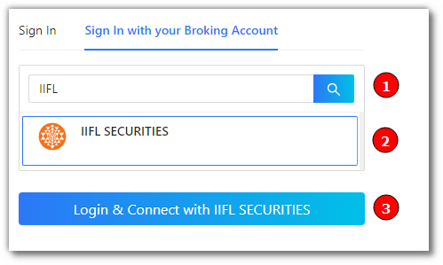
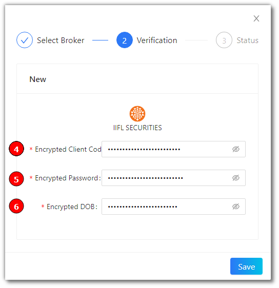
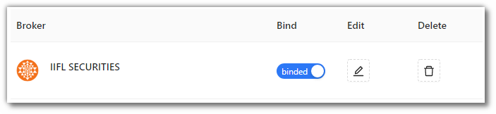

# IIFL Securities
---

* Official Website: [https://www.indiainfoline.com/](https://www.indiainfoline.com/)

* Trading Website: [https://ttweb.indiainfoline.com/Trade/Login.aspx](https://ttweb.indiainfoline.com/Trade/Login.aspx)

* Markets Supported: India

## Login and Setup your IIFL Securities Account 
---
This section will take you through the step-wise instructions to log in, setup, and bind your broker into your AlgoBulls Account.

### Before you Start
---
Keep the following information available before you start:

1) AlgoBulls Account Credentials

* Phone Number

* Password

2) Broking Account Credentials

* Encrypted Client Code

* Encrypted Password

* Encrypted DOB

### Encrypting your Credentials
---
To encrypt your credentials, contact [Support](#support).

### Let's Start
---
* Visit the AlgoBulls [Login Page](https://app.algobulls.com/user/login) and click on **Sign In with your Broking Account**

(1). Type the first few characters of your Broker Name

(2). Select the `IIFL SECURITIES` broker

(3). Click on the `Login & Connect with IIFL SECURITIES` button

Now Login to your AlgoBulls account. Provide data for the following fields and then click the `Login` button

* Phone Number: The Phone Number you have used to Register/Sign-Up to the AlgoBulls website.

* Password: The password you have given to Register/Sign-Up to the AlgoBulls website.

* You will be re-directed to the Verification Page. Provide data for the following fields:

(4). Encrypted Client Code: The Encrypted Client Code generated by you

(5). Encrypted Password: The Encrypted Password generated by you

(6). Encrypted DOB: The Encrypted DOB generated by you

* If the verification is successful, you will see the following message

## Bind your Broking Account
---
The following steps will help you to make sure you have binded your broker account

* Visit the AlgoBulls [Broker Settings Page](https://app.algobulls.com/account/broking)

* Bind your account using the Toggle button marked below

## Support
---
For Help and Support, contact us on +91 80692 30300 or [email us](mailto:support@algobulls.com).
