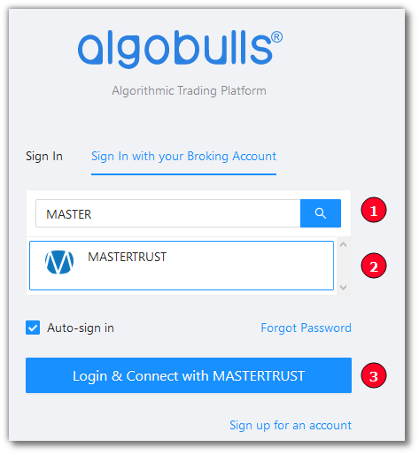
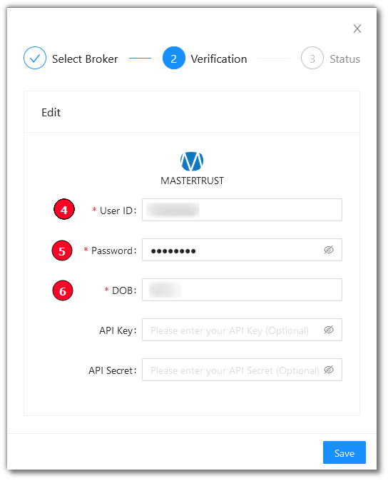
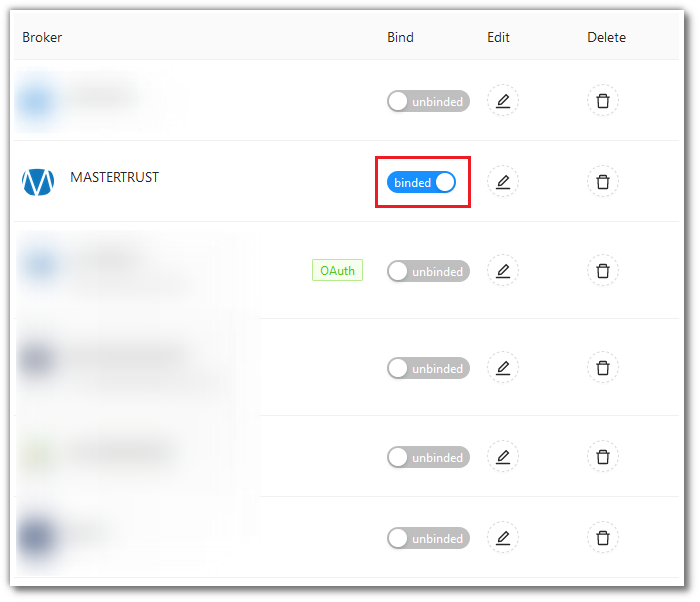

# Mastertrust
---

* Official Website: [https://www.mastertrust.co.in/](https://www.mastertrust.co.in/)

* Trading Website: [https://masterswift-beta.mastertrust.co.in/](https://masterswift-beta.mastertrust.co.in/)

* Markets Supported: India

## Login and Setup your Mastertrust Account 
---
This section will take you through the step-wise instructions to log in, setup, and bind your broker into your AlgoBulls Account.

### Before you Start
---
Keep the following information available before you start:

1) AlgoBulls Account Credentials

* Phone Number

* Password

2) Broking Account Credentials

* User ID

* Password

* DOB

### Let's Start
---
* Visit the AlgoBulls [Login Page](https://app.algobulls.com/user/login) and click on `Sign In with your Broking Account`

(1). Type the first few characters of your Broker Name

(2). Select the `MASTERTRUST` broker

(3). Click on the `Login & Connect with MASTERTRUST` button

Now Login to your AlgoBulls account. Provide data for the following fields and then click the `Login` button

* Phone Number: The Phone Number you have used to Register/Sign-Up to the AlgoBulls website.

* Password: The password you have given to Register/Sign-Up to the AlgoBulls website.

* You will be re-directed to the Verification Page. Provide data for the following fields:

(4). User ID: The ID given to you by your broker

(5). Password: The password given to you by the broker

(6). DOB: Your Date of Birth

* If the verification is successful, you will see the following message

## Bind your Broking Account
---
The following steps will help you to make sure you have binded your broker account

* Visit the AlgoBulls [Broker Settings Page](https://app.algobulls.com/account/broking)

* Bind your account using the Toggle button marked below

## Important Points to Note
---
* Use the following link to login to your broking account: 
    
    [https://masterswift-beta.mastertrust.co.in/](https://masterswift-beta.mastertrust.co.in/)

* You may lose connectivity to your binded broker on the AlgoBulls account if any other app or website is used to login to your account.

## Support
---
For Help and Support, contact us on +91 80692 30300 or [email us](mailto:support@algobulls.com).
