# Zerodha
---

* Official Website: [https://zerodha.com/](https://zerodha.com/)

* Trading Website: [https://kite.zerodha.com/](https://kite.zerodha.com/)

* Developer Website: [https://kite.trade/](https://kite.trade/)

* Markets Supported: India

## Important Points to Note
---
* It is required to login **once** daily (at the start of the trading day) using the steps given in the [Daily Activity](#daily-activity-login) section

* TOTP is required (mandatory) in order to place trades in your account

## Login and Setup your Zerodha Account 
---
This section will take you through the step-wise instructions to log in, setup, and bind your broker into your AlgoBulls Account.

### Before you Start
---
Keep the following information available before you start:

1) Developer Credentials at [https://kite.trade](https://kite.trade)

* EMail ID

* Password

2) Broking Account Credentials at [https://kite.zerodha.com/](https://kite.zerodha.com/)

* User ID

* Password

* PIN

### One-Time Activity
---
This activity will help you to link your broking account to the AlgoBulls account via the oauth method.

!!! Note
    * If you have done this activity once before, then you can directly skip to the [Daily Activity](#daily-activity-login) section

* Visit [https://kite.trade](https://kite.trade) and click on `Login`

[ 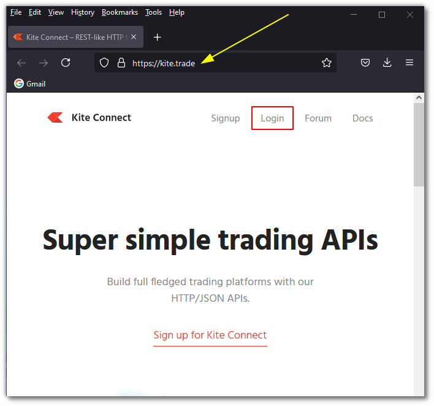 ](imgs/zerodha/visit.png)

* Enter your EMail ID and Password. Click the `Login` button

[ 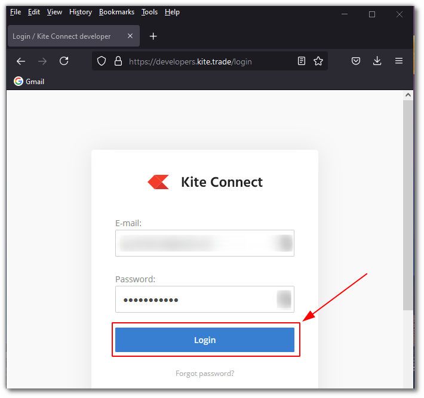 ](imgs/zerodha/login_app.png)

* Click the `Create new app` button

[ 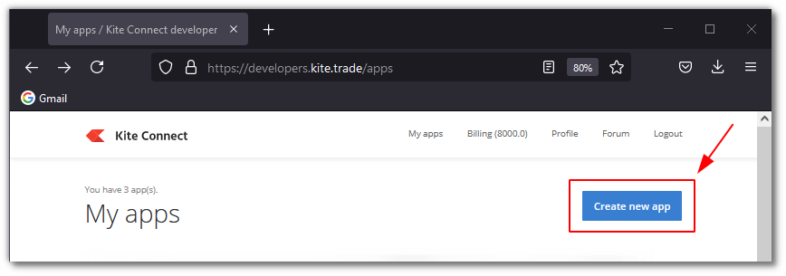 ](imgs/zerodha/create_app_button.png)

* On the `Create a new app` page, fill the following fields:

    * Type: Select `Connect`
    * App name: Give the app name. Example: AlgoBulls Login
    * Zerodha CLient ID: Give your Zerodha User ID
    * Redirect URL: Give the value `https://127.0.0.1`
    * Description: Give the description. Example: App for AlgoBulls Login
    
* Click the `Create` button

[ 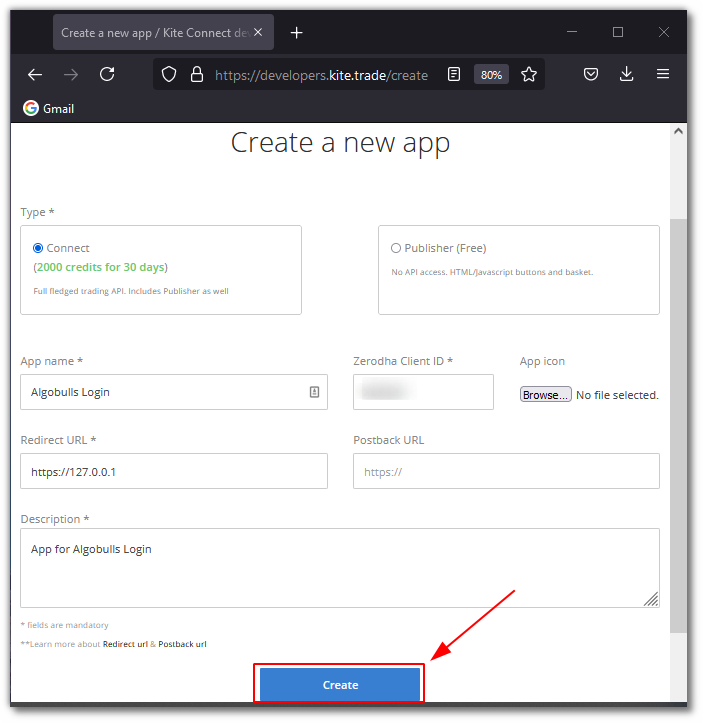 ](imgs/zerodha/create_app.png)
    
!!! Note
    * Make payment once redirected to the payment gateway and then continue the below steps
    * This API subscription has to be renewed periodically (monthly)

* Now click on the newly created app name

[  ](imgs/zerodha/click_here.png)

* Copy the API key and save it separately for later use. Click on `Show API secret` and copy it too

[ 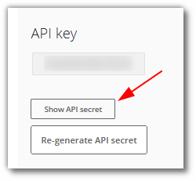 ](imgs/zerodha/show_api_secret.png)

* Use the API key and API secret to create a new Redirect URL in the following format:
```html
https://app.algobulls.com/loading?st=zerodha&k=<userapikey>&s=<userapisecret>
```
  
    Example: If the API key is uS3r@piKey and the API secret is uS3r@pis3cr3t, then the redirect URL will be:
```html
https://app.algobulls.com/loading?st=zerodha&k=uS3r@piKey&s=uS3r@pis3cr3t
```

* Paste the newly created Redirect URL in the `Redirect URL` field and click the `Save` button

[ 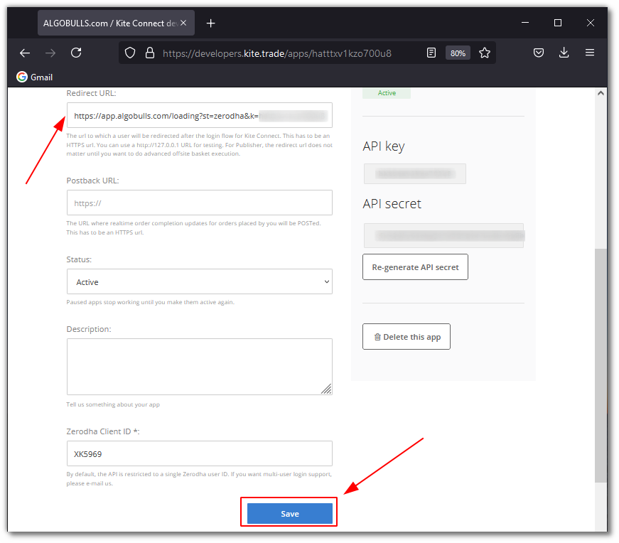 ](imgs/zerodha/change_redirect_url.png)

### Daily Activity (Login)
---

!!! Note
    * Perform the following steps at the start of every trading day

* Visit the AlgoBulls [Login Page](https://app.algobulls.com/user/login) and click on `Sign In with your Broking Account`

[ 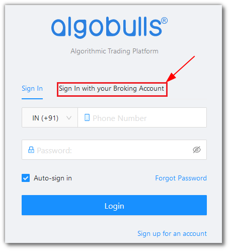 ](imgs/siwyba.png)

(1). Type the first few characters of your Broker Name

(2). Select the `ZERODHA OAuth` broker

(3). Click on the `Login with ZERODHA` button

[ 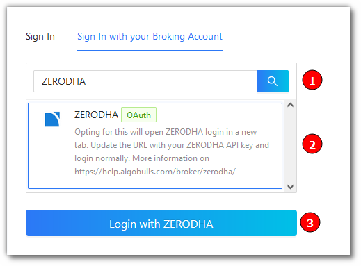 ](imgs/zerodha/zerodha_oauth.png)

Now paste your saved API key in the URL

Example: If the API key is uS3r@piKey and the URL is:

```html
https://kite.zerodha.com/connect/login?api_key=pleaseenteryourapikey
```

[ 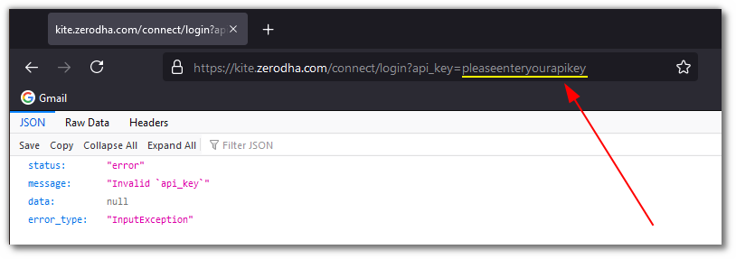 ](imgs/zerodha/zerodha_oauth_2.png)

then the new URL will be:

```html
https://kite.zerodha.com/connect/login?api_key=uS3r@piKey
```

[ 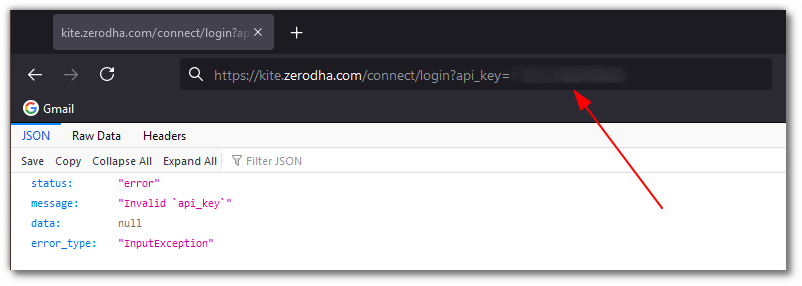 ](imgs/zerodha/zerodha_oauth_3.png)

Press Enter after modifying the URL with your API key

Now provide data for the following fields:

(4). User ID: The ID given to you by your broker

(5). Password: The password given to you by the broker

(6). Click `Login` button

[ 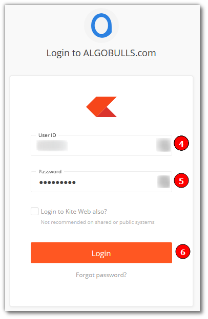 ](imgs/zerodha/zerodha_oauth_4.png)

(7). PIN: The PIN given to you by the broker

(8). Click `Continue` button

[ 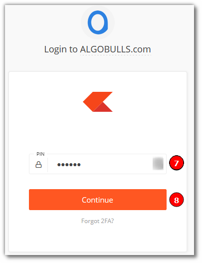 ](imgs/zerodha/zerodha_oauth_5.png)

!!! Note

* If you are facing issues with login, try the following steps:

    * Open a new tab

    * Visit [https://kite.zerodha.com/](https://kite.zerodha.com/)

    * Login with your credentials

    * Logout

    * Close the tab

    * Perform steps (1). to (8). again

## Bind your Broking Account
---
The following steps will help you to make sure you have binded your broker account

* Visit the AlgoBulls [Broker Settings Page](https://app.algobulls.com/account/broking)

* Bind your account using the Toggle button marked below

[ 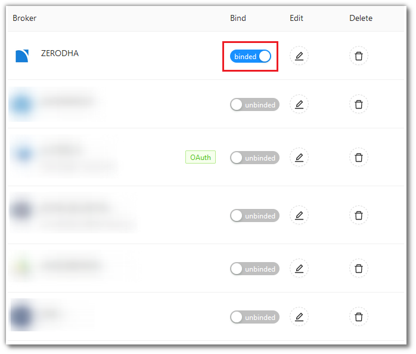 ](imgs/zerodha/zerodha_binded.png)

## Important Points to Note
---
* It is required to login **once** daily (at the start of the trading day) using the steps given in the [Daily Activity](#daily-activity-login) section

## Support
---
For Help and Support, contact us on +91 80692 30300 or [email us](mailto:support@algobulls.com).
