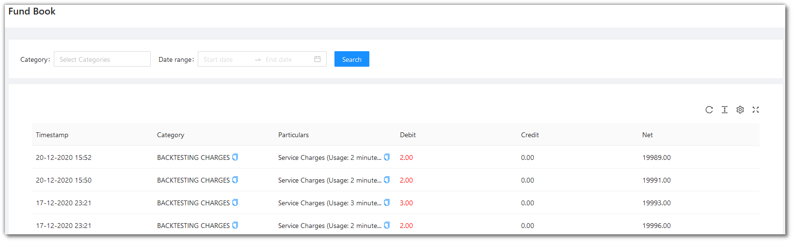
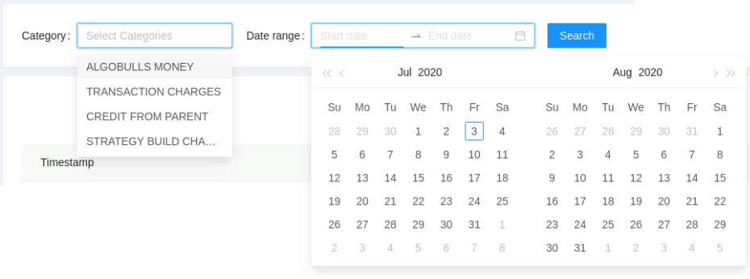

# Fundbook

<iframe width="560" height="315" src="https://www.youtube.com/embed/y7ry8Bmz8QM" frameborder="0" allow="accelerometer; autoplay; encrypted-media; gyroscope; picture-in-picture" allowfullscreen></iframe>

This page shows all the charges that your account has been charged against. The page shows your most recent charges, followed by older ones down the line. To get a better understanding, you can filter your transactions by category, and/or check your transactions within a date range.

## Filters
---
The following list gives a short brief about each field.

`Table Fields` - The table covers the following fields: Timestamp, Category, Particulars, Debit, Credit, Net.

`Filters` - Choose one or more filters to display those particular categories. Choose among the options shown below.

* `Category` - You can filter along 4 categories, AlgoBulls Money, Transaction Charges, Credit from Parent and Strategy Build Charges.

* `Start/End Date` - Give the date range to view the table for the selected category (if any)

## Fields
---
The table covers the following fields:

* `Timestamp` - Time of Transaction.
* `Category` - Nature of  Transaction.
* `Particulars` - Details of Transaction (No. of minutes usage)
* `Debit` -  Amount Debited on the date of transaction.
* `Credit` - Amount Credited on the date of transaction.
* `Net` - Net Debit or Credit as on date.

## A look at the toolbar
---

`Density` - Choose the density of the data you see. Options are Larger, Middle and Compact

`Full Screen` - The current tab on your browser goes Full Screen. Click again to go back to normal. This is similar to pressing F11 on most browsers and operating systems.

`Refresh` - If you are not able to see an entry (possibly a most recent one) in the table, click Refresh to check again. 

`Settings` - You can select which columns should be visible through here. 

