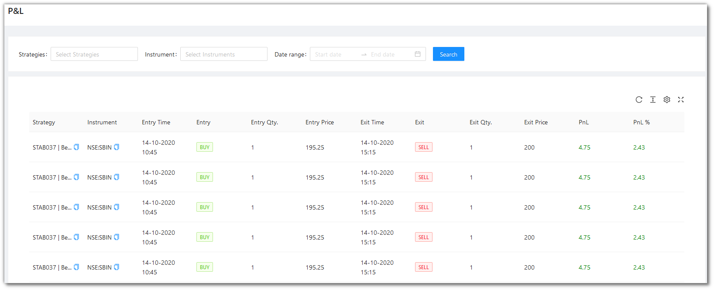
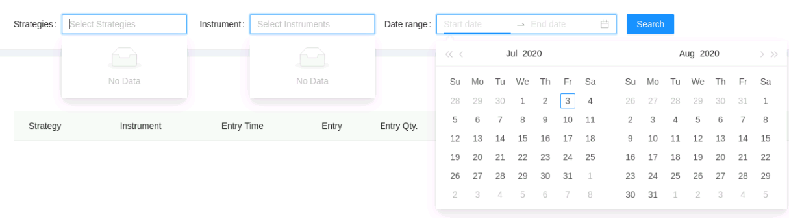

# P & L (Beta)

<iframe width="560" height="315" src="https://www.youtube.com/embed/y7ry8Bmz8QM" frameborder="0" allow="accelerometer; autoplay; encrypted-media; gyroscope; picture-in-picture" allowfullscreen></iframe>

This page shows the Profit and Loss of your trades in your account. All trades/orders in your account are updated real-time as and when the transactions take place. To get a better understanding, you can filter your activities using the filters, strategy, instrument and date range.

## Filters
---
Filters  will allow you to selectively search for a particular entry or entries. 

* `Strategies` - Choose one or more strategies to display them in the table below.
These entries are populated as per the strategies opted/created by you.

* `Instrument` - Choose one or more instruments to display them in the table below.
These entries are populated as per the instruments on which your strategies are fired on.

* `Date Range` - Give the date range to view the table for the selected strategy and instrument (if any)

## Fields
---
The table covers the following fields:
 
* `Strategy` - Name of the Strategy.
* `Instrument` - Instrument on which the backtesting was run.
* `Entry Time` - Entry Time of Trade.
* `Entry` - Entry Type of Trade.
* `Entry Qty.` - Entry Quantity of Trade.
* `Entry Price` - Entry Price of Trade.
* `Exit Time` - Exit Time of Trade.
* `Exit` - Exit Type of Trade.
* `Exit Qty.` - Exit Quantity of Trade.
* `Exit Price` - Exit Price of Trade.
* `PnL` - Pnl of the Trade.
* `PnL %` - Pnl % of the Trade.

## A look at the toolbar
---

`Density` - Choose the density of the data you see. Options are Larger, Middle and Compact

`Full Screen` - The current tab on your browser goes Full Screen. Click again to go back to normal. This is similar to pressing F11 on most browsers and operating systems.

`Refresh` - If you are not able to see an entry (possibly a most recent one) in the table, click Refresh to check again. 

`Settings` - You can select which columns should be visible through here. 

---

Tip: Press the Bell icon to see your most recent activities/events.