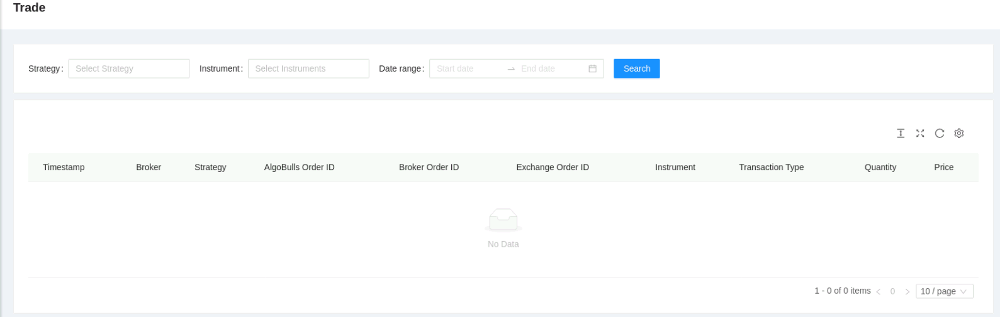
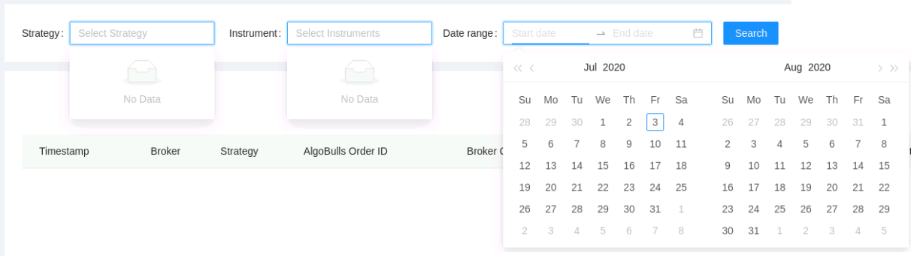
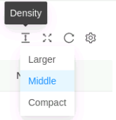
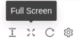
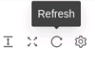

# Tradebook

<iframe width="560" height="315" src="https://www.youtube.com/embed/y7ry8Bmz8QM" frameborder="0" allow="accelerometer; autoplay; encrypted-media; gyroscope; picture-in-picture" allowfullscreen></iframe>

This page shows all the activities done by your strategies in your account. All strategies fire and currently running in your account are updated real-time as and when the transactions take place. To get a better understanding, you can filter your activities using the filters, strategy, instrument and date range.

## Filters
The following list gives a short brief about each field.

`Table Fields` - The table covers the following fields: Timestamp, Broker, Strategy, AlgoBulls Order ID, Broker Order ID, Instrument, Transaction Type, Quantity, Price.

`Filters` - Choose one or more filters to display those activities in the table below.

* `Strategy` - Choose one or more strategies to display them in the table below.
These entries are populated as per the strategies opted/created by you.

* `Instrument` - Choose one or more instruments to display them in the table below.
These entries are populated as per the instruments on which your strategies are fired on. An example is shown below.

* `Start/End Date` - Give the date range to view the table for the selected strategy and instrument (if any)

## Fields
---
The table covers the following fields:

* `Timestamp` - Execution time of trade.
* `Broker` - Broker with whom the trade was executed.
* `Strategy` - Name of strategy that placed the trade.
* `AlgoBulls Order ID` - Unique AlgoBulls order ID. This helps in mapping correct entry/exit orders.
* `Broker Order ID` - Unique Broker order ID. This helps in mapping correct entry/exit orders.
* `Instrument` - Instrument on which the strategy is being run.
* `Transaction Type` - Transaction type of trade. For eg: Buy or Sell.
* `Quantity` - Quantity of the trade.
* `Price` - Price of trade.

## A look at the toolbar
---

`Density` - Choose the density of the data you see. Options are Larger, Middle and Compact

`Full Screen` - The current tab on your browser goes Full Screen. Click again to go back to normal. This is similar to pressing F11 on most browsers and operating systems.

`Refresh` - If you are not able to see an entry (possibly a most recent one) in the table, click Refresh to check again. 

`Settings` - You can select which columns should be visible through here. 

---

Tip: Press the Bell icon to see your most recent activities/events.