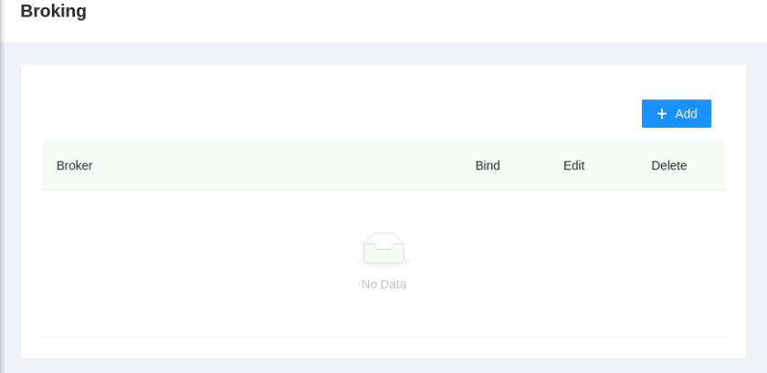
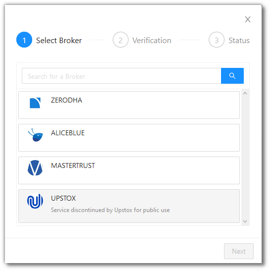
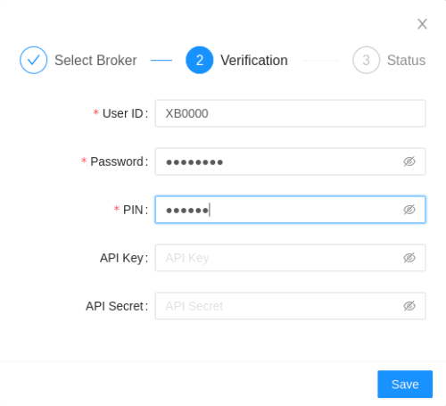
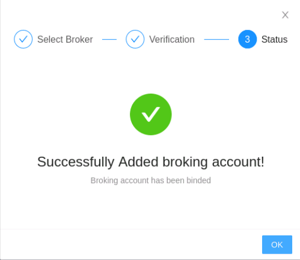
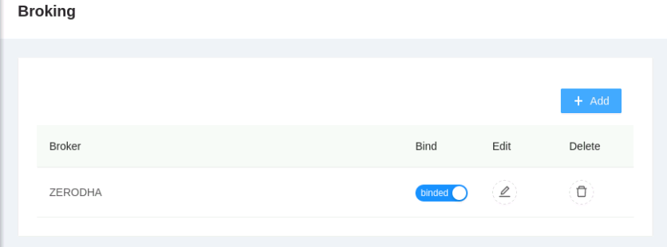
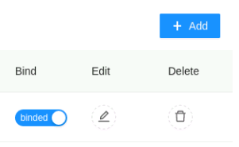

# Broking Account Settings

<iframe width="560" height="315" src="https://www.youtube.com/embed/fYeZjPn3jUY" frameborder="0" allow="accelerometer; autoplay; encrypted-media; gyroscope; picture-in-picture" allowfullscreen></iframe>

This page allows you to add a broker of your choice. Simply give the broker details, and then your strategy can be fired in connection with that broker. This gives you a great way to have complete control over your broking account, and the transactions that happen with it. 

Different broking accounts need different details, and this page helps you to supply those details according to the broking account of your choice!

!!! note
    Only one broker account can be bound to the platform account at any given time. The AlgoBulls platform account will use the binded broker account to fire your trades.

We consider 1 example below:

* Zerodha

## Add a Broker
---
Click on the Add button to add a new broker account.

Select a broker of your choice. For our example, we select Zerodha.

Fill the required fields. (Fields marked with asterisk are required)

## Fields
---
The following list gives a short brief about each field.

`User ID` - Give the user id for the selected broker.

`Password` - Your password for the user id given above.

`PIN` - The PIN provided by your broker (or the one that you have set in your broking account)

`API Key` - The key provided by your broker for electronic connection by the AlgoBulls platform.

`API Secret` - The secret (think of this as a password for the API Key given above) provided by your broker for electronic connection by the AlgoBulls platform.

!!! note
    You need an existing working account with the selected broker.

Click on Save. If all fields are correct, your action is successful.

You should see your broker added and binded.

## Edit Existing Broker Details
---

Click on Edit to edit the details of an existing broker.

Edit the details as required and then click on Save.

!!! warning
    A binded broker cannot be edited. Remove the bind by clicking on the toggle switch and then proceed to edit the broker.

## Delete a Broker
---
Deleting a broker will ask you for confirmation, and will delete the broker details if you click Yes.

!!! warning
    A binded broker cannot be deleted. Remove the bind by clicking on the toggle switch and then proceed to delete the broker.
    

!!! note

    Any one broker at a given time can be binded. Binding a broker will automatically remove the bind of any other broker, if the current binded broker is not being used by the platform.
    
    If no broker is present, all trading will be stopped.
    
    If no broker is binded, all trading will be stopped.
    
    If a broker is binded but the platform trading limit has matched the funds in your broker account, all trading will be stopped.

---

Note: Sensitive details like your broker Password and PIN are safe with us owing to our industry standard encryption algorithms used for storing data.