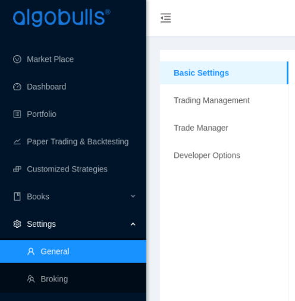
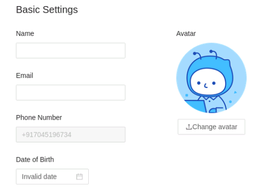
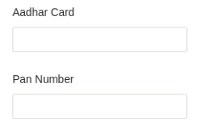
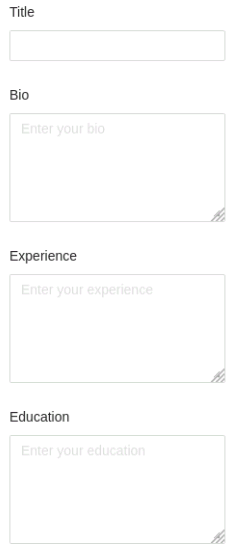
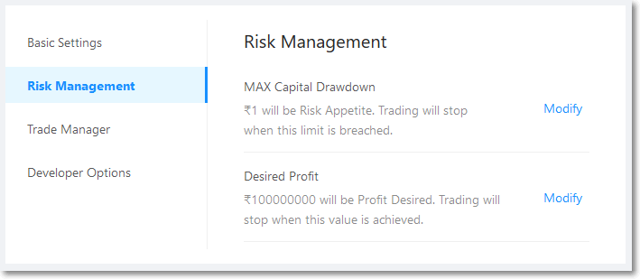
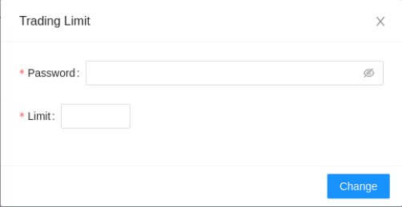
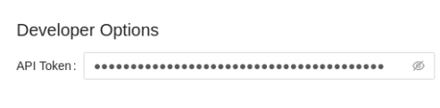

# Settings

<iframe width="560" height="315" src="https://www.youtube.com/embed/fYeZjPn3jUY" frameborder="0" allow="accelerometer; autoplay; encrypted-media; gyroscope; picture-in-picture" allowfullscreen></iframe>

Set up your basic profile, update your KYC details, set your trading risk, give access to your trading manager, and check out your developer options here. 

## Basic Settings
---
The following list gives a short brief about each field.

`Name` - Your Name. Preferably, as per a legal document, like an Aadhar Card.

`Avatar` - Clicking 'Change Avatar' button  will help you to add/change your profile picture. 

`E-mail` - Your relationship manager or an AlgoBulls representative will contact you over email/phone. 

`Phone Number` - This will display the phone number you have signed up with. This field cannot be changed.

`Date of Birth` - Set up your date of birth.

`Aadhar Card` - Your Aadhar ID number. This is required as per the governmental regulations for trading online.

`PAN Number` - Your PAN Card number. This is required as per the governmental regulations for trading online.

`Title` - A suitable one liner description for your bio.

`Bio` - A quick "About Me" that helps us to know more about you to interact with you suitably. Any links to your LinkedIn or other social media is also useful.

`Experience` - Our experts can interact with you better over phone/email if we know the extent of your market knowledge.

`Education` - Our experts can interact with you better over phone/email if we know whether you have some prior financial background. (like Commerce, MBA Finance, etc.)

!!! warning
    Uploading incorrect KYC details (Aadhar / PAN) will lead to de-activation of your account. Please contact your relationship manager or [email us]() to get your account re-activated.
    
    Any packages or payments done to the AlgoBulls platform will continue during you account's deactivated period and cannot be redeemed or extended. 

[//]: <> (## Risk Management)
[//]: <> (---)

[//]: <> ()

[//]: <> (Both the values `MAX Capital Drawdown` and `Desired Profit` should be filled. Click on `Modify` on each field to enter your values.)

[//]: <> (!!! Note)
[//]: <> (    Real Trading will not start in your account, if both the Risk Management fields are left empty.) 

[//]: <> (!!! Important)
[//]: <> (    Once your risk amount entered here matches or is already less than the amount in your broking account, all trading on the AlgoBulls platfrom will automatically stop.)

## Trade Manager
---
If you AlgoBulls platform account is going to be handled by your agent, enter the details here.

!!! important
    Please do not share your AlgoBulls credentials with your agent. Once you add your agent details here, the agent gets a separate set of credentials with limited account access to manage your trades.
    
    AlgoBulls will not be responsible for any issues occurring because of deliberate or leaked credentials of your account.
    
## Developer Options
---
We offer various services to developers through our platform.

We provide:
* Notification service through SMS and Email
* Web Socket Service API for connecting with brokers

To learn more, visit the [Developer Options](../../../developers.md) Help page.

[Email us](mailto:support@algobulls.com) to know more! 
