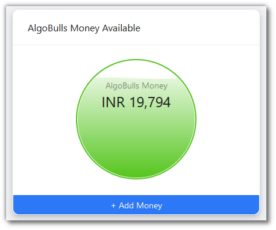
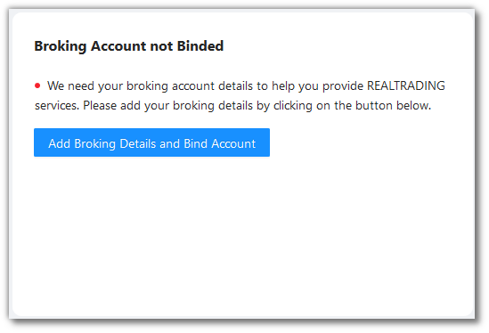
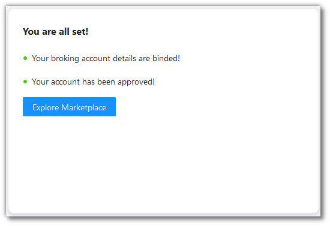
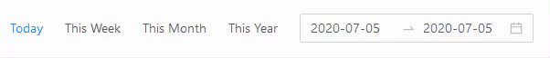
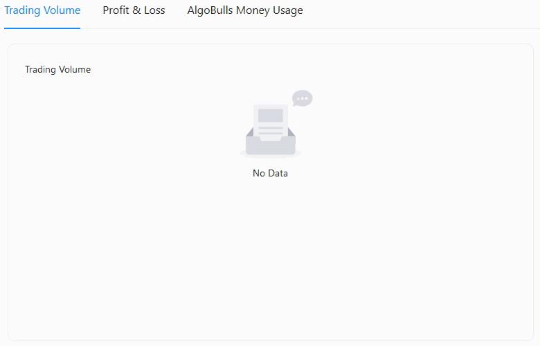
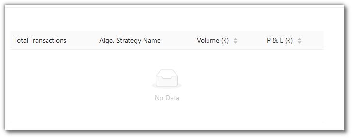

# Dashboard

<iframe width="560" height="315" src="https://www.youtube.com/embed/J9msKNweQvI" frameborder="0" allow="accelerometer; autoplay; encrypted-media; gyroscope; picture-in-picture" allowfullscreen></iframe>

This page gives an overview of your account and trades.

## AlgoBulls Money
---
Click `+ Add Money` to add funds into your AlgoBulls wallet.

## Broker Details and Binding
---
Click `Add Broking Details and Bind Account` to bind a broker account to the AlgoBulls platform.

Before binding an account, you will see this.

After binding an account, you will see this.

## Action Bar
---
The Action Bar gives the following information:
 
 * `Capital Risk Set` - Redirects to Risk Management where user can define the risk appetite. The strategy stops once this amount is breached.
 * `Portfolio Strategy Added` - Redirect to Portfolio (Real Trading) module which is your complete overview of strategies availed by you.
 * `Real Trading (Started/Stopped)` - Redirects to Portfolio (Real Trading) module which is your complete overview of strategies availed by you. You can start/stop strategy from here.
 * `Backtesting Strategy Added` - Redirects to Backtesting module which is your complete overview of backtesting and real trading strategies availed by you. You can start/stop backtesting/paper trading from here.

## Algo Strategy & Transaction Status
---
You can see Strategy & Transaction Status for today, this week, this month, this year or any custom date range of your choosing.

As per the range chosen by you, the following data is reflected and updated as a graph:
 
* `Trading Volume` - Value traded for the defined period (Daily, Weekly, Monthly, Annual and Custom) across strategies.
* `Profit & Loss` - Total Profit/Loss earned during the defined period (Daily, Weekly, Monthly, Annual and Custom)  across strategies.
* `AlgoBulls Money Usage` - AlgoBulls Money used during the defined period (Daily, Weekly, Monthly, Annual and Custom) across strategies.

As per the range chosen by you, the following data is reflected and updated as a table: 

* `Total Transactions` - No of trades per strategy over the defined period (Daily, Weekly, Monthly, Annual and Custom).
* `Algo. Strategy Name` - Name of the strategy.
* `Volume (₹)` -  Volume per strategy over the defined period (Daily, Weekly, Monthly, Annual and Custom).
* `P & L (₹)` - P&L per strategy over the defined period (Daily, Weekly, Monthly, Annual and Custom).

