# Marketplace

<iframe width="560" height="315" src="https://www.youtube.com/embed/KpnncgSfKXY" frameborder="0" allow="accelerometer; autoplay; encrypted-media; gyroscope; picture-in-picture" allowfullscreen></iframe>

This is the AlgoBulls Platform Marketplace for strategies.

[ 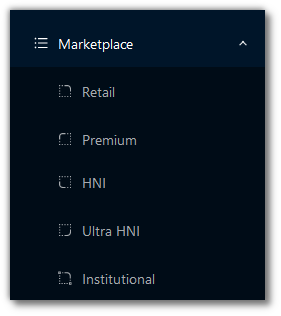 ](imgs/mktplace_types.png)

The Marketplace is divided into the following categories:

* Retail - This marketplace is for traders having little to no experience in algorithmic trading

* Premium - This marketplace consists of options strategies for high risk individuals

* HNI - This marketplace is for High Networth Individuals

* Ultra HNI - This marketplace is for High Networth Individuals having more capital than HNI

* Institutional - This marketplace is for institutions and broking houses

Before adding any strategy to your Portfolio, you can search for strategies here, look into the details for each strategy, and view the backtesting reports to evaluate the performance. 

[ 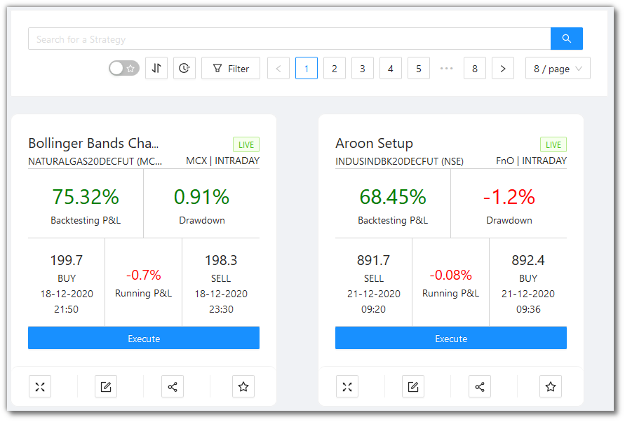 ](imgs/screenshots/mkt1.png)

## Searching for a Strategy
---

<iframe width="560" height="315" src="https://www.youtube.com/embed/VQCWEm4gJHg" frameborder="0" allow="accelerometer; autoplay; encrypted-media; gyroscope; picture-in-picture" allowfullscreen></iframe>

[ 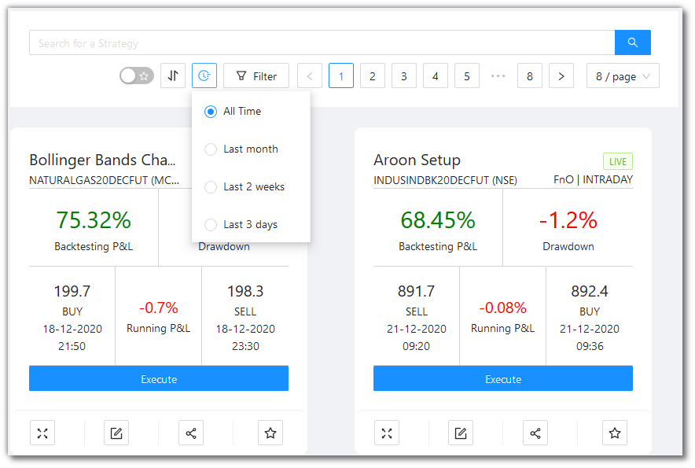 ](imgs/screenshots/search_filter.png)

`Search Bar` - You can type your keywords here.

`Favorites` Toggle - Toggle the switch to see the strategies marked as Favorite (☆)

`Time` - Search for strategies added to the marketplace in the last month, last 3 days, last 2 weeks, or all time. 

`Filter` - You can filter your view as per the following categories shown.

[ 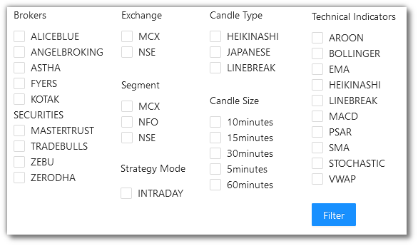 ](imgs/mkt_filter.png)

`Sort By` - You can sort the strategies into the following:

* Backtest P&L ↑ ↓
* Drawdown ↑ ↓ 
* Transaction Charges ↑ ↓
* Most Recent Transactions ↑ ↓

[ 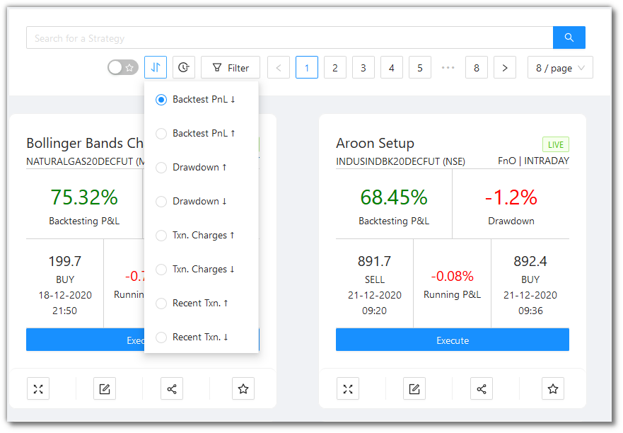 ](imgs/screenshots/search_sort.png)

`Pagination` - You can click the < and > for changing pages. You can also choose to view 6/8/10 strategies per page.

[ 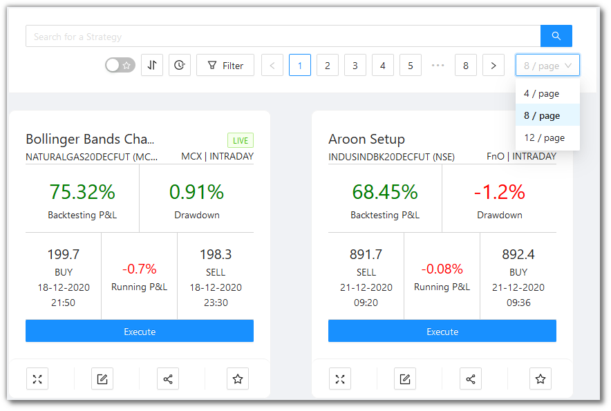 ](imgs/screenshots/search_pagination.png)

## What does a Strategy Card look like
---

<iframe width="560" height="315" src="https://www.youtube.com/embed/jlAmzId6Z6k" frameborder="0" allow="accelerometer; autoplay; encrypted-media; gyroscope; picture-in-picture" allowfullscreen></iframe>

[//]: <> ([ 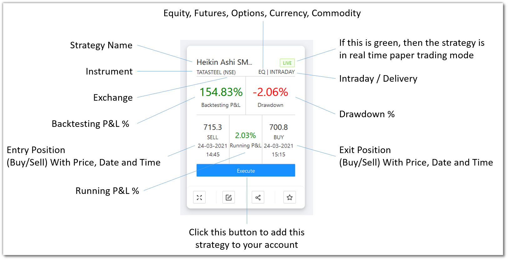 ](imgs/strategy_card_details.png))

The `Execute` button adds the strategy to your [Portfolio](portfolio.md) (Real Trading).

You can further add this strategy to Backtesting and Papertrading using the [Manage Strategies](custom-strategies.md) menu from the Navigation bar.  

## A look at the toolbar
---

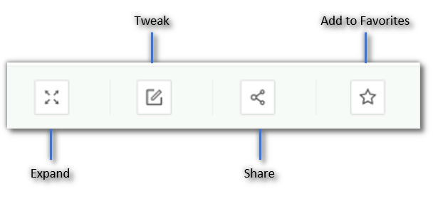

`Expand` - You see a detailed and expanded view of a strategy when you click on the card or click this button. The effect is the same when you click on a Strategy Card.

`Tweak` - Click this button to tweak the parameters of a strategy. This is what happens when you click the `Tweak` button:

* The strategy gets added to your account
* You are re-directed to the [Paper Trading & Backtesting](paperback.md) page
* Click on `Tweak` on the newly added strategy on this page

`Share` - Click this button to get a shareable link for a strategy. You will see this message:

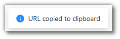

`Add to Favorites` - Click this button to add this strategy to Favorites for easy viewing later.

## When you click on a Strategy Card
---

Clicking on a Strategy Card will give you a detailed and expanded view of the strategy.

[ 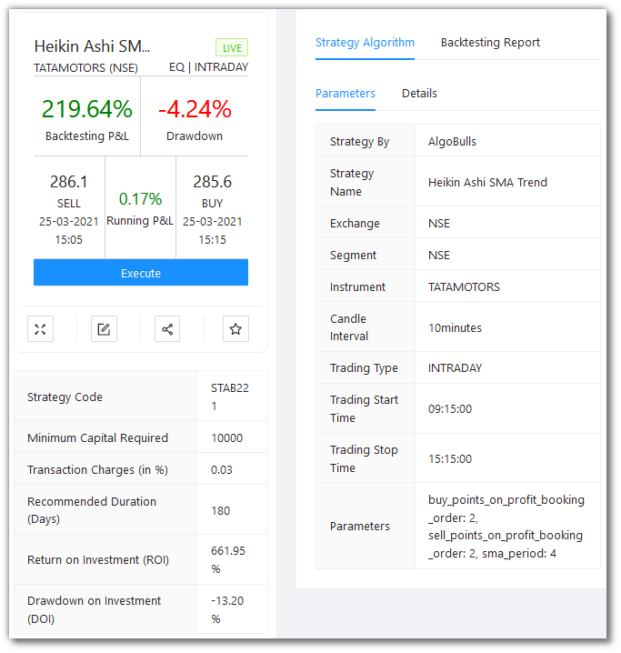 ](imgs/strategy_card_click.png)

### The LHS of the Expanded View for a Strategy Card
---
The Left-hand Side of the expanded view shows the same details and the toolbar as the marketplace.

[ 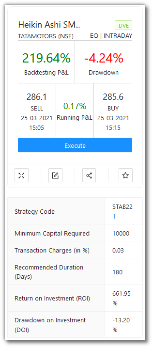 ](imgs/strategy_card_click_lhs.png)

In addition to that, the following details are visible:

 * `Strategy Code` - A unique identification code assigned to each strategy. You can search the strategy directly with the code.

 * `Minimum Capital Required` - Approximate margin as required by the brokers to buy or sell the instrument, this normally keeps fluctuating hence a max value is considered compared among the partnered brokers.

 * `Transaction Charges (in %)` - Indicative transaction charges strategy is expected to incur per trade.

 * `Recommended Duration (Days)` - Duration over which the strategy is expected to generate positive returns.

[//]: # ( * `Return on Investment` - Cumulative P&L absolute value divided by Minimum Capital Required, ROI indicates a simulated yet accurate representation of return on capital employed. )

 * `Drawdown on Investment` - Max DD absolute value divided by Minimum Capital Required, DDOI indicates a simulated yet accurate representation of drawdown on capital employed. 
 
### The RHS of the Expanded View for a Strategy Card
---

The Right-hand Side of the expanded view has 2 tabs:
 
 * `Strategy Algorithm` - Gives an overview of functioning of the strategy. You will find key parameters and entire logic of how the strategy is designed and works.

 * `Backtesting Report` - Backtesting is very crucial before making trading any strategy live. You get the entire trade summary of how the strategy has performed over backtesting period along with various key data points such as Net P/L (Rs & %), No of profitable trades, Hit Ratio, etc.

#### Strategy Algorithm
---
`Strategy Algorithm` has 2 tabs:
 
 [ 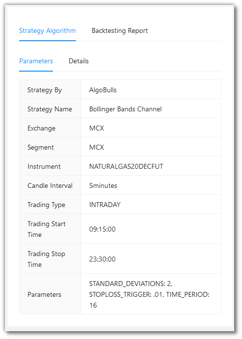 ](imgs/screenshots/sap.png)
 
 * `Parameters` - These are all the parameters used by the strategy. 
    * `Strategy By` - Creator of the strategy.
    * `Strategy Name` - Name of the strategy.
    * `Exchange` - Exchange where the strategy is expected to trade on. This depends on the instrument the strategy being executed on such as NSE, NFO and MCX for Indian markets.
    * `Segment` - Segments where the strategy is expected to trade on. This depends on the exchange the strategy being executed on such as NSE, NFO and MCX for Indian markets.
    * `Instrument` - Instrument on which the trading will be performed.
    * `Candle Interval` - Candle Interval in which the strategy will be performed. 1 Min, 3 Mins, 5 Mins, 15 Mins and 30 Mins are some of the candle types which can be used to generate signals.
    * `Trading Type` - States the trading type on which strategy will be performed. Intraday and Delivery are two modes supported by the platform. Transaction charges differ for both the trading types.
    * `Trading Start Time` - Start time of the strategy. A user can define the timings according to their own requirements by tweaking the strategy parameters.
    * `Trading Stop Time` - Stop time of the strategy. A user can define the timings according to their own requirements by tweaking the strategy parameters.
    * `Parameters` - Key parameters of the strategy. This differs from strategy-to-strategy based on the logic. Example: Fast MA Period, Slow MA Period, Signal Period etc.

[ 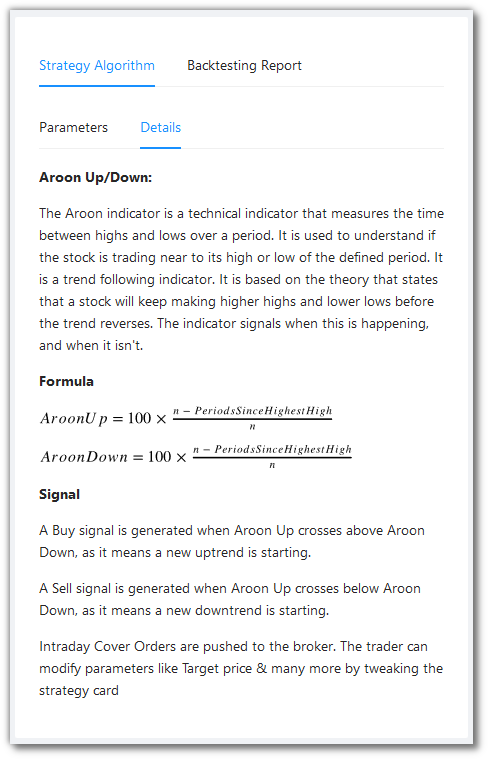 ](imgs/screenshots/sad.png)

 * `Details` - This gives a description of how the strategy works. It includes - strategy details and working, indicators used, formulae, signal generation conditions, etc.

#### Backtesting Report
---
`Backtesting Report` has 4 tabs:
 
[ 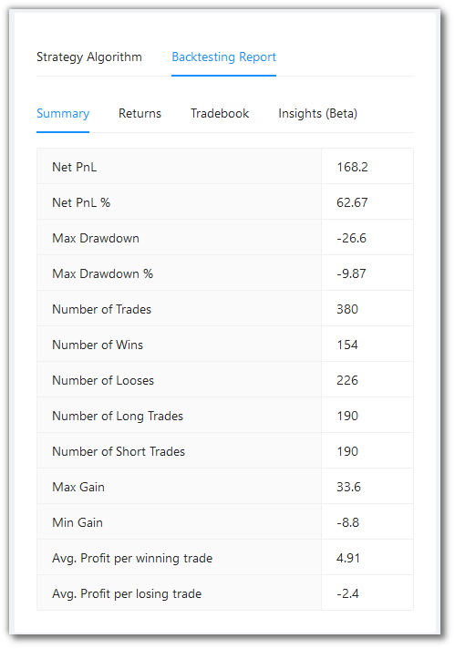 ](imgs/screenshots/brs.png)

 * `Summary` - Summary statistics of the strategy backtesting performed.
    * `Net P&L` - The cumulative backtesting P&L.
    * `Net P&L %` - The cumulative backtesting P&L percentage.
    * `Max Drawdown` - The maximum loss your strategy has encountered during the execution.
    * `Max Drawdown %` - The maximum loss your strategy has encountered during the execution in percentage.
    * `Number of Trades` - Total trades (entry and exit counted as one) during the session.
    * `Number of Wins` - Count of trades where the trade P&L was non-negative.
    * `Number of Losses` - Count of trades where the trade P&L was negative.
    * `Number of Long Trades` - Count of trades where the entry transaction type was 'BUY'.
    * `Number of Short Trades` - Count of trades where the entry transaction type was 'SELL'.
    * `Max Gain` - P&L of the trade with the maximum P&L value among all trades.
    * `Min Gain` - P&L of the trade with the minimum P&L value among all trades.
    * `Avg. Profit per winning trade` - Cumulative Profit for winning trades divided by No. of Wins.
    * `Avg. Profit per losing trade` - Cumulative Loss for winning trades divided by No. of Losses.

!!! Note
    See the [Formulae](#formulae) section below to know more about the Summary Fields.
    
[ 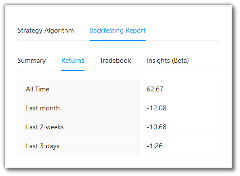 ](imgs/screenshots/brr.png) 
    
 * `Returns` - Shows the returns given by the strategy over a period of time.
    * `All Time` -Returns during the entire backtesting period.
    * `Last month` - Returns during last 1 month.
    * `Last 2 weeks` - Returns during last 2 weeks. 
    * `Last 3 days` - Returns during last 3 days.

[ 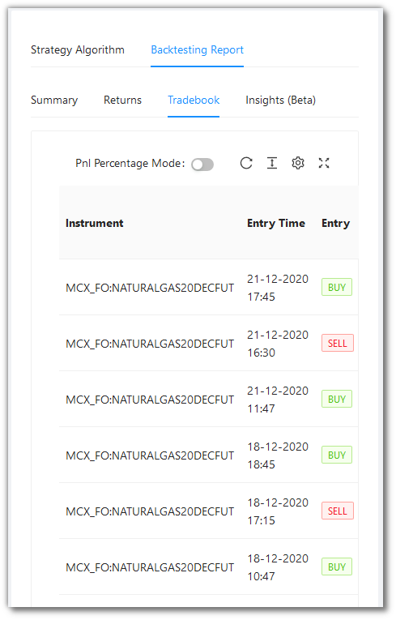 ](imgs/screenshots/brt.png)

 * `Tradebook` - Entire trade book for the backtesting period.
    * `Instrument` - Instrument strategy being performed on.
    * `Entry Time` - Entry time of trade.	
    * `Entry` -	Entry trade type such as Buy/Sell
    * `Entry Qty.` - Quantity traded	
    * `Entry Price` - Price at which entry trade was executed	
    * `Exit Time` -	Exit time of trade.
    * `Exit` - Exit trade type such as Buy/Sell	
    * `Exit Qty.` -	Quantity traded. This depends on the number of profit booking trades embedded in the strategy logic.
    * `Exit Price` - Price at which exit trade was executed.	
    * `P&L (Rs.) / P&L %` -	P&L amount and P&L % of each trade.
    * `P&L Cum. (Rs.) / P&L Cum. %` - Cumulative P&L amount and Cumulative P&L % of each trade.
 * `Insights (Beta)` - Graphical representation of trading results over the backtesting period. X-Axis is the daily time series of the backtesting period and Y-Axis is the amount and percentage depending upon the data.
    * `P&L Absolute (Rs.)` - Absolute P&L in Rs./INR.
    * `P&L %` - Absolute P&L in %.
    * `P&L Cumulative Absolute (Rs.)` - Absolute Cumulative P&L in Rs./INR
    * `P&L Cumulative %` - Absolute Cumulative P&L in %.

## Formulae
---

* Net P&L: The cumulative backtesting P&L. This is the sum of all the Absolute P&L values of the previous trades.
  
      `p&l_absolute = (exit_price - entry_price) x exit_quantity` for a long trade

      `p&l_absolute = (entry_price - exit_price) x exit_quantity` for a short trade

* Max DD.:

      `Max DD. = minimum of ( ((Equity Curve) / (Max. Equity Curve)  - 1) x 100 )`

[//]: # (* ROI:)

[//]: # ()
[//]: # (      `ROI =  &#40;P&L Cumulative&#41; / &#40;Minimum Capital Required&#41; x 100`)

* Equity Curve:

      `Equity Curve = (Minimum Capital Required) + (P&L Cumulative)`

* Max Drawdown %: The maximum loss your strategy has encountered during the execution in percentage.
  
      `max_drowdown_percentage = (Max Drawdown) / (corresponding entry_price) // exit _ quantity x 100`

* Avg. Profit per winning trade: Cumulative Profit for winning trades divided by No. of Wins.
  
      `avg_profit_per_winning_trade = (Total P&L of winning trades) / (Count of winning trades)`

* Avg. Profit per losing trade: Cumulative Loss for winning trades divided by No. of Losses.
  
      `avg_profit_per_losing_trade = (Total P&L of losing trades) / (Count of losing trades)`
