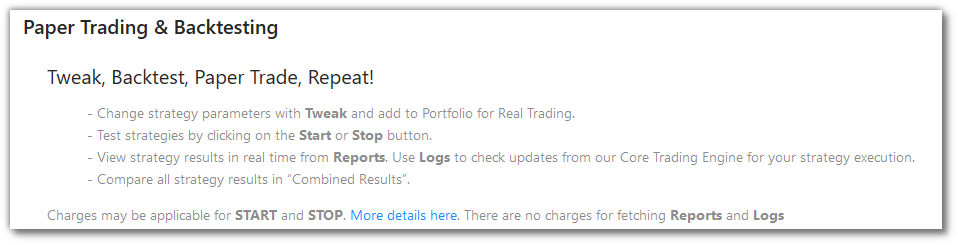
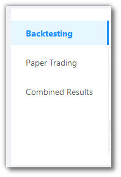
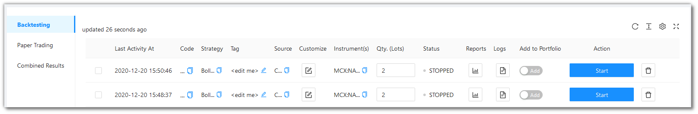
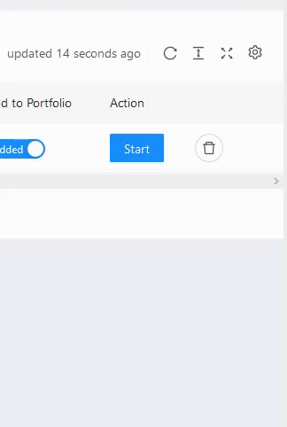
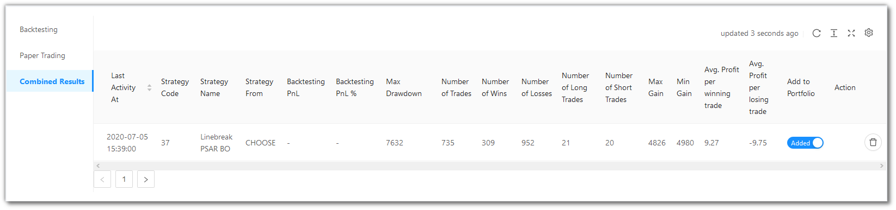

# Paper Trading and Backtesting

<iframe width="560" height="315" src="https://www.youtube.com/embed/wc0h930E1AU" frameborder="0" allow="accelerometer; autoplay; encrypted-media; gyroscope; picture-in-picture" allowfullscreen></iframe>

You can view and manage all your strategies of Paper Trading and Backtesting here.

There are 3 menu options here - `Backtesting`, `Paper Trading` and `Combined Results`.

## Table Fields for Backtesting and Paper Trading
---
The table covers the following fields:

* `Last Activity At` - Shows last time the strategy was run.
* `Code` - Code of the Strategy.
* `Strategy` - Name of the Strategy
* `Tag` - User defined tag for the strategy. User can tag different strategies under different tags from Tweak.
* `Source` - Type of the Strategy viz. Build, Tweak or Develop.
* `Customize` - Tweak you strategy from here.
* `Instrument(s)` - Instrument on which the strategy is being run.
* `Qty. (Lots)` - Quantity/Lots being traded.
* `Status` - States the Status of the strategy if it is Started or Stopped.
* `Reports` - The Report for a particular strategy consists of the `Summary` and the `P&L Table`. Jump to the [`Reports`](#reports) topic for a complete description.
* `Logs` - You can access the logs from here.  Jump to the [`Logs`](#logs) topic for a complete description.
* `Add to Portfolio` - Adds strategy to Portfolio.
* `Action` - Option to whether Start or Stop the Strategy.

## A look at the Backtesting/Paper Trading/Combined Results toolbar
---

`Refresh` - If you are not able to see an entry (possibly a most recent one) in the table, click Refresh to check again.

`Density` - Choose the density of the data you see. Options are Larger, Middle and Compact

`Full Screen` - The current tab on your browser goes Full Screen. Click again to go back to normal. This is similar to pressing F11 on most browsers and operating systems.

`Settings` - You can select which columns should be visible through here. 

## Combined Results Fields
---
The table covers the following fields: 

* `Last Activity At` - Shows last time the strategy was run.
* `Code` - Code of the Strategy.
* `Strategy` - Name of the Strategy.
* `Tag` - User defined tag for the strategy. User can tag different strategies under different tags from Tweak.
* `Source` - Type of the Strategy viz. Build, Tweak or Develop.
* `Backtesting PnL` - Net PnL of the strategy.
* `Backtesting PnL %` - Net PnL of the strategy in absolute percentage.
* `Max Drawdown` - Max drawdown the strategy suffered during backtesting period.
* `Number of Trades` - No. of signals strategy generated during the backtesting.
* `Number of Wins` - No. of wins during the backtesting period.
* `Number of Losses` - No. of losses during the backtesting period.
* `Number of Long Trades` - No. of Long Trades strategy generated during backtesting period.
* `Number of Short Trades` - No. of Short Trades strategy generated during backtesting period.
* `Max Gain` - Max Gain during backtesting period.
* `Min Gain` - Min Gain during backtesting period. This is different than Drawdown in a way that it considers the minimum possible return from strategy.
* `Avg. Profit per winning trade` - Cumulative Profit for winning trades divided by No. of Wins.
* `Avg. Profit per losing trade` - Cumulative Loss for winning trades divided by No. of Wins.
* `Add to Portfolio` - Adds the Strategy to Portfolio from where it can be traded in live market.
* `Action` - Lets users delete the strategy card from the account.

!!! note
    The `Source` field will have one of the three values - CHOOSE, CHOOSE (TWEAK), BUILD_PYTHON (TWEAK). 
    
    Choose reflects in `Choose Strategy` from the `Summary Bar`.
    
    Choose Tweak reflects in `Tweak Strategy` from the `Summary Bar`.
    
    Choose Premium reflects in `Build Strategy` from the `Summary Bar`.

## Reports
---
The Reports consist of a `Summary` and a `P&L Table`.

 * `Summary` - Summary statistics of the strategy performance.
    * `Net PnL` - The cumulative backtesting P&L.
    * `Net PnL %` - The cumulative backtesting P&L percentage.
    * `Max Drawdown` - The maximum loss your strategy has encountered during the execution.
    * `Max Drawdown %` - The maximum loss your strategy has encountered during the execution in percentage.
    * `Number of Trades` - Total trades (entry and exit counted as one) during the session.
    * `Number of Wins` - Count of trades where the trade P&L was non-negative.
    * `Number of Losses` - Count of trades where the trade P&L was negative.
    * `Number of Long Trades` - Count of trades where the entry transaction type was 'BUY'.
    * `Number of Short Trades` - Count of trades where the entry transaction type was 'SELL'.
    * `Max Gain` - P&L of the trade with the maximum P&L value among all trades.
    * `Min Gain` - P&L of the trade with the minimum P&L value among all trades.
    * `Avg. Profit per winning trade` - Cumulative Profit for winning trades divided by No. of Wins.
    * `Avg. Profit per losing trade` - Cumulative Loss for winning trades divided by No. of Losses.
 * `P&L Table` - Profit and Loss Details.
    * `Instrument` - Instrument strategy being performed on.
    * `Entry Time` - Entry time of trade.
    * `Entry` -	Entry trade type such as Buy/Sell.
    * `Entry Qty.` - Quantity traded.
    * `Entry Price` - Price at which entry trade was executed.
    * `Exit Time` -	Exit time of trade.
    * `Exit` - Exit trade type such as Buy/Sell.
    * `Exit Qty.` -	Quantity traded. This depends on the number of profit booking trades embedded in the strategy logic.
    * `Exit Price` - Price at which exit trade was executed.
    * `PnL (Rs.) / PnL %` -	PnL amount and PnL % of each trade.
    * `PnL Cum. (Rs.) / PnL Cum. %` - Cumulative PnL amount and Cumulative PnL % of each trade.   

!!! Note
    See the [Formulae](#formulae) section below to know more about the Summary Fields.

## Logs
---

You can see the complete running of the strategy as it progresses here.

You can Refresh the logs periodically using the `↻` button.

You can also download the logs for later reference using the `Download Logs` button.

## Formulae
---

* Net PnL: The cumulative backtesting P&L. This is the sum of all the Absolute P&L values of the previous trades.
  
      `pnl_absolute = (exit_price - entry_price)*exit_quantity` for a long trade

      `pnl_absolute = (entry_price - exit_price)*exit_quantity` for a short trade
 
* Max Drawdown %: The maximum loss your strategy has encountered during the execution in percentage.
  
      `max_drowdown_percentage = (Max Drawdown) / (corresponding entry_price) // exit _ quantity x 100`

* Avg. Profit per winning trade: Cumulative Profit for winning trades divided by No. of Wins.
  
      `avg_profit_per_winning_trade = (Total P&L of winning trades) / (Count of winning trades)`

* Avg. Profit per losing trade: Cumulative Loss for winning trades divided by No. of Wins.
  
      `avg_profit_per_losing_trade = (Total P&L of losing trades) / (Count of losing trades)`
