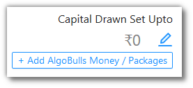
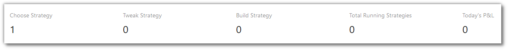
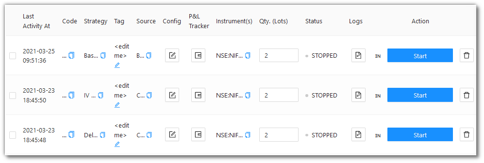
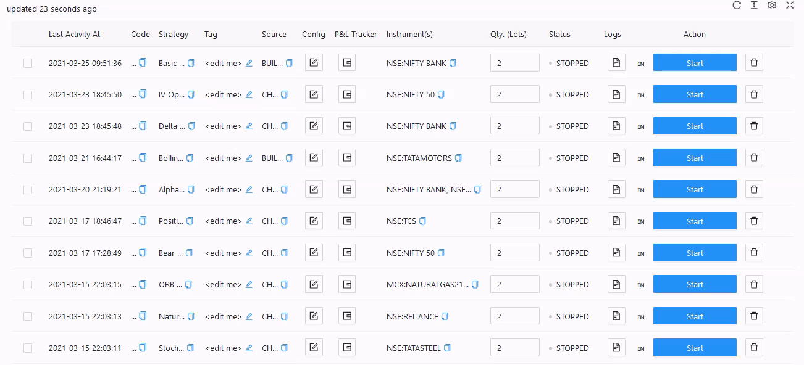
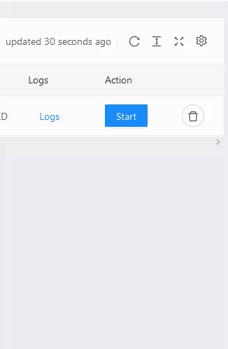

# Portfolio
    
<iframe width="560" height="315" src="https://www.youtube.com/embed/qC_Kbf1KwFg" frameborder="0" allow="accelerometer; autoplay; encrypted-media; gyroscope; picture-in-picture" allowfullscreen></iframe>

The Portfolio page is your complete overview of the strategies availed by you. 

If this page does not have any entries, you can add a strategy using the `Choose from our Marketplace!` link. 

Click the `+ Add AlgoBulls Money / Packages` button to add money into your account and/or choose a package that suits your needs.

Click  to edit/set the `Capital Drawn Set Upto` field. (This feature is in beta, currently)

The `Summary Bar` shows the following metrics:

`Choose Strategy` - How many strategies from the [Marketplace](marketplace.md) are in your Portfolio.

`Tweak Strategy` - How many strategies have been tweaked by you.

`Build Strategy` - How many custom strategies have you gotten built from us.

`Total Running Strategies` - How many of the above 3 are running right now (during the market hours).

`Today's P&L` - Today's P&L value.

## Fields
---
The table covers the following fields: 

* `Last Activity At` - Shows last time the strategy was run.
* `Code` - Code of the Strategy.
* `Strategy` - Name of the Strategy
* `Tag` - User defined tag for the strategy. User can tag different strategies under different tags from Tweak.
* `Source` - Type of the Strategy viz. Build, Tweak or Develop.
* `Config` - Change parameters and other configuration from here.
* `Instrument(s)` - Instrument on which the strategy is being run.
* `P&L Tracker` - Define your Desired Profit and Risk Appetite to trade for that particular strategy. AlgoBulls Risk Management System will try its best to book your P&L at the given Profit Desired or limit it at the given Risk Appetite. However, these values are not guaranteed as there are various factors into play outside the control of AlgoBulls systems, like market liquidity, momentum, delays introduced due to network, and so on.
* `Qty. (Lots)` - Quantity/Lots being traded.
* `Status` - States the Status of the strategy if it is Started or Stopped.
* `Logs` - You can access the logs from here.
* `Action` - Option to whether Start or Stop the Strategy.

!!! note
    The `Source` field will have one of the three values - CHOOSE, CHOOSE (TWEAK), BUILD_PYTHON (TWEAK). 
    
    Choose reflects in `Choose Strategy` from the `Summary Bar`.
    
    Choose Tweak reflects in `Tweak Strategy` from the `Summary Bar`.
    
    Choose Premium reflects in `Build Strategy` from the `Summary Bar`.

## A look at the toolbar
---

`Refresh` - If you are not able to see an entry (possibly a most recent one) in the table, click Refresh to check again.

`Density` - Choose the density of the data you see. Options are Larger, Middle and Compact

`Full Screen` - The current tab on your browser goes Full Screen. Click again to go back to normal. This is similar to pressing F11 on most browsers and operating systems.

`Settings` - You can select which columns should be visible through here. 

