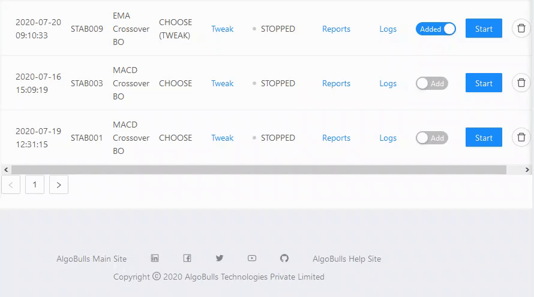
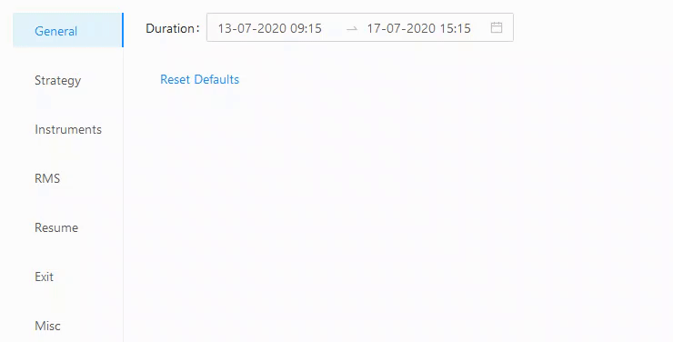
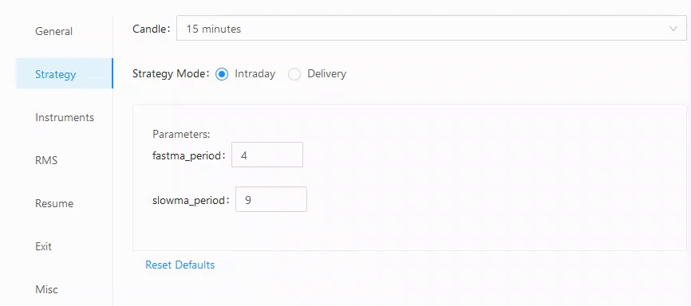
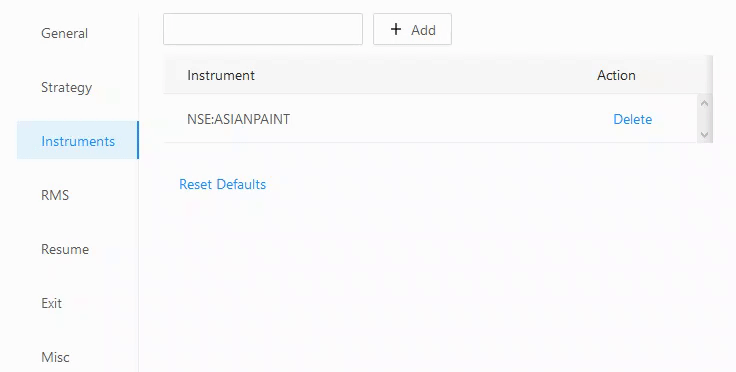
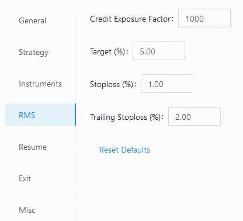
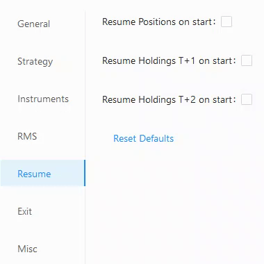
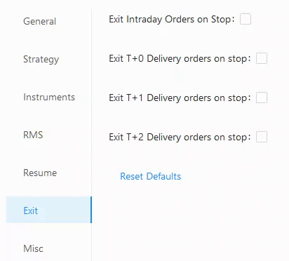
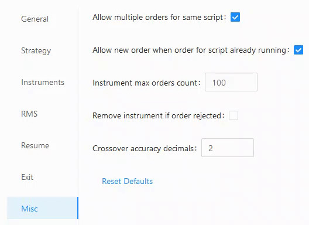

# Tweak
Tweak gives user an option to change different parameters of strategy as per their preferences. This gives the user a fair amount of control over the working of the strategy.

This feature is available and live for:

|  Trading Type | Available |
|:-------------:|:-------:|
| Real Trading  |    ✅    |
| Paper Trading |    ✅    |
| Backtesting   |    ✅    |

## General
---
All general parameters are listed.

* **Duration** - This parameter is relevant only for backtesting. User can give custom duration for backtesting. The Strategy will perform backtesting on the given user defined period.

## Strategy
---

All strategy related parameters are listed here.

* -**Candle** - Strategy will be performed on user defined candle. User can change candle size from here and can customize trading for his/her preferred candle size. User can choose either of below candle sizes:
·  1 minute
·  3 minutes
·  5 minutes
·  10 minutes
·  15 minutes
·  30 minutes
·  1 hour
·  1day
* -**Strategy Mode**` - User can select if he/she wants to run strategy on Intraday or Delivery mode. Other defaults will change accordingly on selection of either of this option.
* -**Parameters** - Strategy specific editable parameters are available for change here. Short EMA period, Long EMA period, Buy RSI Threshold, Sell RSI Threshold, Aroon Up period, Aroon Down period are amongst others which are available here for editing based on the strategy being tweaked.

## Instruments
---

* **Add** - User can add instrument here for performing backtesting, paper trading and real trading.
 

## RMS
---

* `Credit Exposure Factor` - Credit exposure factor lets user define the credit available to user.
* `Target (%)` - This lets user define Target (%) from running the strategy. Order will auto square off once the price crosses the Target (%) defined here.
* `Stoploss (%)` - This lets user define Stoploss (%) from running the strategy. Order will auto square off once the price crosses the Stoploss (%) defined here.
* `Trailing Stoploss (%)` - This lets user define Trailing Stoploss (%) which will trail the prices from running the strategy. Order will auto square off once the price crosses the Trailing Stoploss (%) defined here.

## Resume
---

This option lets the user decide if he/she wants to resume position on start for securities with different settlement cycle:

* `Resume Positions on start` - This is for intraday strategies where the position starts on next day.
* `Resume Holdings T+1 on start` - This is for Delivery based strategies where the position starts on T+1 day.
* `Resume Holdings T+2 on start` - This is for Delivery based strategies where the position starts on T+2 day.
 

## Exit
---

This option lets the user decide if he/she wants to exit position on stop for securities with different settlement cycle:

* `Exit Intraday Orders on stop` - This is for intraday strategies where the position stops on the same day. De-selecting this option will have no impact as broker auto squares off position at day end.
* `Exit T+0 Delivery orders on stop` - This is for delivery-based strategies where the position stops on T+0.
* `Exit T+1 Delivery orders on stop` - This is for delivery-based intraday strategies where the position stops on T+1.
* `Exit T+2 Delivery orders on stop` - This is for delivery-based strategies where the position stops on T+2.

## Misc
---
* `Allow multiple orders for same script` - This option lets the user define if he wants to allow multiple orders for a script.
* `Allow new order when order for script already running` - This option lets the user define if he wants new orders for same script while one order is running.
* `Instrument max orders count` - This defines the maximum orders that the user wants to take in the strategy.
* `Remove instrument if order rejected` - This lets the user decide if he/she wants to remove instruments if order is rejected.
* `Crossover accuracy decimals` - This helps the user define crossover accuracy in crossover-based strategies. Ideally, the user can define 4 for currency-based strategies and 2 for equity-based strategies.

