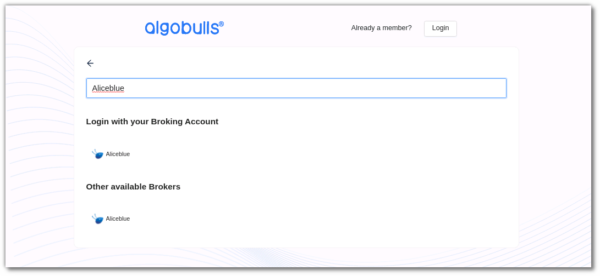
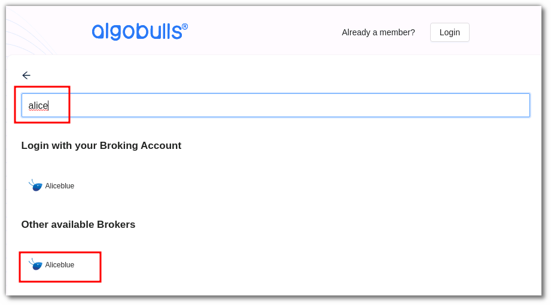
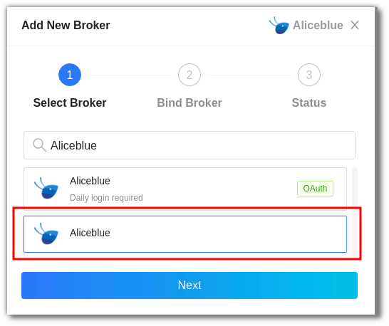
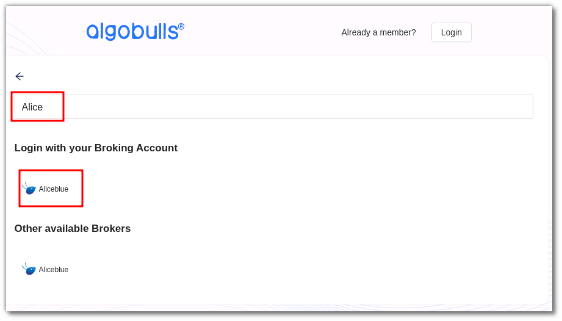
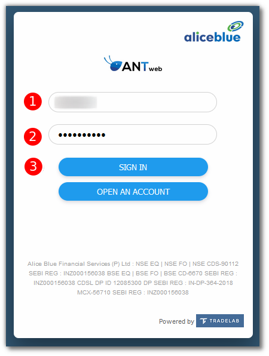
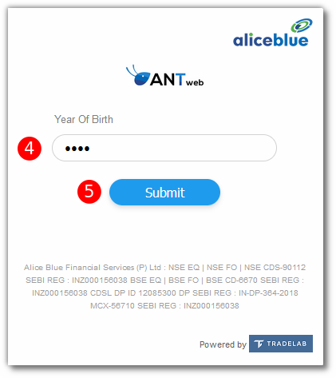

# AliceBlue
---
* Official Website: [https://aliceblueonline.com/](https://aliceblueonline.com/)

* Trading Website: [https://ant.aliceblueonline.com/](https://ant.aliceblueonline.com/)

* Markets Supported: India

## 1. Login and Set up your AliceBlue Account
---
This section will take you through the step-wise instructions to log in, setup, and bind your broker into your AlgoBulls Account.

### i. Before you Start
---
Keep the following information available before you start:

1) AlgoBulls Account Credentials

* Phone Number

* Password

2) Broking Account Credentials

* ClientID
      
* Password
      
* Year of Birth

### ii. Let's Start
---
* Visit the AlgoBulls [Login Page](https://app.algobulls.com/user/login) and click on **login with your Broking Account**.

* Type the first few characters of your Broker Name.

As seen here, AliceBlue supports 2 ways of logging in:

1. non-OAuth Method 

2. OAuth Method.
     
Both are explained below

### iii. Login with non-OAuth Method
---
* Type the first few characters of your Broker Name.

* Select the **ALICEBLUE** broker under **other available brokers**.

Now Login to your AlgoBulls account. Provide data for the following fields and then click the **Login** button.

* Phone Number: The Phone Number you have used to Register/Sign-Up to the AlgoBulls website.

* Password: The password you have given to Register/Sign-Up to the AlgoBulls website.

* Now go to **Broking Details** and click add broker.

* Choose the broker. 

* Now Provide data for the following fields:

(1). Client ID: The ID given to you by your broker.

(2). Password: The password given to you by the broker.

(3). Year of Birth: The year of birth you have given while creating the broker account.

(4). Click **Confirm**.

* If the verification is successful, you will see the following message:

### iv. Login with OAuth Method
---
* Type the first few characters of your Broker Name.

* Select the **ALICEBLUE** broker.

* You will be re-directed to the broker login page. Provide data for the following fields:

(1). Client ID: The ID given to you by your broker.

(2). Password: The password given to you by the broker.

(3). Click **SIGN IN**.

(4). Year of Birth: The year of birth you have given while creating the broker account

(5). Click **Submit**

* If the sign-in is successful, you will re-directed back to the AlgoBulls website.

## 2. Support
---
For Help and Support, contact us on +91 80692 30300 or [email us](mailto:support@algobulls.com).
