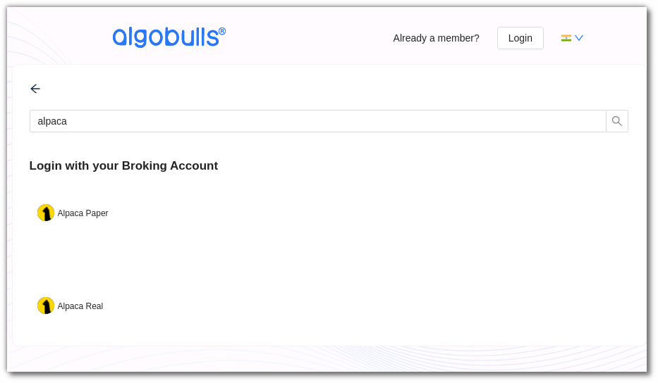
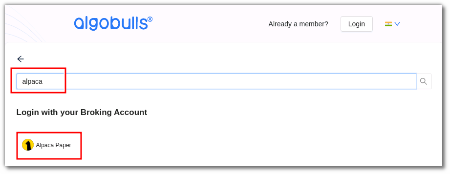
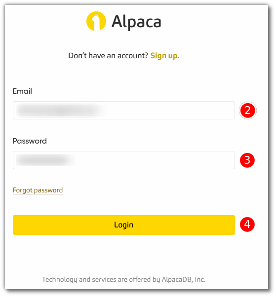
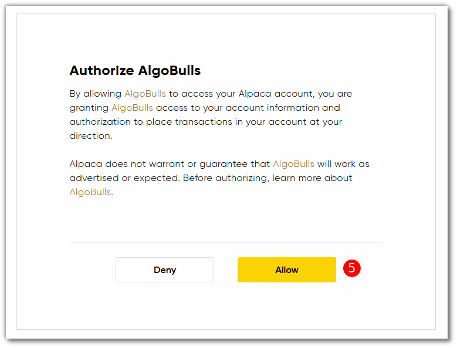
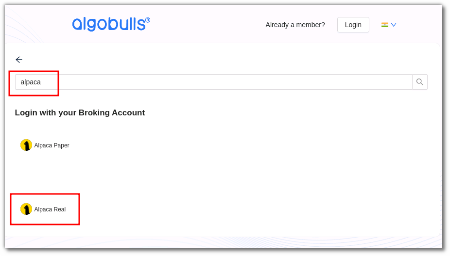

# Alpaca
---
* Official Website: [https://alpaca.markets/](https://alpaca.markets/)

* Trading Website: [https://alpaca.markets/](https://alpaca.markets/)

* Markets Supported: USA

## 1. Login and Set up your Alpaca Account
---
This section will take you through the step-wise instructions to log in, setup, and bind your broker into your AlgoBulls Account.

### i. Before you Start
---
Keep the following information available before you start:

1) AlgoBulls Account Credentials

* Phone Number

* Password

2) Broking Account Credentials

* Email

* Password

### ii. Let's Start
---
* Visit the AlgoBulls [Login Page](https://app.algobulls.com/user/login) and click on **login with your Broking Account**.

* Type the first few characters of your Broker Name.

As seen here, Alpaca supports 2 ways of logging in:

1. Alpaca Paper (OAuth) Method

2. Alpaca Real (OAuth) Method

Both are explained below

### iii. Login with Alpaca Paper (OAuth) Method
---
* Type the first few characters of your Broker Name.

* Select the **ALPACA PAPER** broker.

* You will be re-directed to the broker login page. Provide data for the following fields:

(1). Click **Log In**.

* You will be re-directed to the broker login page. Provide data for the following fields:

(2). Email ID: Your Email ID.

(3). Password: The password you have set.

(4). Click **Login**.

(5). Click **Allow** if asked for authorization.

### iv. Login with Alpaca Real (OAuth) Method
---

!!! Note
        Coming Soon! This option is not yet enabled!

* Type the first few characters of your Broker Name.

* Select the **ALPACA REAL** broker.

* You will be re-directed to the broker login page. Provide data for the following fields:

(4). Click **Log In**.

* You will be re-directed to the broker login page. Provide data for the following fields:

(5). Email ID: Your Email ID.

(6). Password: The password you have set.

(7). Click **Login**.

(8). Click **Allow** if asked for authorization.

### v. After any of the above 2 methods...
---

Now Login to your AlgoBulls account. Provide data for the following fields and then click the **Login** button

* Phone Number: The Phone Number you have used to Register/Sign-Up to the AlgoBulls website.

* Password: The password you have given to Register/Sign-Up to the AlgoBulls website.

## 2. Support
---
For Help and Support, contact us on +91 80692 30300 or [email us](mailto:support@algobulls.com).
