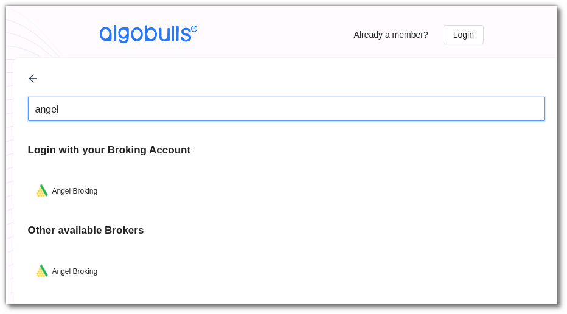
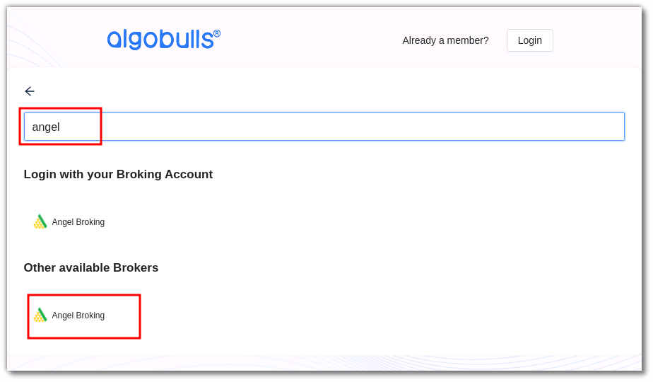
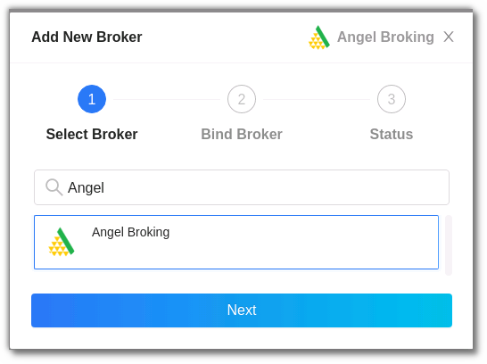
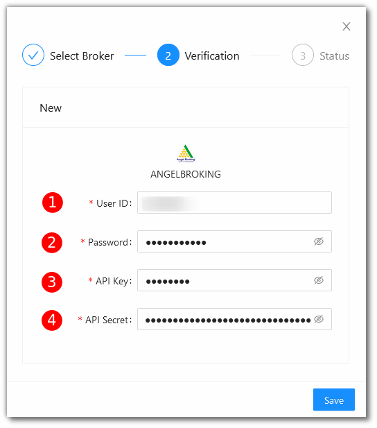
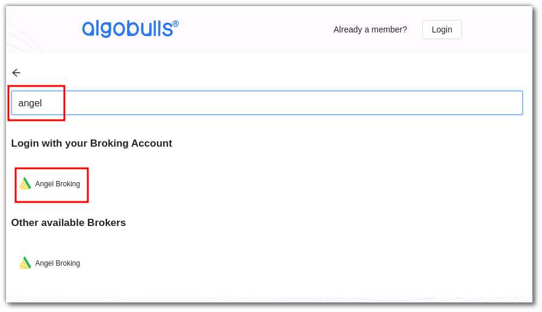

# Angel Broking
---
* Official Website: [https://www.angelbroking.com/](https://www.angelbroking.com/)

* Trading Website: [https://trade.angelbroking.com/](https://trade.angelbroking.com/)

* Markets Supported: India

## Important Points to Note

To enable the TOTP please [click here](https://smartapi.angelbroking.com/enable-totp).

## 1. Login and Set up your Angel Broking Account 
---
This section will take you through the step-wise instructions to log in, setup, and bind your broker into your AlgoBulls Account.

### i. Before you Start
---
Keep the following information available before you start:

1) AlgoBulls Account Credentials

* Phone Number

* Password

2) Broking Account Credentials

* User ID
      
* Password
      
* API Key

* API Secret

!!! note
    * To know more about API Key and Secret, see the following video (Only for Non-Oauth based login):

<iframe width="560" height="315" src="https://www.youtube.com/embed/75vlLNRD3IA" frameborder="0" allow="accelerometer; autoplay; clipboard-write; encrypted-media; gyroscope; picture-in-picture" allowfullscreen></iframe>

### ii. Let's Start
---
* Visit the AlgoBulls [Login Page](https://app.algobulls.com/user/login) and click on **login with your Broking Account**.

* Type the first few characters of your Broker Name.

As seen here, Angel Broking supports 2 ways of logging in:

1. non-OAuth Method

2. OAuth Method
     
Both are explained below

### iii. Login with non-OAuth Method
---

* Type the first few characters of your Broker Name.

* Select the **ANGELBROKING** broker under **other available brokers**.

Now Login to your AlgoBulls account. Provide data for the following fields and then click the **Login** button

* Phone Number: The Phone Number you have used to Register/Sign-Up to the AlgoBulls website.

* Password: The password you have given to Register/Sign-Up to the AlgoBulls website.

* Now go to **Broking Details** and click add broker.

* Choose the broker. 

* Now Provide data for the following fields:

(1). User ID: The ID given to you by your broker.

(2). Password: The password given to you by the broker.

(3). API Key: The API Key given to you by your broker.

(4). API Secret: The API Secret given to you by your broker.

* If the verification is successful, you will see the following message:

### iv. Login with OAuth Method
---
* Type the first few characters of your Broker Name.

* Select the **ANGELBROKING** broker.

* You will be re-directed to the broker login page. Provide data for the following fields:

(1). User ID: The ID given to you by your broker.

(2). Password: The password given to you by the broker.

(3). Click **Login**.

* If the sign-in is successful, you will re-directed back to the AlgoBulls website.

## 2. Support
---
For Help and Support, contact us on +91 80692 30300 or [email us](mailto:support@algobulls.com).
