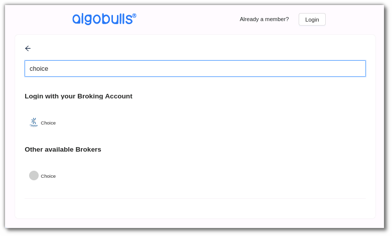
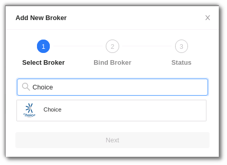
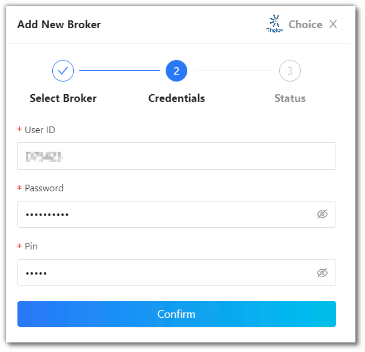
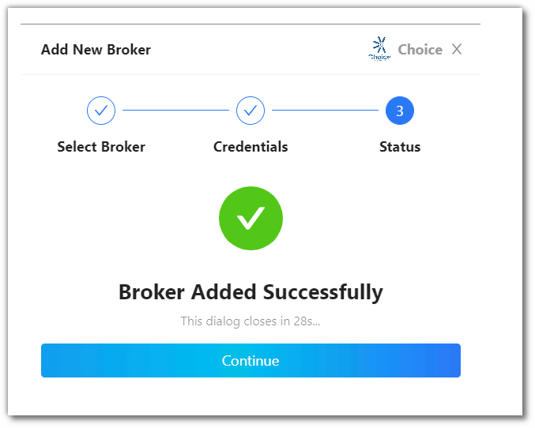

# Choice Broker
---

* Official Website: [ https://choiceindia.com/]( https://choiceindia.com/)

* Trading Website: [https://jiffy.choiceindia.com/auth/login](https://jiffy.choiceindia.com/auth/login)

* Markets Supported: India

## 1. Login and Set up your Choice Broking Account 
---
This section will take you through the step-wise instructions to log in, set up, and bind your broker into your AlgoBulls Account.

### i. Before you Start
---
Keep the following information available before you start:

1) AlgoBulls Account Credentials

* Phone Number

* Password

2) Broking Account Credentials

* User ID

* Password

* PIN

### ii. Let's Start
---
* Visit the AlgoBulls [Login Page](https://app.algobulls.com/user/login) and click on **login with your Broking Account**.

* If the broker name is not visible in the list, click on + x more (where x is the number of brokers) on the bottom right corner of the page.

* In the search box, enter **CHOICE**, and then click on the broker link that appears in the list of results.

### iii. Login with non-OAuth Method
---
* Type the first few characters of your Broker Name.

* Select the **CHOICE** broker.

Now Login to your AlgoBulls account. Provide data for the following fields and then click the **Login** button

* **Phone Number:** The Phone Number you have used to Register/Sign-Up to the AlgoBulls website.

* **Password:** The password you have given to Register/Sign-Up to the AlgoBulls website.

* Now go to **Broking Details** and click add broker.

* Choose the broker.

* Now Provide data for the following fields:

    1. User ID: The ID given to you by your broker.

    2. Password: The password given to you by the broker.

    3. PIN

* If the verification is successful, you will see the following message:

## 2. Support

For further support related to adding your Choice broker account, contact our helpful customer support team on +91 80692 30300 or email us at [support@algobulls.com](https://support@algobulls.com/).
