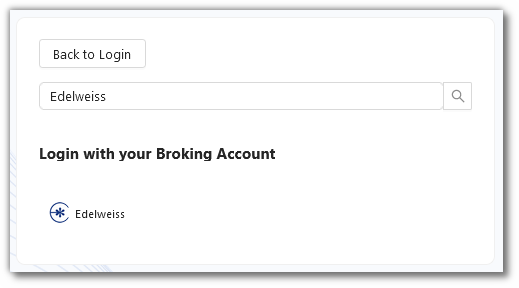
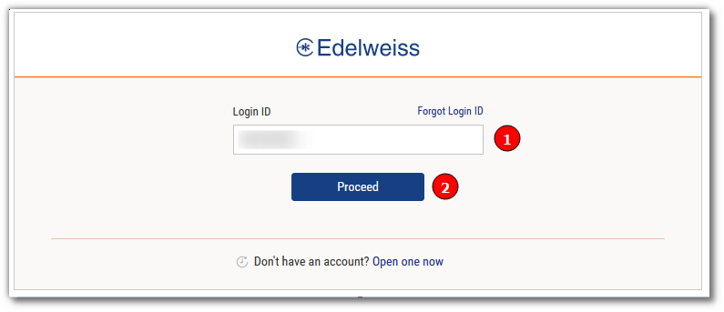
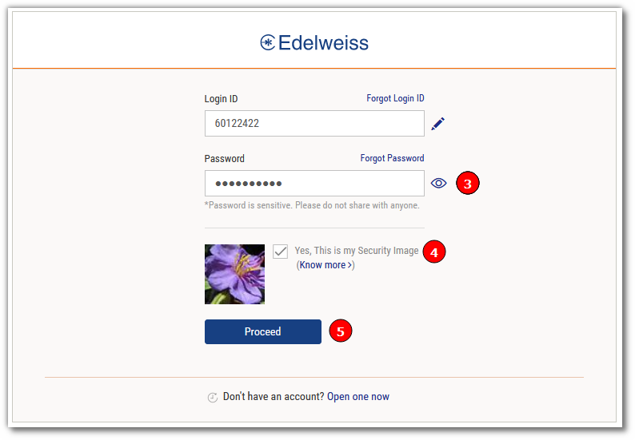
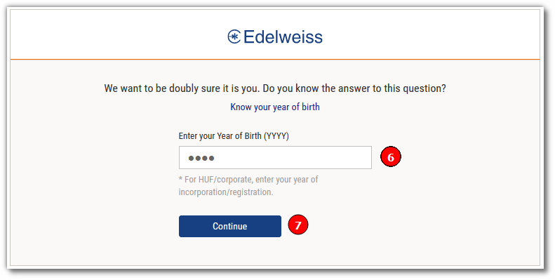
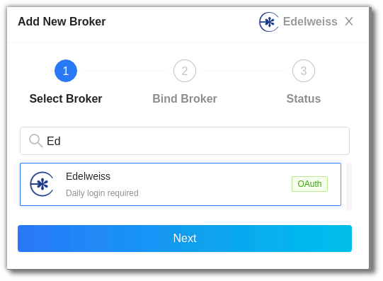

# Edelweiss
---

* Official Website: [https://www.edelweiss.in](https://www.edelweiss.in)

* Trading Website: [https://www.edelweiss.in/login](https://www.edelweiss.in/login)

* Markets Supported: India

## 1. Important Point(s) to Note
---
* It is required to login **once** daily (at the start of the trading day).

## 2. Login and Set up your Edelweiss Account 
---
This section will take you through the step-wise instructions to log in, setup, and bind your broker into your AlgoBulls Account.

### i. Before you Start
---
Keep the following information available before you start:

1) AlgoBulls Account Credentials

* Phone Number

* Password

2) Broking Account Credentials

* Login ID

* Password

* Year of Birth

### ii. Let's Start
---
* Visit the AlgoBulls [Login Page](https://app.algobulls.com/user/login) and click on 'Edelweiss' under **Login with your Broking Account**.

* If you do not see your broker name, then click on **+ x more** where x is the number of brokers.

* Type **Edelweiss** in the Search Box. and then click on the Broker Link that is shown in the search results.

(1). Type your Login ID.

(2). Click on the **Proceed** button.

(3). Type your Password.

(4). Make sure that **Yes, This is my Security Image** is ticked.

(5). Click on the **Proceed** button.

(6). Type your Year of Birth.

(7). Click on the **Continue** button.

* If the sign-in is successful, you will re-directed back to the AlgoBulls website.

### iii. Another Way to Bind the Broker
---

Login to your AlgoBulls account. Provide data for the following fields and then click the **Login** button

* Phone Number: The Phone Number you have used to Register/Sign-Up to the AlgoBulls website.

* Password: The password you have given to Register/Sign-Up to the AlgoBulls website.

* Now go to **Broking Details** and click add broker.

* Choose the broker.

* You will be re-directed to the Verification Page. Provide data for the following fields:

(1). Type your Login ID.

(2). Click on the **Proceed** button.

(3). Type your Password.

(4). Make sure that **Yes, This is my Security Image** is ticked.

(5). Click on the **Proceed** button.

(6). Type your Year of Birth.

(7). Click on the **Continue** button.

* If the verification is successful, you will see the following message:

## 2. Support
---
For Help and Support, contact us on +91 80692 30300 or [email us](mailto:support@algobulls.com).
