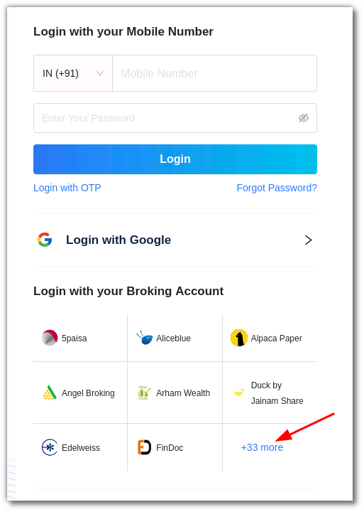
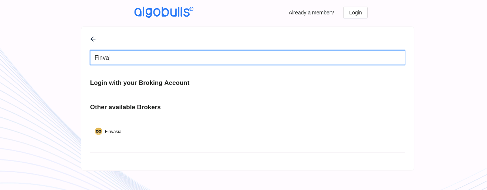
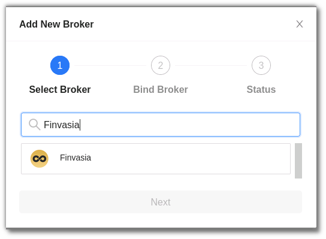
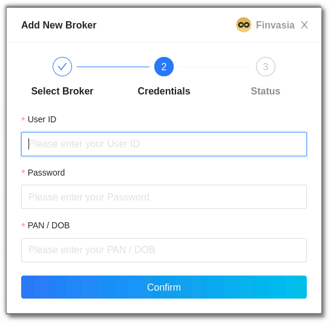
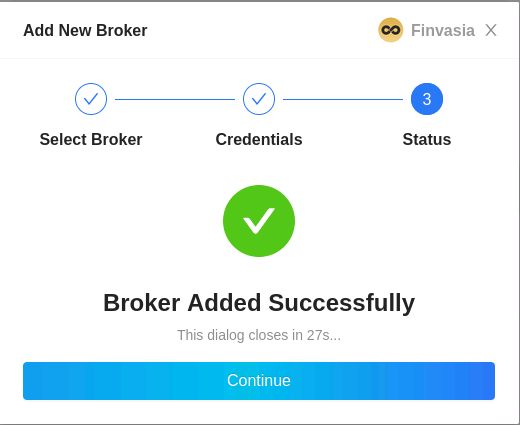

# Finvasia
---

* Official Website: [www.finvasia.com](https://www.finvasia.com)

* Trading Website: [https://shoonya.finvasia.com/#/](https://shoonya.finvasia.com/#/)

* Markets Supported: India

## 1. Login and Set up your Finvasia Account
---

This section will take you through the step-wise instructions to log in, setup, and bind your broker into your AlgoBulls Account.

### i. Before you Start
---

Keep the following information available before you start:

(1) AlgoBulls Account Credentials

* Phone Number

* Password

(2) Broking Account Credentials

* User ID
      
* Password
      
* PAN/DOB

### ii. Let's Start
---

* Visit the AlgoBulls [Login Page](https://app.algobulls.com/user/login) and click on ‘Finvasia’ under Login with your Broking Account

* If you do not see your broker name, then click on + x more where x is the number of brokers

* Type **Finvasia** in the Search Box and then click on the Broker Link that is shown in the search results

* Now Login to your AlgoBulls account. Provide data for the following fields and then click the Login button

(1). Phone Number: The Phone Number you have used to Register/Sign-Up to the AlgoBulls website.

(2). Password: The password you have given to Register/Sign-Up to the AlgoBulls website.

* Now go to Broking Details and click add broker

* Choose the broker

* Now Provide data for the following fields:

(1). User ID: The ID given to you by your broker

(2). Password: The password given to you by the broker

(3). PAN/DOB: The 2-factor authentication answer you have given (your PAN Card number or DOB)

* If the verification is successful, you will see the following message

## 3. Bind your Broking Account
---

The following steps will help you to make sure you have binded your broker account
* Visit the AlgoBulls [Broker Settings Page](https://app.algobulls.com/account/broking)
* Bind your account using the Toggle button marked below

## 4. Support
---
For Help and Support, contact us on +91 80692 30300 or [email us](mailto:support@algobulls.com).
