# ICICI Securities

---


* Official Website: [https://www.icicidirect.com/](https://www.icicidirect.com/)


* Trading Website: [https://www.icicidirect.com/](https://www.icicidirect.com/)


* Developer Website: [https://api.icicidirect.com/apiuser/home](https://api.icicidirect.com/apiuser/home)


* Markets Supported: India


## 1. Important Points to Note

---

* It is required to log in **once** daily (at the start of the trading day)


## 2. Login and Set up your ICICI Securities Account 

---

This section will take you through the step-wise instructions to log in, setup, and bind your broker into your AlgoBulls Account.


### i. Before you Start

---

Keep the following information available before you start:


1) Account Credentials


* User ID


* Password


* PAN No./ DOB 


### ii. One-Time Activity

---

This activity will help you to link your broking account to the AlgoBulls account via the oauth method.


!!! Note

    * If you have done this activity once before, then you can directly skip to the [Daily Activity](#daily-activity-login) section


* Visit [https://api.icicidirect.com/apiuser/home](https://api.icicidirect.com/apiuser/home).


[ 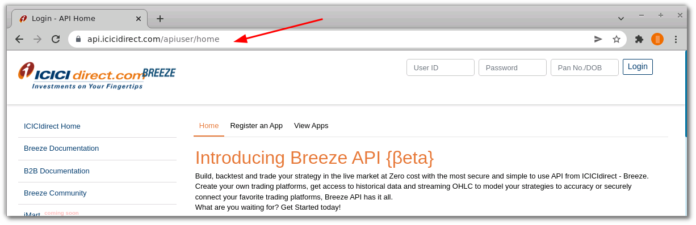 ](imgs/icici_securities/home.png)


* Enter your User ID, Password and PAN No./DOB. Click the **Login** button.


[ 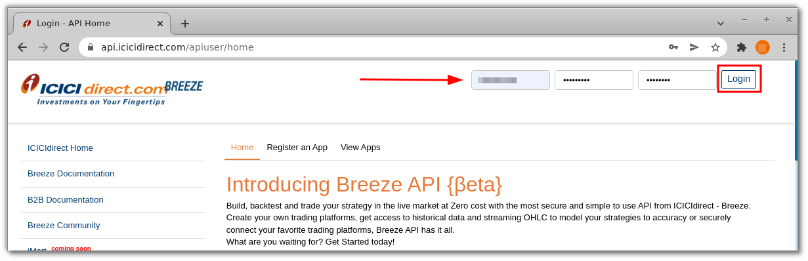 ](imgs/icici_securities/login.png)


* Click the `Register an app` button.


[ 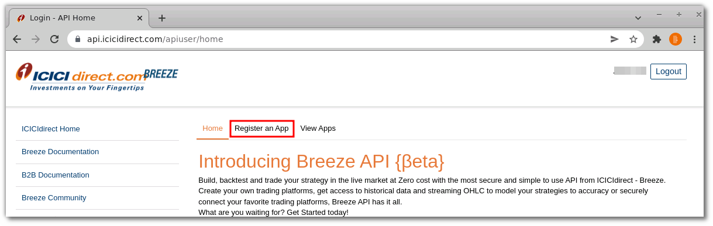 ](imgs/icici_securities/register_an_app.png)


* On the `Register an app` page, fill the following fields:


    * App name: Give the app name. Example: `algobulls_icici`.

    * Redirect URL: Give the value `https://app.algobulls.com/loading`.

    
* Click the `Submit` button.


[ 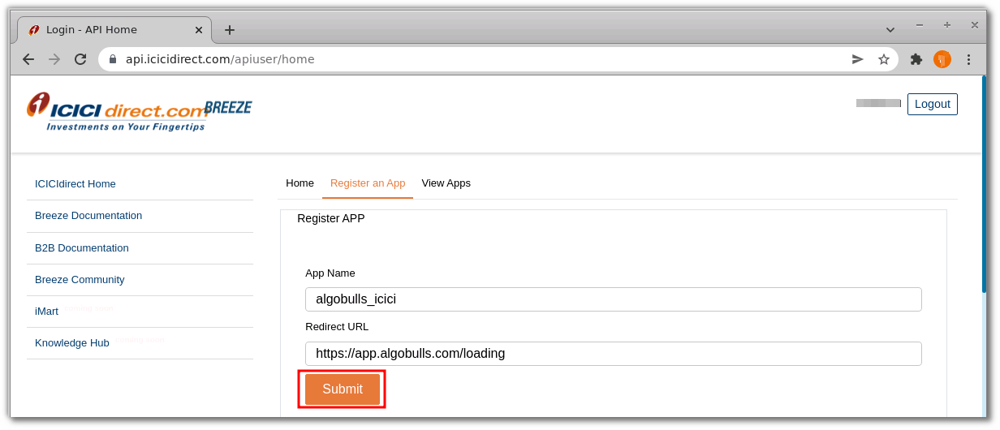 ](imgs/icici_securities/submit.png)


* Now Copy and Save the App key.


[ 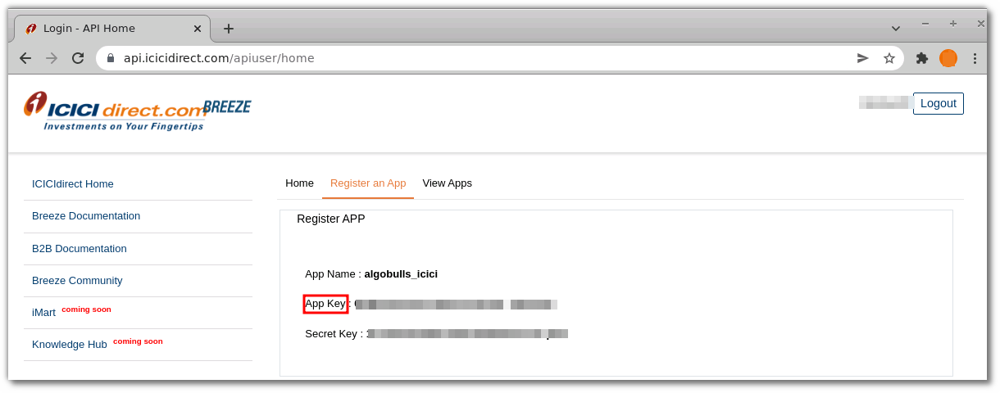 ](imgs/icici_securities/app_key.png)


* Now click on the 'View Apps' button.


[ 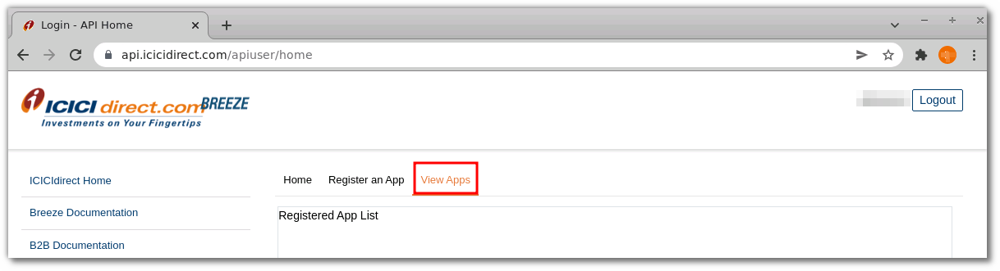 ](imgs/icici_securities/view_apps.png)


* Current App Status is 'Deactive'. Click on it to activate the app.


[ 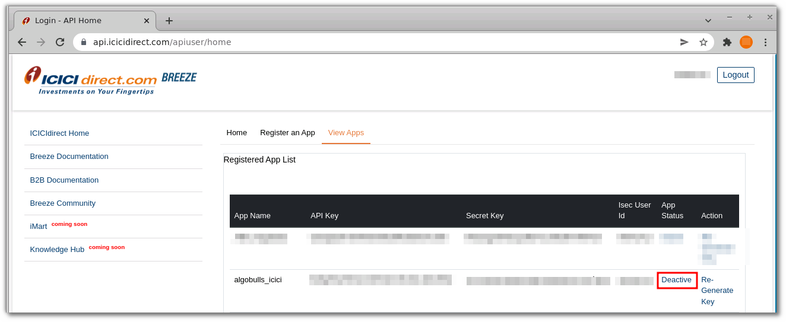 ](imgs/icici_securities/deactive.png)


* Click 'Yes' to confirm.


[ 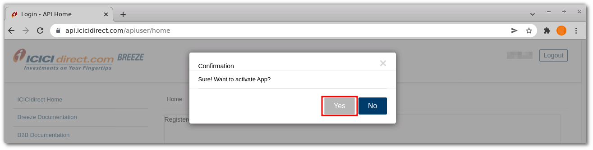 ](imgs/icici_securities/yes.png)


* Ensure that the App status has changed to 'Active'.


[ 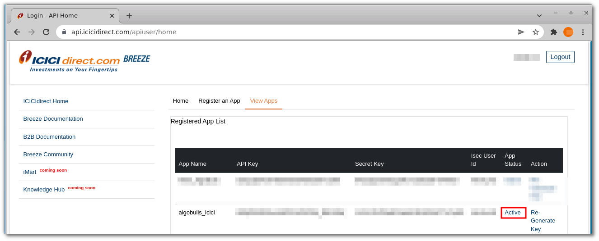 ](imgs/icici_securities/active.png)


* Now visit [https://www.urlencoder.org/](https://www.urlencoder.org/) to Encode your key.


* Type your 'APP key' in the box.


[ 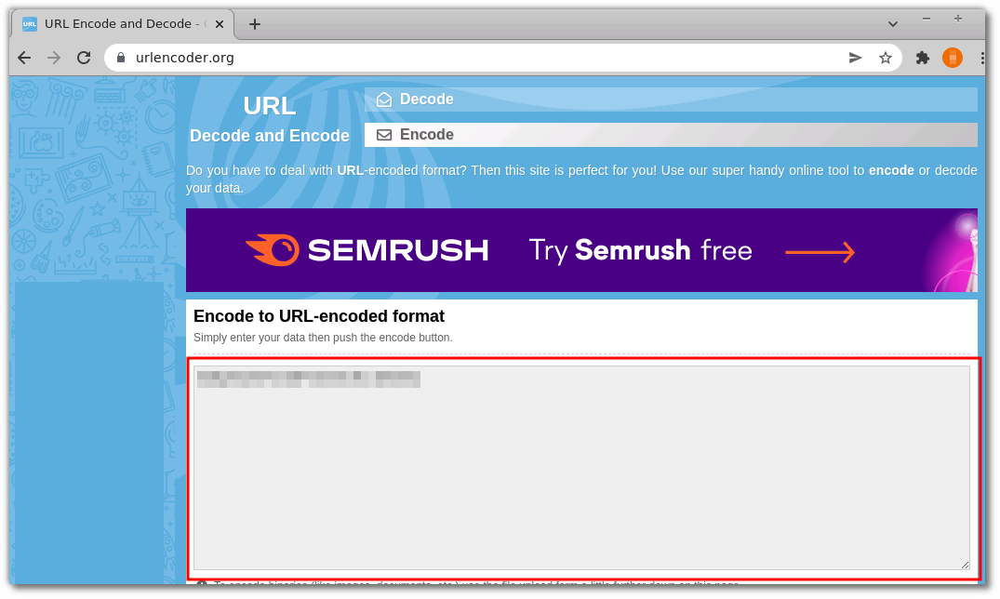 ](imgs/icici_securities/encode.png)


* Click on `Encode` and encoded key will appear in box below .


* Copy and Save the Encoded key.


[ 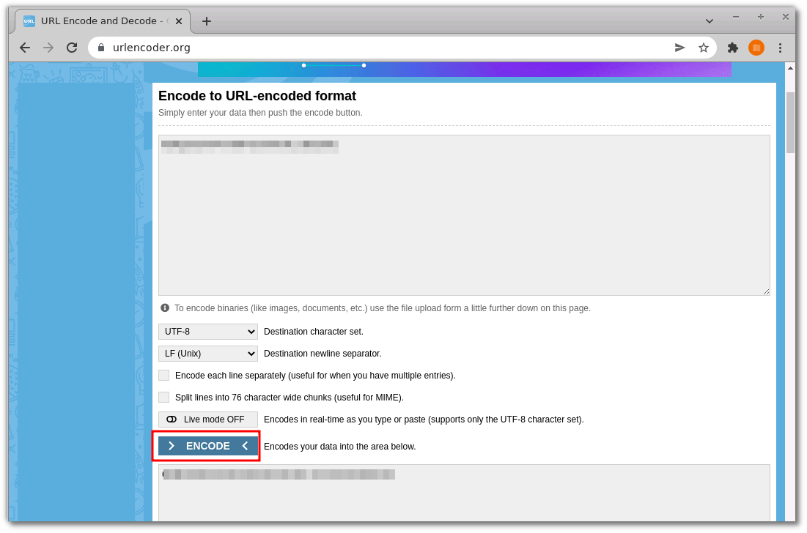 ](imgs/icici_securities/encode_two.png)


### iii. Daily Activity (Login)

---


!!! Note

    * Perform the following steps at the start of every trading day


* Visit the AlgoBulls [Login Page](https://app.algobulls.com/user/login) and click on `Login with your Broking Account`


[ 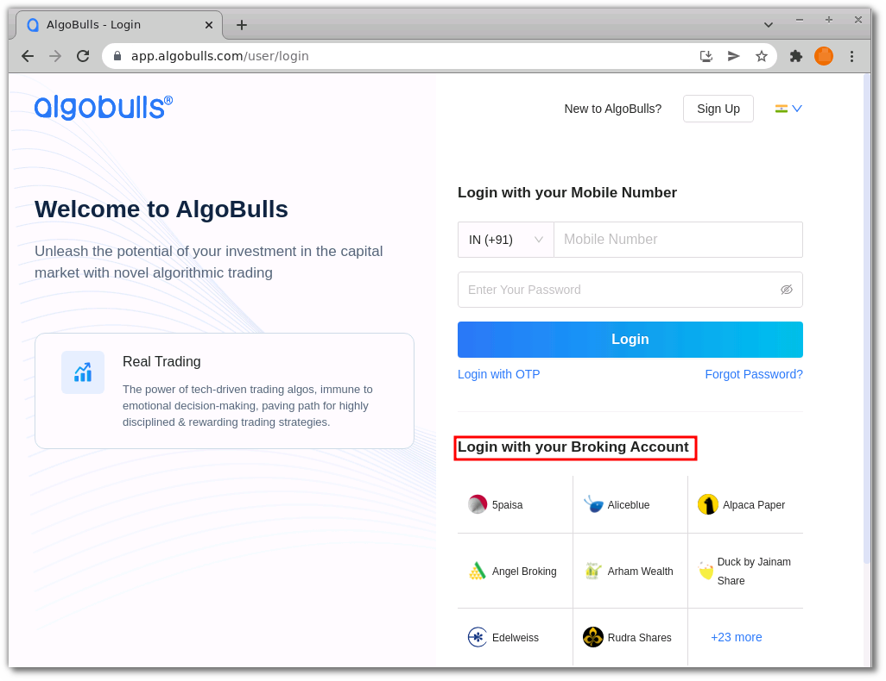 ](imgs/icici_securities/algo_home.png)


(1). Type the first few characters of your Broker Name.


(2). Select the `ICICI Securities` broker.


[ 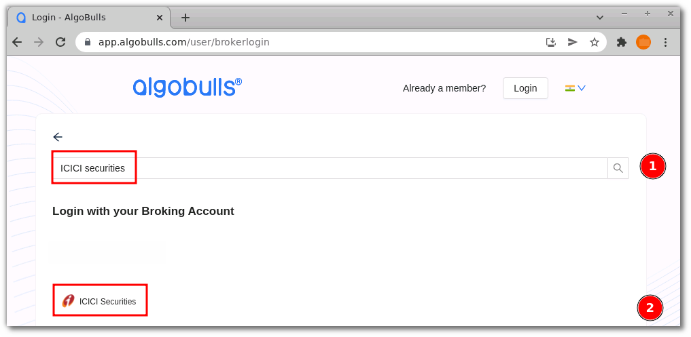 ](imgs/icici_securities/select_broker.png)


Now paste your saved Encoded key in the following URL


Example: If the Encoded APP key is uS3r@ppKey and the URL is:


```html

https://api.icicidirect.com/apiuser/login?api_key=placeappkeyhere

```

then the new URL will be:


```html

https://api.icicidirect.com/apiuser/login?api_key=uS3r@ppKey

```


[ 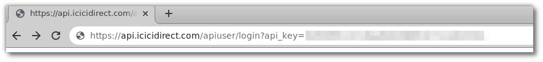 ](imgs/icici_securities/key.png)


Press Enter after modifying the URL with your APP key.


Now provide data for the following fields:


(3). User ID: The ID given to you by your broker.


(4). Password: The password given to you by the broker.


(5). DOB/PAN: Add Date Of Birth or PAN number.


(6). Agree to terms and conditions.


(7). Click `Submit` button.


[ 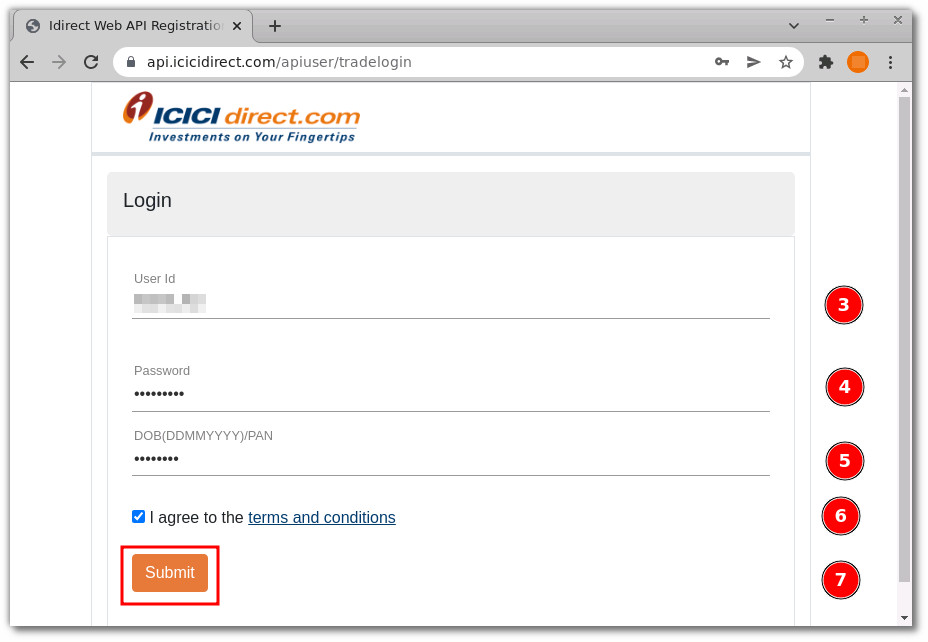 ](imgs/icici_securities/login_again.png)


* If the sign-in is successful, you will re-directed back to the AlgoBulls website.


### iv. Another Way to Bind the Broker

---


Login to your AlgoBulls account. Provide data for the following fields and then click the `Login` button


* Phone Number: The Phone Number you have used to Register/Sign-Up to the AlgoBulls website.


* Password: The password you have given to Register/Sign-Up to the AlgoBulls website.


[  ](imgs/sign-in-2.png)


* Now go to `Broking Details` and click add broker.


[  ](imgs/brokingdetails.png)


(1) & (2) Choose the broker and click 'Next'.


[ 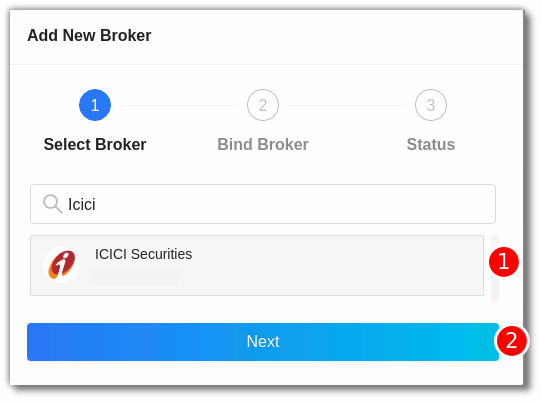 ](imgs/icici_securities/icici.png)


Now paste your saved Encoded key in the following URL


Example: If the Encoded APP key is uS3r@ppKey and the URL is:


```html

https://api.icicidirect.com/apiuser/login?api_key=placeappkeyhere

```

then the new URL will be:


```html

https://api.icicidirect.com/apiuser/login?api_key=uS3r@ppKey

```


[  ](imgs/icici_securities/key.png)


Press Enter after modifying the URL with your APP key


Now provide data for the following fields:


(3). User ID: The ID given to you by your broker.


(4). Password: The password given to you by the broker.


(5). DOB/PAN: Add Date Of Birth or PAN number.


(6). Agree to terms and conditions.


(7). Click `Submit` button.


[  ](imgs/icici_securities/login_again.png)


* If the verification is successful, you will see the following message:


[  ](imgs/success_login.png)


## 2. Support

---

For Help and Support, contact us on +91 80692 30300 or [email us](mailto:support@algobulls.com).
