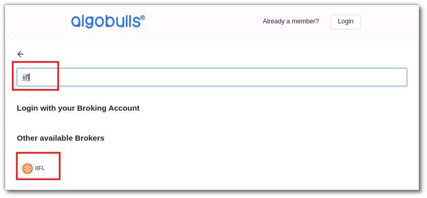
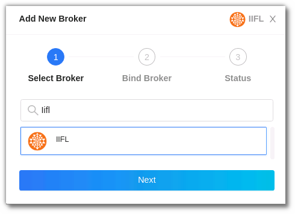
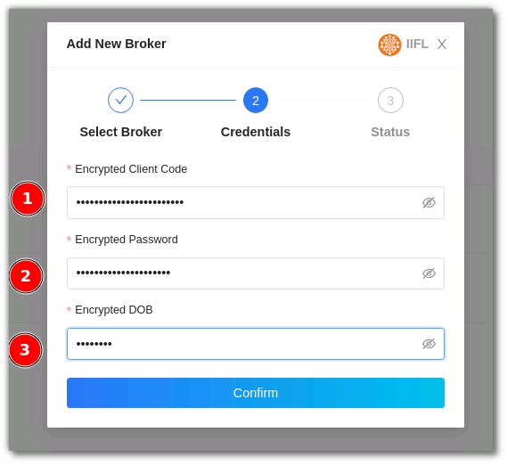

# IIFL Securities
---

* Official Website: [https://www.indiainfoline.com/](https://www.indiainfoline.com/)

* Trading Website: [https://ttweb.indiainfoline.com/Trade/Login.aspx](https://ttweb.indiainfoline.com/Trade/Login.aspx)

* Markets Supported: India

## 1. Important Point(s) to Note
---
* It is required to login **once** daily (at the start of the trading day).

## 2. Login and Set up your IIFL Securities Account 
---
This section will take you through the step-wise instructions to log in, setup, and bind your broker into your AlgoBulls Account.

### i. Before you Start
---
Keep the following information available before you start:

1) AlgoBulls Account Credentials

* Phone Number

* Password

2) Broking Account Credentials

* Encrypted Client Code

* Encrypted Password

* Encrypted DOB

### ii. Encrypting your Credentials
---
To encrypt your credentials, contact [Support](#support).

### iii. Let's Start
---
* Visit the AlgoBulls [Login Page](https://app.algobulls.com/user/login) and click on **login with your Broking Account**.

* Type the first few characters of your Broker Name.

* Select the **IIFL SECURITIES** broker.

Now Login to your AlgoBulls account. Provide data for the following fields and then click the **Login** button

* Phone Number: The Phone Number you have used to Register/Sign-Up to the AlgoBulls website.

* Password: The password you have given to Register/Sign-Up to the AlgoBulls website.

* Now go to **Broking Details** and click add broker.

* Choose the broker .

* Now Provide data for the following fields:

(1). Encrypted Client Code: The Encrypted Client Code generated by you.

(2). Encrypted Password: The Encrypted Password generated by you.

(3). Encrypted DOB: The Encrypted DOB generated by you.

* If the verification is successful, you will see the following message:

## 2. Support
---
For Help and Support, contact us on +91 80692 30300 or [email us](mailto:support@algobulls.com).
