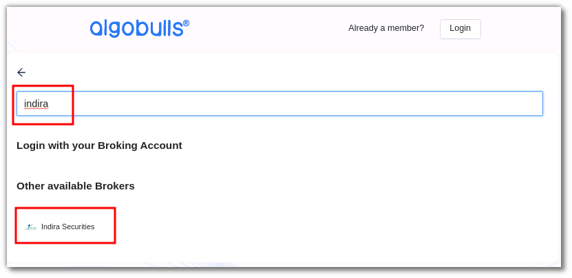
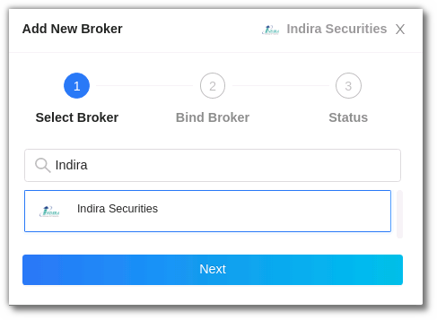
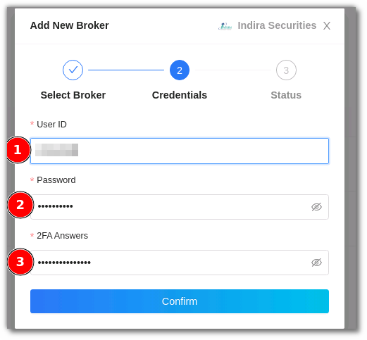

# Indira Securities
---

* Official Website: [https://www.indiratrade.com/](https://www.indiratrade.com/)

* Trading Website: [https://www.indiratrade.com/trade-online](https://www.indiratrade.com/trade-online)

* Markets Supported: India

## 1. Login and Set up your Indira Securities Account 
---
This section will take you through the step-wise instructions to log in, setup, and bind your broker into your AlgoBulls Account.

### i. Before you Start
---
Keep the following information available before you start:

1) AlgoBulls Account Credentials

* Phone Number

* Password

2) Broking Account Credentials

* User ID

* Password

* 2FA Answers (your PAN Card number)

### ii. Let's Start
---
* Visit the AlgoBulls [Login Page](https://app.algobulls.com/user/login) and click on **login with your Broking Account**.

* Type the first few characters of your Broker Name.

* Select the **INDIRASECURITIES** broker.

Now Login to your AlgoBulls account. Provide data for the following fields and then click the **Login** button

* Phone Number: The Phone Number you have used to Register/Sign-Up to the AlgoBulls website.

* Password: The password you have given to Register/Sign-Up to the AlgoBulls website.

* Now go to **Broking Details** and click add broker.

* Choose the broker.

* Now Provide data for the following fields:

(1). User ID: The ID given to you by your broker.

(2). Password: The password given to you by the broker.

(3). 2FA Answers: The 2-factor authentication answer you have given (your PAN Card number).

* If the verification is successful, you will see the following message:

## 2. Support
---
For Help and Support, contact us on +91 80692 30300 or [email us](mailto:support@algobulls.com).
