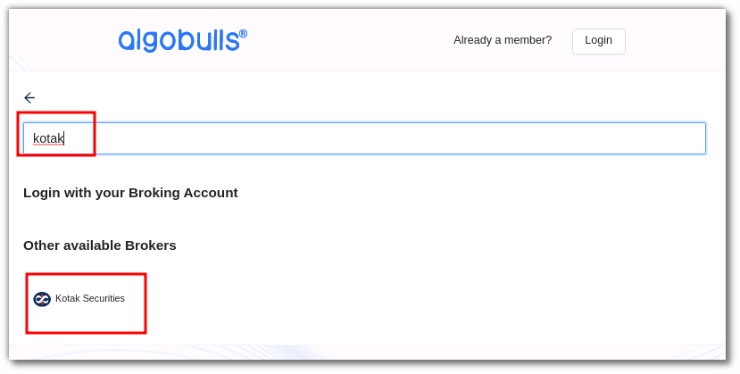
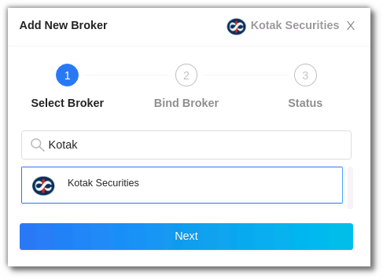
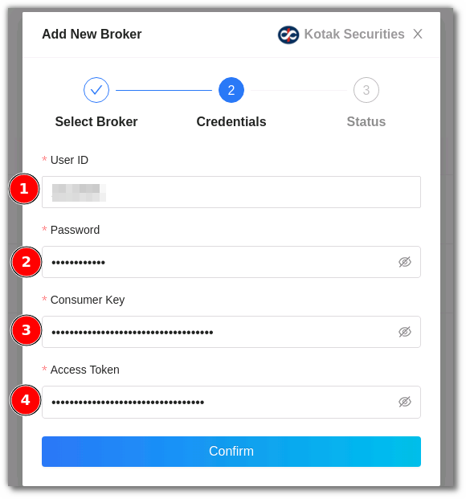
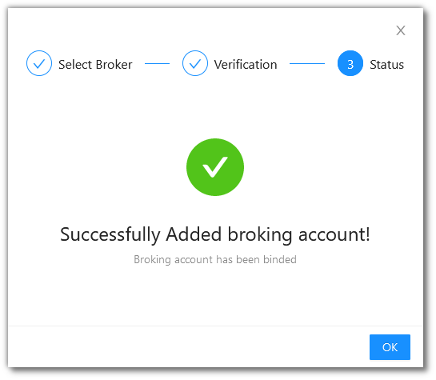

# Kotak Securities
---

* Official Website: [https://www.kotaksecurities.com/](https://www.kotaksecurities.com/)

* Trading Website: [https://www.kotaksecurities.com/](https://www.kotaksecurities.com/)

* Markets Supported: India

## 1. Login and Set up your Kotak Securities Account 
---
This section will take you through the step-wise instructions to log in, setup, and bind your broker into your AlgoBulls Account.

### i. Before you Start
---
Keep the following information available before you start:

1) AlgoBulls Account Credentials

* Phone Number

* Password

2) Broking Account Credentials

* User ID

* Password

* Consumer Key

* Access Token

!!! Note
    * Get your Consumer Key and Access Token from [here](docs/access_token_process.pdf) 

### ii. Let's Start
---
* Visit the AlgoBulls [Login Page](https://app.algobulls.com/user/login) and click on **login with your Broking Account**.

* Type the first few characters of your Broker Name.

* Select the **KOTAK SECURITIES** broker.

Now Login to your AlgoBulls account. Provide data for the following fields and then click the **Login** button

* Phone Number: The Phone Number you have used to Register/Sign-Up to the AlgoBulls website.

* Password: The password you have given to Register/Sign-Up to the AlgoBulls website.

* Now go to **Broking Details** and click add broker.

* Choose the broker.

* Now Provide data for the following fields:

(1). User ID: The ID given to you by your broker.

(2). Password: The password given to you by the broker.

(3). Consumer Key: The consumer key given to you by the broker.

(4). Access Token: The access token given to you by the broker.

Get your Consumer Key and Access Token from [here](docs/access_token_process.pdf).

* If the verification is successful, you will see the following message:

## 2. Support
---
For Help and Support, contact us on +91 80692 30300 or [email us](mailto:support@algobulls.com).
