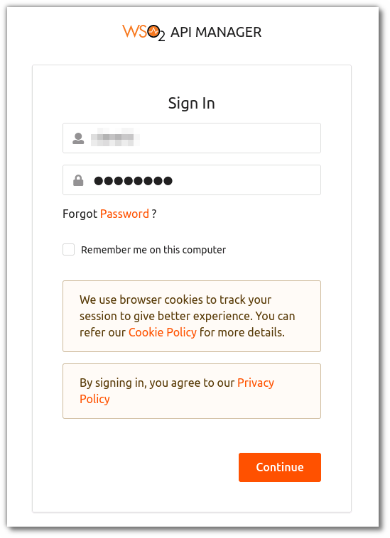
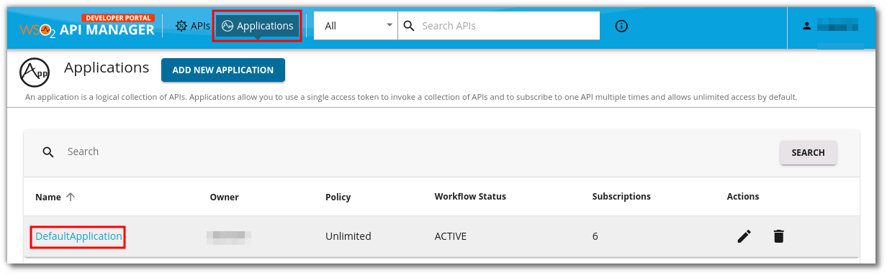
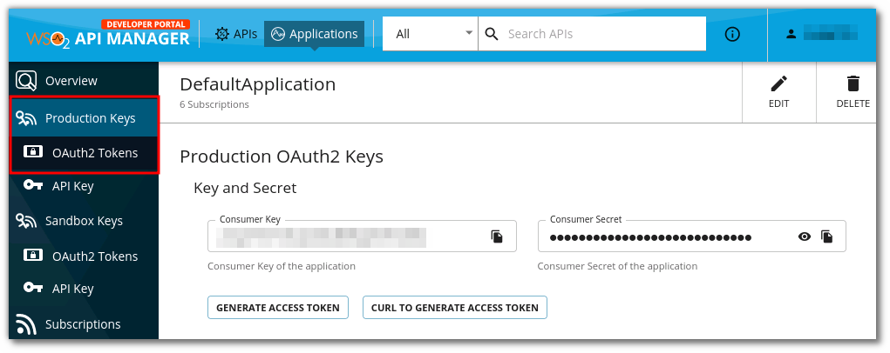
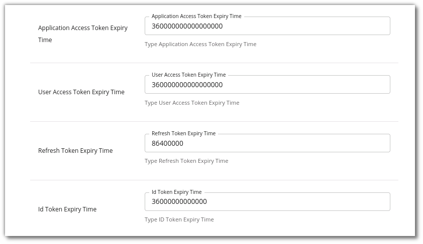
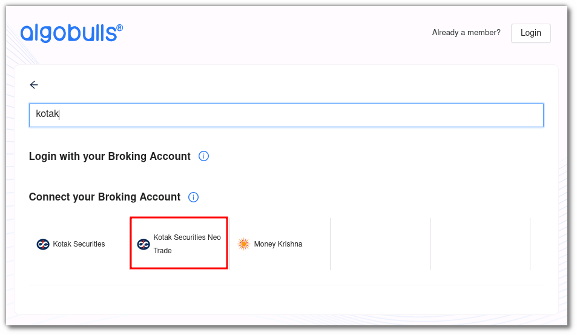
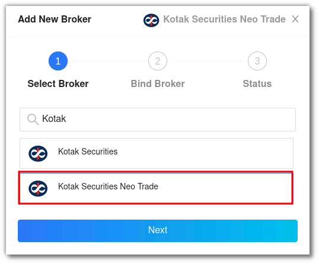
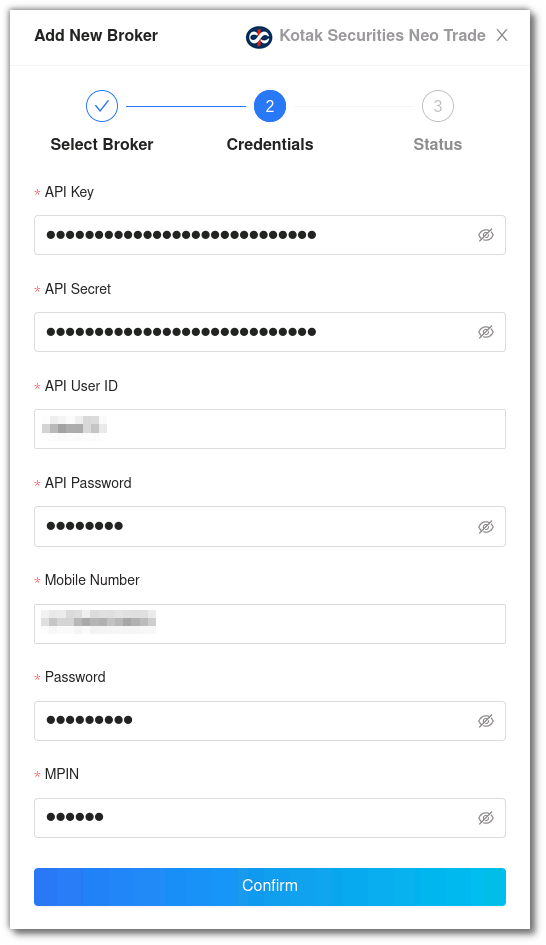
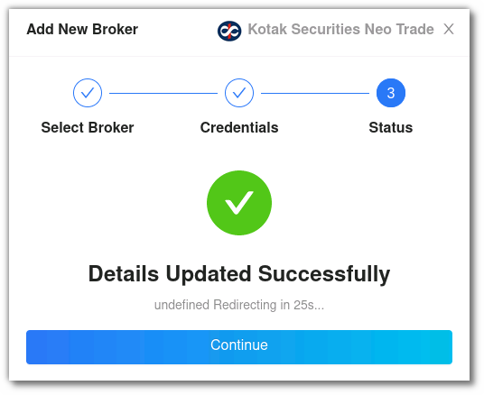

# Kotak Securities Neo Trade
---

* Official Website: [https://www.kotaksecurities.com/](https://www.kotaksecurities.com/)

* Trading Website: [https://www.kotaksecurities.com/](https://www.kotaksecurities.com/)

* Markets Supported: India

## 1. Login and Set up your Kotak Securities  Neo Trade Account 
---
This section will take you through the step-wise instructions to log in, setup, and bind your broker into your AlgoBulls Account.

### i. Before you Start
---
Keep the following information available before you start:

1) AlgoBulls Account Credentials

* Phone Number

* Password

2) Broking Account Credentials

* API Key

* API Secret

* API User ID

* API Password

* Mobile Number

* Password

* MPIN

### ii. How to get your API Key and API Secret
---

* Click [here](https://napi.kotaksecurities.com/devportal/apis/) to login into your WSO2 account. Enter the API User ID as Username and the API Password as Password and click on **Continue**.
 

    
* Click on **Applications** and then click on **DefaultApplication**. 

* Click on the Production Keys tab to the left to get the API Key (Consumer Key) and API Secret (Consumer Secret).

* Set the expiry to 36000000000000 to ensure that the Consumer Key and Consumer Secret do not expire frequently.

### iii. Let's Start
---

* Visit the AlgoBulls [Login Page](https://app.algobulls.com/user/login) and click on **Login with your Broking Account**.

* Type the first few characters of your Broker Name.

* Select the **Kotak Securities Neo Trade** broker.

Now Login to your AlgoBulls account. Provide data for the following fields and then click the **Login** button

* Phone Number: The Phone Number you have used to Register/Sign-Up to the AlgoBulls website.

* Password: The password you have given to Register/Sign-Up to the AlgoBulls website.

* Now go to **Broking Details** and click add broker.

* Choose the broker.

* Now Provide data for the following fields:

(1). API Key: The Consumer Key given to you by your broker.

(2). API Secret: The Consumer Secret given to you by your broker.

(3). API Secret: The Consumer Secret given to you by your broker.

(4). API User ID: Your WSO2 login user id.

(5). API Password: Your WSO2 login password.

(6). Mobile Number: Your mobile number registered with the broker.

(7). Password: The Consumer Secret given to you by your broker.

(8). MPIN: The Consumer Secret given to you by your broker.

* If the verification is successful, you will see the following message:

## 2. Support
---
For Help and Support, contact us on +91 80692 30300 or [email us](mailto:support@algobulls.com).
