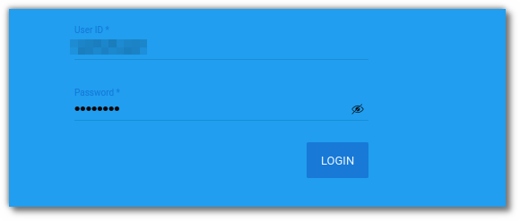
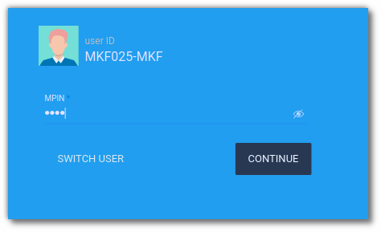
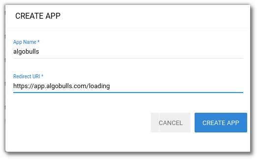
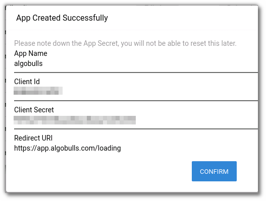
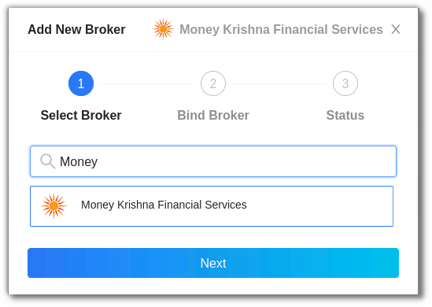
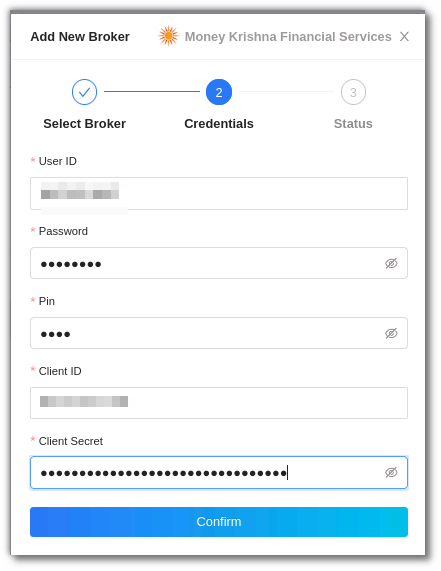
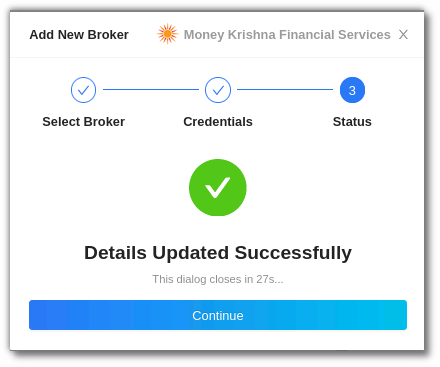

# Money Krishna Financial Services 
---

* Official Website: [https://www.moneykrishna.com/](https://www.moneykrishna.com/)

* Trading Website: [https://mkf.hypertrade.in/login](https://mkf.hypertrade.in/login)

* MKF Login URL: [https://hsconsole.hypertrade.in/login](https://hsconsole.hypertrade.in/login) 

* Markets Supported: India

## 1. One-Time Activity
---
This is a pre-requisite activity to be done before you can link your broking account to the AlgoBulls account via the Non-OAuth method.

* Visit [https://hsconsole.hypertrade.in/login?brokerId=MKF](https://hsconsole.hypertrade.in/login?brokerId=MKF) 

* Enter your **User ID** and **Password**.

Enter the MPIN:

Create the App:

!!!note "Note:"
    Ensure that the App name is **AlgoBulls** & the App URL you will be redirected to should be [https://app.algobulls.com/loading](https://app.algobulls.com/loading).

Once the App is created successfully, the App name, Client ID, Client Secret & Redirect URL will be displayed. **Ensure you note down this information**, you will not be able to reset this information later. Click on confirm.

If you click on confirm without noting down the above-mentioned details displayed by the broker, you will have to delete the App by clicking the Delete App button and repeat the entire process to create the App again.

## 2. Login & Set up your Money Krishna Financial Services (MKF) account.
---
This section will take you through the step-wise instructions to log in, set up, and bind your broker into your AlgoBulls Account.

### i. Before you start
---
Keep the following information available before you start:

(1) AlgoBulls Account Credentials

* Phone Number

* Password

(2) Broking Account Credentials

* User ID

* Password

* PIN

* Client ID (Available only after App creation)

* Client Secret Code (Available only after App creation)

### ii. Let's Start
---
* Visit the AlgoBulls [Login Page](https://app.algobulls.com/user/login) and click on **login with your Broking Account**.

* If the broker name is not visible in the list, click on + x more (where x is the number of brokers) on the bottom right corner of the page.

* In the search box, enter **MONEY KRISHNA FINANCIAL SERVICES**, and then click on the broker link that appears in the list of results.

### iii. Login with Non-OAuth Method
---
* Type the first few characters of the broker's name.

* Select the **MONEY KRISHNA FINANCIAL SERVICES** broker.

Now Login to your AlgoBulls account. Provide data for the following fields and then click the **Login** button

* **Phone Number:** The Phone Number you have used to Register/Sign-Up to the AlgoBulls website.

* **Password:** The password you have given to Register/Sign-Up to the AlgoBulls website.

* Now go to **Broking Details** and click add broker.

* Choose the broker.

* Now provide data for the following fields:

(1) User ID: The ID given to you by your broker.

(2) Password: The password given to you by the broker.

(3) PIN: The PIN provided to you by the broker.  

(4) Client ID: The Client ID displayed during the App creation. 

(5) Client Secret: The Client Secret displayed during the App creation. 

* If the verification is successful, you will see the following message:

## 3. Support

For further support related to adding your Money Krishna Financial Services broker account, contact our helpful customer support team on +91 80692 30300 or email us at [support@algobulls.com](mailto:support@algobulls.com)
