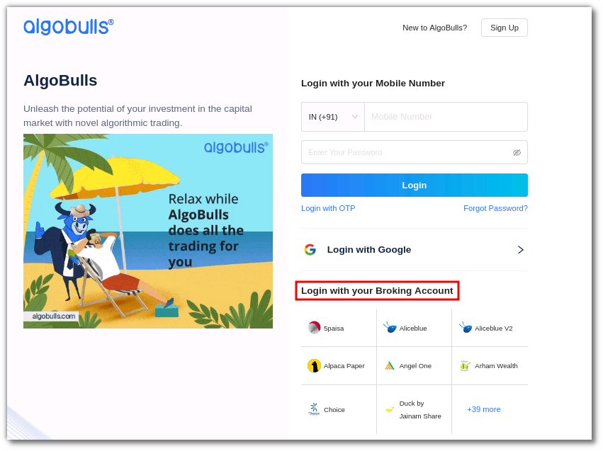
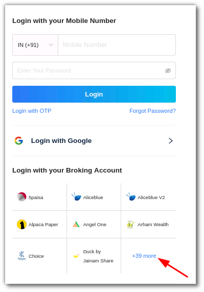
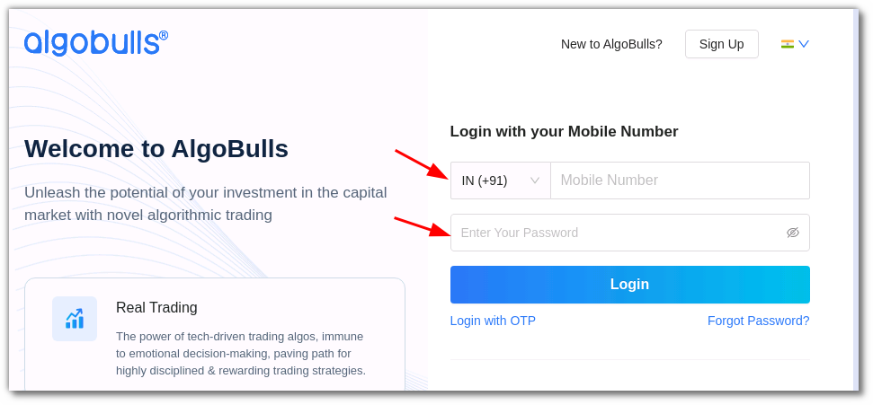
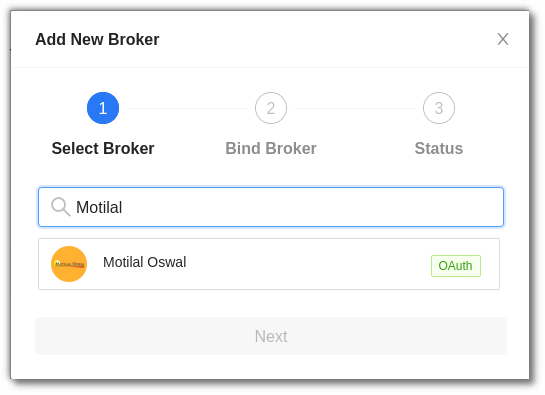
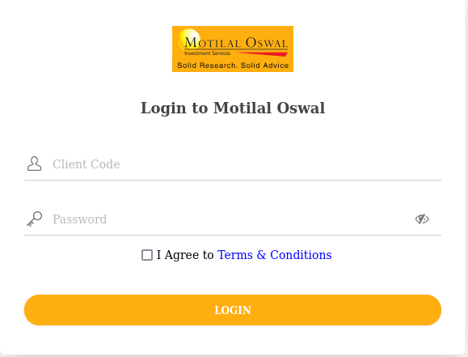

# Motilal Oswal
---

* Official Website: [https://www.mastertrust.co.in/](https://www.motilaloswal.com/)

* Trading Website: [https://masterswift-beta.mastertrust.co.in/](https://www.motilaloswal.com/)

* Markets Supported: India

## 1. Login and Set up your Motilal Account
---

You will be guided step-by-step through the process of logging in, setting up, and binding your broker to your AlgoBulls account in this section.

### i. Before you begin

Keep the following information available before you start:

(1). **AlgoBulls Account Credentials**

* Phone Number

* Password

(2). **Broking Account Credentials**

* User ID/ Client ID

* Password

### ii. Let's Begin! 

* Visit the AlgoBulls [Login Page](https://app.algobulls.com/user/login) and click on **Motilal Oswal** under the **Login with your Broking Account** section.

* If the broker name is not visible in the list, click on + x more (where x is the number of brokers) on the bottom right corner of the page.

* In the search box, enter **MOTILAL OSWAL**, and then click on the broker link that appears in the list of results.

* Log in to your AlgoBulls account by entering your AlgoBulls credentials in the following fields before clicking on the login button.

(1). **Phone Number:** The phone number used to register/sign-up to the AlgoBulls website.

(2). **Password:** The password used while registering on the AlgoBulls website.

* Click the **Add Broker** button under **Broking Details** now.

* Choose **Motilal Oswal** from the broker list.

Select **Next**. You will be directed to the **Motilal Oswal Login Page**.

* Enter your Client Code.

* Followed by your Password. 

* Check the Terms & Conditions box. 

* Click on Login.

## 2. Bind your Broking Account
---

The following steps will help you to make sure you have binded your broker account.

* Visit the AlgoBulls [Broker Settings Page](https://app.algobulls.com/broking).

* Bind your account using the Toggle button marked below.     

## 3. Support
---

For further support related to adding your Motilal Oswal broker account, contact our helpful customer support team on +91 80692 30300 or email us at [support@algobulls.com](https://support@algobulls.com)
