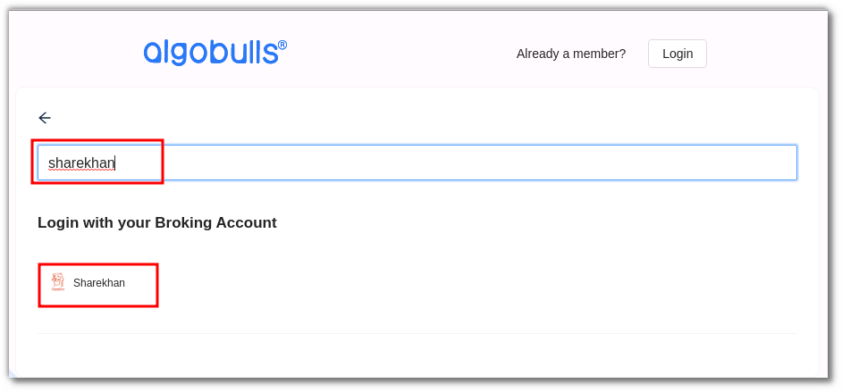
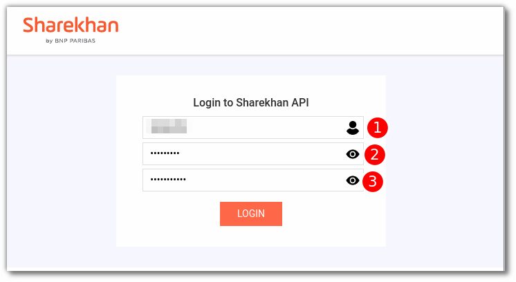
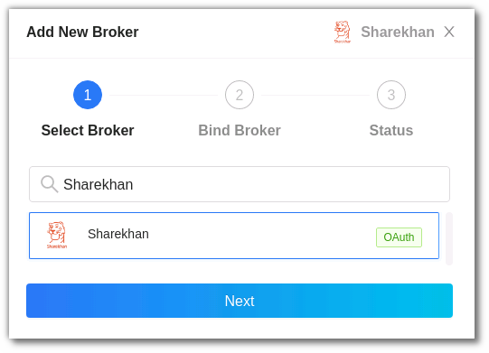
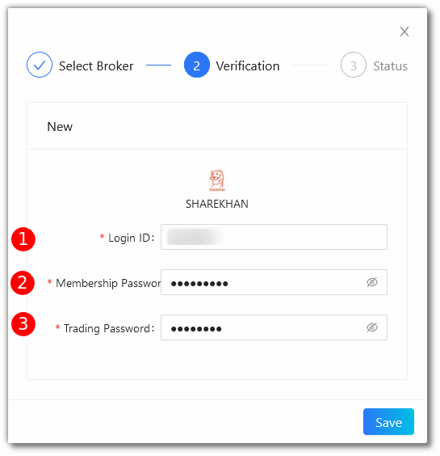

# ShareKhan
---

* Official Website: [https://www.sharekhan.com/](https://www.sharekhan.com/)

* Trading Website: [https://newtrade.sharekhan.com/](https://newtrade.sharekhan.com/)

* Markets Supported: India

## 1. Important Point(s) to Note
---
* It is required to login **once** daily (at the start of the trading day).

## 2. Login and Set up your ShareKhan Account 
---
This section will take you through the step-wise instructions to log in, setup, and bind your broker into your AlgoBulls Account.

### i. Before you Start
---
Keep the following information available before you start:

1) AlgoBulls Account Credentials

* Phone Number

* Password

2) Broking Account Credentials

* Login ID

* Membership Password

* Trading Password

### ii. Let's Start
---
* Visit the AlgoBulls [Login Page](https://app.algobulls.com/user/login) and click on **Login with your Broking Account**.

* Type the first few characters of your Broker Name.

* Select the **SHAREKHAN** broker.

* You will be re-directed to the Verification Page. Provide data for the following fields:

(1). Login ID: The ID given to you by your broker.

(2). Membership Password: The Membership Password given to you by the broker.

(3). Trading Password: The Trading Password given to you by the broker.

* If the login is successful, you will re-directed back to the AlgoBulls website.

### iii. Another Way to Bind the Broker
---

Now Login to your AlgoBulls account. Provide data for the following fields and then click the **Login** button.

* Phone Number: The Phone Number you have used to Register/Sign-Up to the AlgoBulls website.

* Password: The password you have given to Register/Sign-Up to the AlgoBulls website.

* Now go to **Broking Details** and click add broker.

* Choose the broker .

* Now Provide data for the following fields:

(1). Login ID: The ID given to you by your broker.

(2). Membership Password: The Membership Password given to you by the broker.

(3). Trading Password: The Trading Password given to you by the broker .

* If the verification is successful, you will see the following message:

## 3. Support
---
For Help and Support, contact us on +91 80692 30300 or [email us](mailto:support@algobulls.com).
