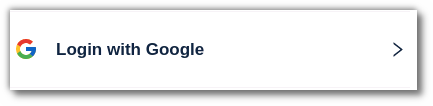
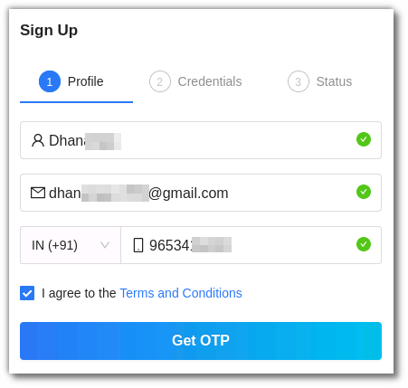
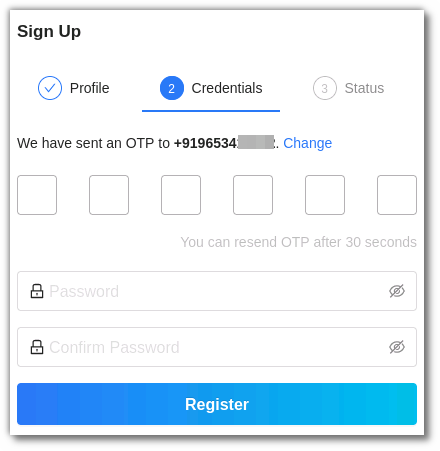
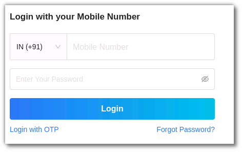
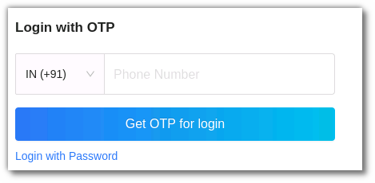
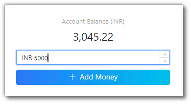
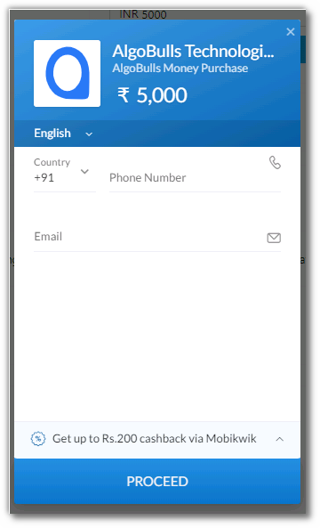

# AlgoBulls Help Site

<iframe width="560" height="315" src="https://www.youtube.com/embed/iKkvgFcV9Xk" frameborder="0" allow="accelerometer; autoplay; encrypted-media; gyroscope; picture-in-picture" allowfullscreen></iframe>

## 1. Introduction
Welcome to AlgoBulls! A trading marketplace that provides 100% automated trading algorithms and has the ability to deploy multiple trading strategies across asset classes. You can choose from numerous ready-to-use strategies, or build and deploy your own strategies in the live markets. AlgoBulls also offers a Fixed Income marketplace where you can begin investing in Bonds & NCDs.

Here's a quick guide to help you trade or invest on our user-friendly platform right away!

## 2. Sign Up with AlgoBulls

#### i. **Sign Up with Google**
You can now register with AlgoBulls within a minute with the Login with Google option.

#### ii. **Sign Up in 3 simple steps**

   **Step 1:** 

   **Profile:** Add your Name, Email & Phone Number. Click on **Get OTP**.

   **Step 2:**
   
   **Credentials:** Add the OTP & other credentials such as password.

   **Step 3:** 
   
   **Status:** You can view the status of your registration here.

   Haven't registered with AlgoBulls yet? [Register now!](https://app.algobulls.com/user/register)
 
## 3. Log in with AlgoBulls

   If you already have an AlgoBulls account, simply log in using the following options:  

####  i. Login with Google

Use your Google account to **Login with Google**.

   

#### ii. [Login with mobile number](https://app.algobulls.com/user/login) 

Use your mobile number and the password to Login.

   

#### iii. [Login with OTP](https://app.algobulls.com/user/login?method=mobile) 

You can select the Login with OTP option too. Enter your phone number and an OTP will be sent to your registered mobile number.
   
   

   
#### iv. Login with your Broking Account

You can login with your broking account too. It requires a one time set up where you will have to link your existing/new broker. Once that process is complete you can login using your broking account daily. 
   
   
   
## 4. Forgot password?

If you have forgotten your password, you can reset it <a href="https://app.algobulls.com/user/login?method=forgot_password">here</a>. 

Want to begin trading? <a href="https://app.algobulls.com/user/login">Login</a> now.

## 5. What is Live and Test mode?

The AlgoBulls <a href="https://help.algobulls.com/member/test-to-live-mode.html">Live & Test mode</a> is a feature that allows you to switch between live and virtual trading. The Test Mode on AlgoBulls is a virtual simulation of the real markets. Whereas the Live Mode is where you can execute strategies to begin live trading.

## 6. How to add a broking account?

To begin trading, it is necessary to add your broker details and add your broking account. To add a broker account follow these 3 simple steps: 

**Step 1:** From the AlgoBulls sidebar navigation select <a href="https://app.algobulls.com/broking">Broking Details</a> in Live Mode and click on the <a href="https://app.algobulls.com/broking?addBroker=true">Add Broker</a> button.

**Step 2:** Select your broker and fill in the necessary information. Click on **Confirm**.

**Step 3:** Once confirmed the broker will be added to your account. 

For more information on adding, removing and editing the broker details, <a href="https://help.algobulls.com/member/broking-details.html">click here</a>. 

To visit the broker details page, <a href="https://app.algobulls.com/broking">click here</a>. 

## 7. Add money in AlgoBulls Plans and Wallet

After adding your broker with AlgoBulls, you can then <a href="https://app.algobulls.com/wallet?defaultCategory=backtesting%26PaperTrading">add money in the AlgoBulls account</a> and subscribe to a package of your choice from the Plans & Wallet section in the sidebar navigation. 

**Step 1:** In the plans & wallet section, enter the amount and click on **+ Add Money**.

**Step 2:** Enter your phone number & email address and click on proceed.

**Step 3:** Choose your preferred payment method. Once the payment is successful the balance will be added in your AlgoBulls account. 

Running out of balance? <a href="https://app.algobulls.com/wallet?defaultCategory=backtesting%26PaperTrading">Add money now!</a>

Know more about the <a href="https://help.algobulls.com/member/wallet.html">Plans & Wallet section</a>.

## 8. How to Subscribe to a Plan? 

To <a href="https://app.algobulls.com/wallet?defaultCategory=backtesting%26PaperTrading">subscribe to a plan</a>, you can choose a plans of your choice from the plans & wallet section, these plans are active for a specific time duration. Hence all services included in the package will not incur any additional charges for that period. 

Know more about <a href="https://help.algobulls.com/member/wallet.html">Plans & Wallet</a>. 

AlgoBulls also offers a range of free plans: Subscribe for a <a href="https://app.algobulls.com/wallet?defaultCategory=free">Free Plan</a> now! 

## 9. How to select a strategy?

After subscribing to a plan you can now choose the Algo Strategy of your choice from the Choose Strategy section. This Marketplace has more than 150+ Algo Strategies created by industry leading experts. It is divided into 3 segments: Retail, Premium & HNI Marketplace. 

<a href="https://app.algobulls.com/marketplace/category/retail">Retail Marketplace</a>: The retail marketplace includes carefully chosen trading algos, ideal for all levels of experience, whether novice or expert. The Retail section includes Equity, Futures & Commodities cash segment strategies. <a href="https://help.algobulls.com/member/choose-strategy.html#2-retail-marketplace">Know more</a> about the Retail Marketplace.

<a href="https://app.algobulls.com/marketplace/category/premium">Premium Marketplace</a>: Trade with our intelligent and powerful Index Option Strategies in the Premium Marketplace. <a href="https://help.algobulls.com/member/choose-strategy.html#3-premium-marketplace">Read more</a> about the Premium Marketplace.

<a href="https://app.algobulls.com/marketplace/category/hni">HNI Marketplace</a>: AI-driven trading algos tailored for the HNI clientele's individual needs and risk appetite.This marketplace also includes Index Option Strategies. <a href="https://help.algobulls.com/member/choose-strategy.html#4-hni-marketplace">Learn more</a> about the HNI Marketplace.

Select a strategy from the AlgoBulls <a href="https://app.algobulls.com/marketplace/category/retail">Choose Strategy Marketplace now!</a> 

## 10. The Strategy Card

A strategy card has all the information you need about a strategy. To view these details, select a marketplace in the <a href="https://app.algobulls.com/marketplace/category/retail">Choose Strategy Marketplace</a>, search for the strategy you would like to view and click on the strategy card. 

A detailed view of the strategy card will open. To begin trading with a particular strategy, click on the execute button to add it to your <a href="https://help.algobulls.com/member/choose-strategy.html#4-hni-marketplace">My Portfolio</a> page. To know more about the strategy card, <a href="https://help.algobulls.com/member/strategy-card.html">click here</a>.    

## 11. My Portfolio

In the My Portfolio section you can execute strategies in the real markets with Live Trading in the <a href="https://help.algobulls.com/member/test-to-live-mode.html">Live Mode</a>.

In the <a href="https://help.algobulls.com/member/test-to-live-mode.html">Test Mode</a>, you can test a strategy in live markets without risking any money through Paper Trading, modify strategies using the <a href="https://help.algobulls.com/member/tweak.html">Tweak option</a> and test the past performance data for that strategy through Backtesting.

In order to begin live trading or virtual trading you can switch the toggle button on the bottom left side of the website to Live Mode/Test Mode. Learn more about the Portfolio in [Virtual](https://help.algobulls.com/member/virtual-trading.html) & [Live Trading](https://help.algobulls.com/member/live-trading.html) mode.  

<a href="https://app.algobulls.com/portfolio">Begin Trading now!</a>

The portfolio also includes some fantastic features such as the P&L Tracker and <a href="https://help.algobulls.com/member/tweak.html">Tweak strategy feature</a>. 

The <a href="https://help.algobulls.com/member/pnltracker.html">P&L Tracker feature</a> allows you to gain profit or limit losses at (or near) predefined values for your plan. You can access the P&L Tracker when you start a strategy in the My Portfolio section in Test or Live Mode.

## 12. My Strategies

The My Strategies page displays a list of all your strategies that you may set as [Live Trading](https://help.algobulls.com/member/live-trading.html) (Live Mode) or [Virtual Trading](https://help.algobulls.com/member/virtual-trading.html) (Backtesting/Paper Trading). 

To add a strategy from the My Strategies section, click the Add strategy button and choose from the <a href="https://app.algobulls.com/marketplace/category/retail">Retail</a>, <a href="https://app.algobulls.com/marketplace/category/premium">Premium</a> and <a href="https://app.algobulls.com/marketplace/category/hni">HNI</a> marketplace. 

You can also add strategies and manage them <a href="https://app.algobulls.com/manage-strategies">here</a>.

<a href="https://help.algobulls.com/member/my-strategies.html">Learn more</a> about the My Strategies page on AlgoBulls. 

## 13. Live Reports

The Live Reports section is divided into 3 parts: <a href="https://app.algobulls.com/book/pl">P&L Book</a>, <a href="https://app.algobulls.com/book/trade">Trade Book</a>, and <a href="https://app.algobulls.com/book/fund">Fund Book</a>. 

* The P&L Book displays the Profit & Loss of your trades in your account. All trades/orders in your account are updated real-time as and when the transactions take place. <a href="https://help.algobulls.com/member/Books/pnl.html">Know more</a>.

* The Trade Book displays the chosen strategy’s activities in your account. <a href="https://help.algobulls.com/member/Books/tradebook.html">Read more</a>.

* The Fund Book section shows all of the charges that have been applied to your account. <a href="https://help.algobulls.com/member/Books/fundbook.html">Learn more</a>.

Want to check Live Reports for your Strategies? Visit the <a href="https://app.algobulls.com/book/pl">P&L Book</a>, <a href="https://app.algobulls.com/book/trade">Trade Book</a>, and <a href="https://app.algobulls.com/book/fund">Fund Book</a> now! 

## 14. The Dashboard

Once you have successfully registered with AlgoBulls, you will be redirected to the <a href="https://help.algobulls.com/member/dashboard.html">AlgoBulls Dashboard</a>. The AlgoBulls Dashboard gives you an overview of your account and trades.

Go to <a href="https://app.algobulls.com/dashboard">my dashboard</a>.

## 15. Settings

In Settings, you can add/edit your basic profile, set your trading risk, grant access to your trading manager, and explore your developer options.

- <a href="https://app.algobulls.com/settings">Add/Edit your basic information</a>
- <a href="https://app.algobulls.com/settings?section=password%26Security">Password & Security</a> 
- <a href="https://app.algobulls.com/settings?section=tradeManager">Trade Manager</a> 
- <a href="https://app.algobulls.com/settings?section=developerOptions">Developer Options</a> 

Learn more about settings <a href="https://help.algobulls.com/member/settings.html">here</a>.

For [FAQs](member/faq.md) and other help related videos and documents you can check the **resources** section from the AlgoBulls sidebar navigation. 

For further information regarding the AlgoBulls platform you can always reach out to our customer service team at <a href="mailto:support@algobulls.com">support@algobulls.com</a> OR call us on +91 8069 230 300.
