# P&L Book

<iframe width="560" height="315" src="https://www.youtube.com/embed/DxOBhWKBNIE" frameborder="0" allow="accelerometer; autoplay; encrypted-media; gyroscope; picture-in-picture" allowfullscreen></iframe>

## 1. What is a P&L Book?
---

Track the **profit and loss** of your trades in the [P&L Book](https://app.algobulls.com/book/pl).

* All trades/orders in your account are updated real-time as and when the transactions take place. 
* Filter your activities using filters such as **strategies, instrument and date range**.
* View data in **heatmaps**.

[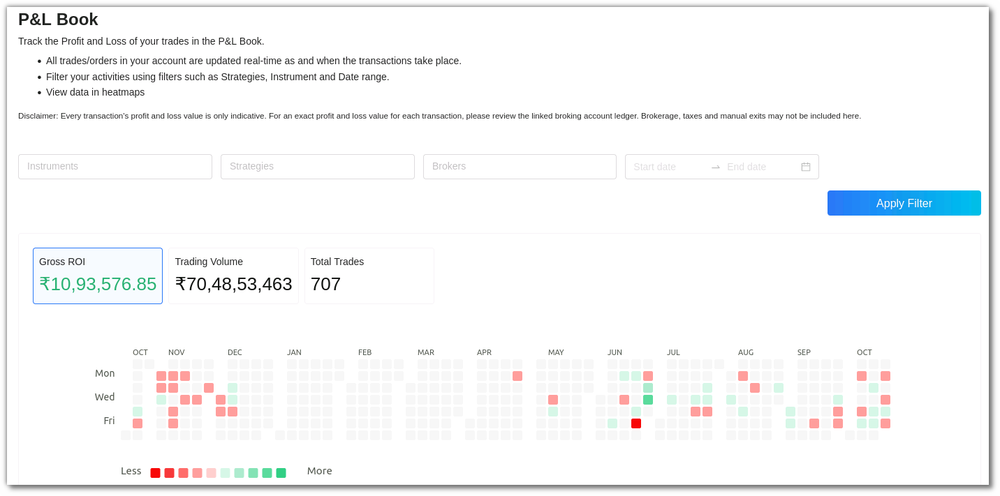](imgs/pnl.png)

## 2. Summary Bar
---

The P&L Book shows the **gross roi**, which is your total profit and loss, the **trading volume**, which is the maximum traded volume to date, and the **total trades**, which is the total number of trades made to date.

[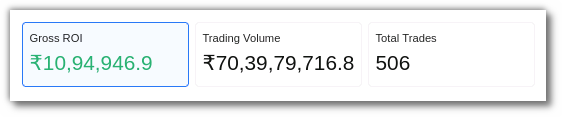](imgs/pnl1.png)

## 3. Heatmaps
---

Your P&L data is segregated in shades of green and red. Data can be viewed daily, weekly, monthly, and yearly. Dark green denotes highest profit and red denotes maximum loss.

[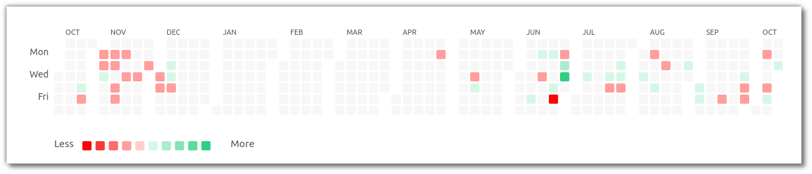](imgs/pnl2.png)

## 4. Filters
---

Filters will allow you to selectively search for a specific entry or multiple entries.

[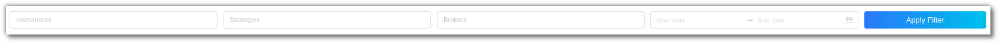](imgs/pnl3.png)

* **Instrument**: Select one or more instruments to display in the table below. 
These entries are populated as per the instruments on the strategies that were executed.

[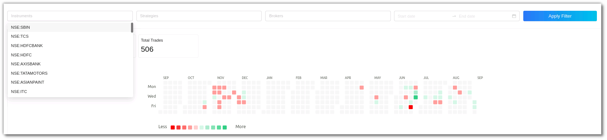](imgs/pnl4.png)

* **Strategies**: Choose one or more strategies to display them in the table below. 
These entries are populated as per the strategies chosen by you.

[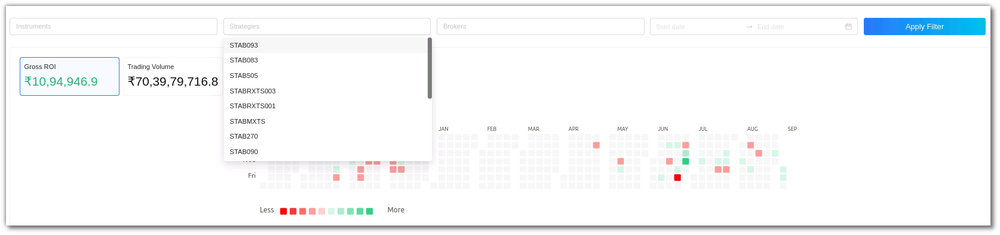](imgs/pnl5.png)

* **Brokers**: Choose one or more brokers to display them in the table below.
These entries are populated as per the brokers selected by you.

[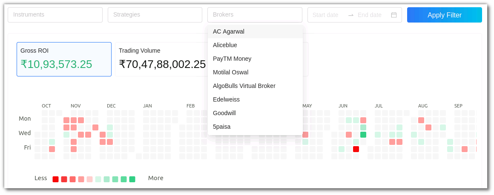](imgs/pnl_broker_filter.png)

* **Date Range (Start Date & End Date)**: Give the date range to view the table for the selected  strategy and instrument (if any).

[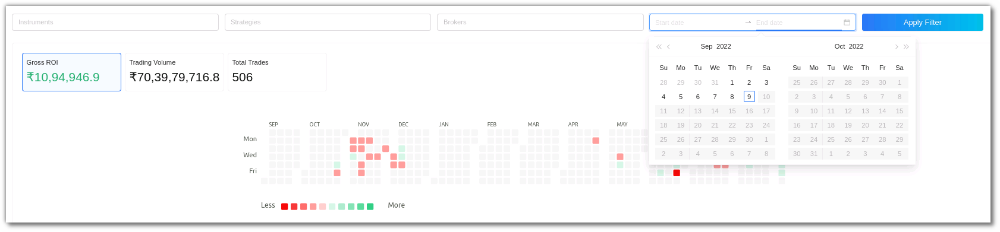](imgs/pnl6.png)

## 5. Fields
---

The table covers the following fields:
 
* **Strategy**: Name of the strategy.

* **Broker**: Broker name.

* **Entry**: Quantity, price, date & entry time of trade.

* **Exit**: Quantity, price, date & exit time of trade.

* **P&L (% or INR)**: The P&L % or INR can be changed using the toggle option in the tools section in the top right corner. You can view the P&L in rupees or P&L percentage of the trade.

[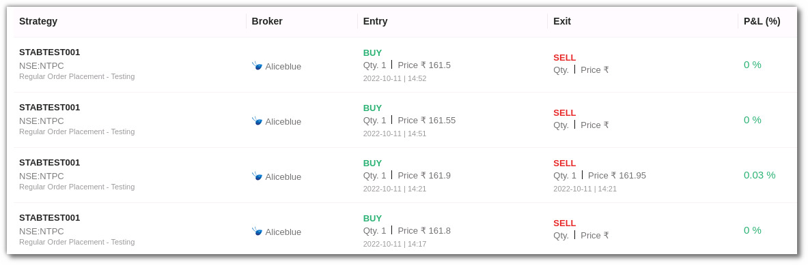](imgs/pnl7.png)

## 6. The Toolbar
---

[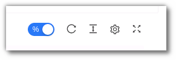](imgs/pnl.png)

**P&L % and INR toggle button**: View P&L in percentage or INR by using this option. 

[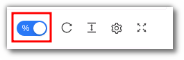](imgs/pnl.png)

**Refresh** - If you can't see an entry in the table (perhaps the most recent one), click **refresh** to check again.

[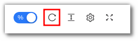](imgs/pnl.png)

**Density** - View data comfortably by choosing the density. The options include **larger, middle and compact**. 

[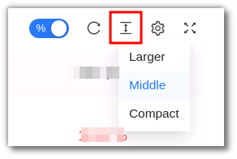](imgs/pnl.png)

**Settings** - Select the columns that you want to view in this **settings** option.

[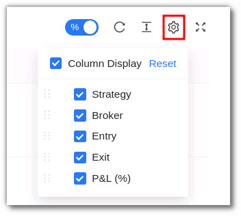](imgs/pnl.png)

**Full Screen** - With this option you will be able to view your current tab on the browser in full Screen. To go back to the normal viewing mode click on it again. This is similar to pressing F11 on most browsers and operating systems.

[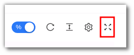](imgs/pnl.png)

