# Choose Strategy Marketplace

## 1. Introduction
---

Choose from a wide range of advanced, AI-driven strategies developed with cutting-edge technology.
This Marketplace has more than 150+ Algo Strategies created by industry leading experts. The AlgoBulls strategies are a combination of complex formulas and mathematical models that offer excellent speed and accuracy in comparison to Manual trading. 
The Choose strategy marketplace is divided into 3 parts: [Retail](https://app.algobulls.com/marketplace/category/retail), [Premium](https://app.algobulls.com/marketplace/category/premium) & [HNI](https://app.algobulls.com/marketplace/category/hni) marketplace.

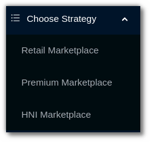

## 2. [Retail Marketplace](https://app.algobulls.com/marketplace/category/retail) 
The retail marketplace includes carefully chosen trading algos, ideal for all levels of experience, whether novice or expert. The **retail section** includes **equity, futures & commodities** cash segment strategies. 

* Filter strategies by name or strategy code. 

* Search strategies using the **sort** or **duration** filter. 

* Add strategies to your **favourites** list.

* To add strategy to your **my portfolio** page, click on **execute**.

* Click on **know more** to get more information about any strategy.

[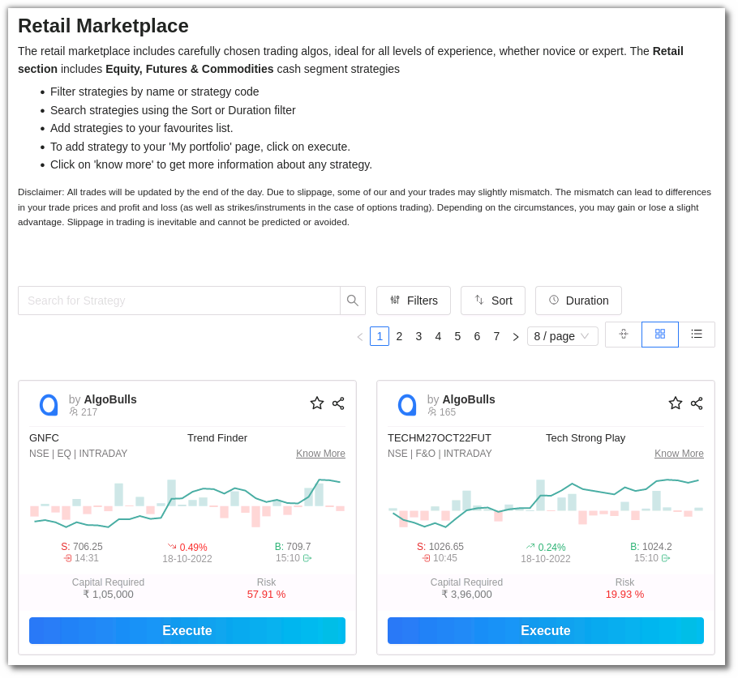](imgs/retail_marketplace.png)

## 3. [Premium Marketplace](https://app.algobulls.com/marketplace/category/premium)  
With our intelligent and powerful trading algos, we enable you to trade through **index options strategies**. Choose from this wide range of advanced, AI-driven strategies developed with cutting-edge technology. 

* Filter strategies by name or strategy code 

* Search strategies using the **sort** or **duration** filter 

* Add strategies to your **favourites** list.

* To add strategy to your **my portfolio** page, click on **execute**.

* Click on **know more** to get more information about any strategy.

[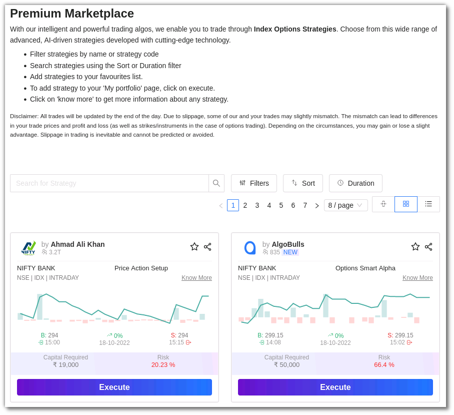](imgs/premium_marketplace.png)

## 4. [HNI Marketplace](https://app.algobulls.com/marketplace/category/hni) 
AI-driven trading algos tailored for the HNI clientele's individual needs and risk appetite.This marketplace includes **index option strategies** 

* Filter strategies by name or strategy code 

* Search strategies using the **sort** or **duration** filter 

* Add strategies to your **favourites** list.

* To add strategy to your **my portfolio** page, click on **execute**.

* Click on **know more** to get more information about any strategy.

[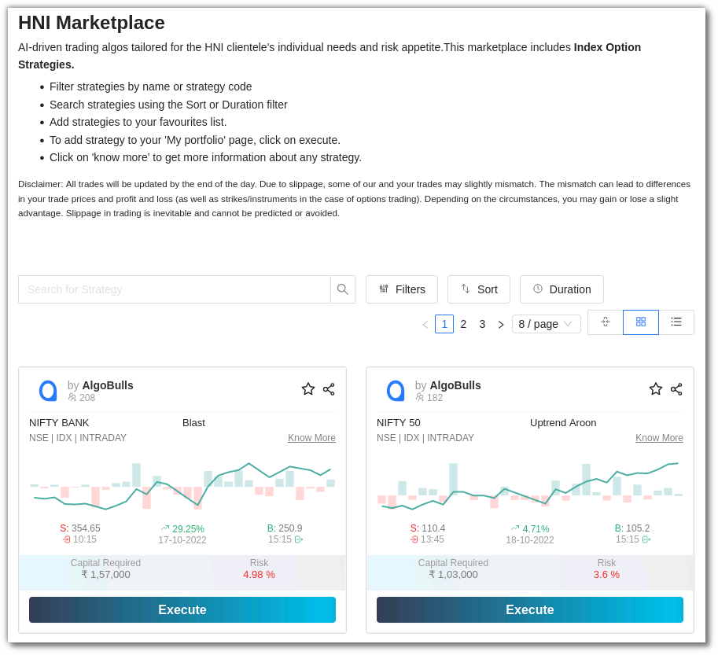](imgs/hni_marketplace.png)

Before adding strategies to your **my portfolio** section, you can explore the strategy details, parameters and back testing reports to evaluate the strategy's performance in the **choose strategy** section. Know more about the [Strategy Card](strategy-card.md).

## 5. Explore Strategies
---
You can find strategies using the following options: 

### i. Search Bar

Use this to type in the **strategy name** or **code** .

[ 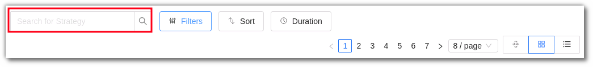](imgs/cs3.png)

### ii. Filters

[//]: # (You can filter your view as per the **ROI %, risk %, capital required & hit ratio**. You can also use the filter option for **brokers, exchanges, segments, modes, candle types, candle sizes** and **tags**. Click on the **Apply Filters** button to see the results.)
You can filter your view as per the **risk %, capital required & hit ratio**. You can also use the filter option for **brokers, exchanges, segments, modes, candle types, candle sizes** and **tags**. Click on the **Apply Filters** button to see the results.

[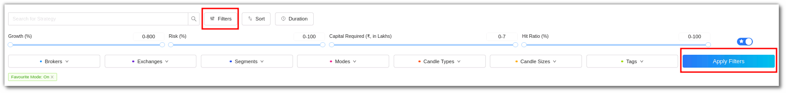](imgs/cs4.png)

### iii. Favourites

Use the toggle button to activate the Favourite Mode to view the strategies marked as **Favourite** (**☆**).

[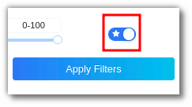](imgs/cs5.png)

### iv. Sort

You can sort the strategies into the following:

[//]: # (* ROI)

* Risk 

* Transaction Charges 

* Recent Transactions 

Click on the **Apply Sort** button to categorise the strategies. 

[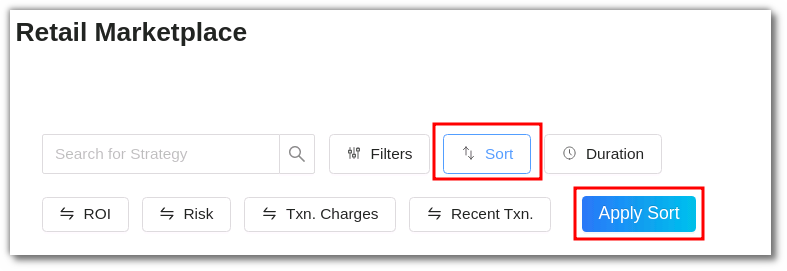](imgs/cs6.png)

### v. Duration

This option allows you to search for strategies that have been added to the marketplace in the last 3 days, 14 days, 30 days and All Time. Click on **Apply Duration** to save the changes. 

[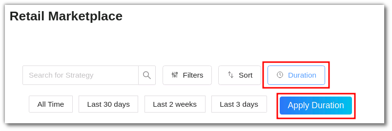](imgs/cs7.png)

### vi. Pagination

You can click the **<** and **>** for changing pages. You can also choose to view **4/8/12** strategies per page.

[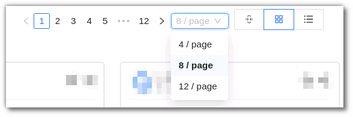](imgs/cs8.png)

### vii. Density

Adjust the density by choosing the **compact, regular or list mode**.

* **Compact Mode**

In this mode the strategies are displayed in a compact view. You can click on the know more button to view the whole strategy.

[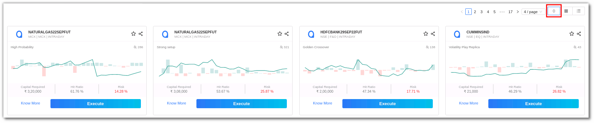](imgs/compact_mode.png)

* **Regular Mode** 

This is the AlgoBulls' default mode. In comparison to any other mode, the strategy card in regular mode has the most information.

[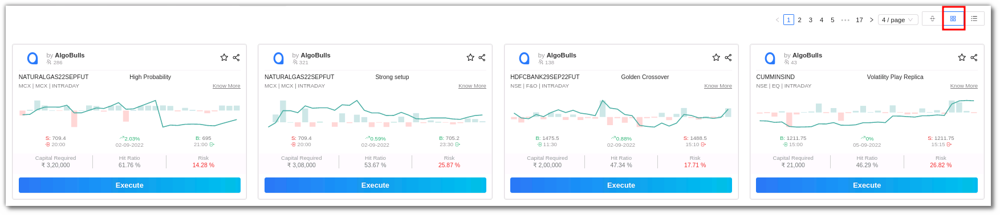](imgs/regular_mode.png)

* **List Mode**

This mode displays all the strategies in the marketplace in a list view.

[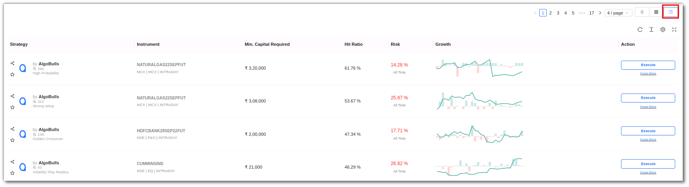](imgs/list_mode.png)