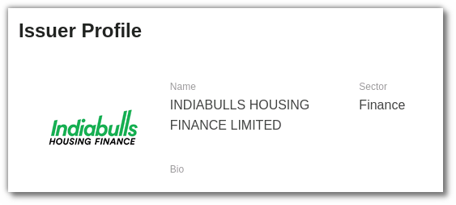
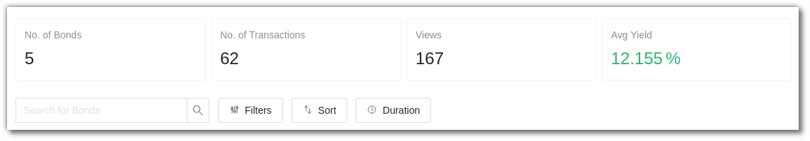
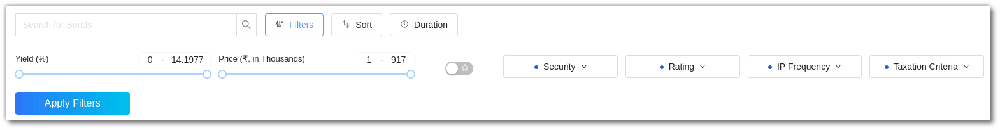
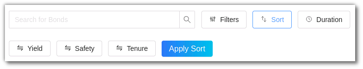
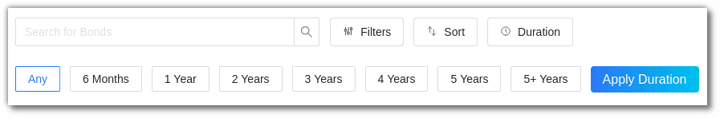
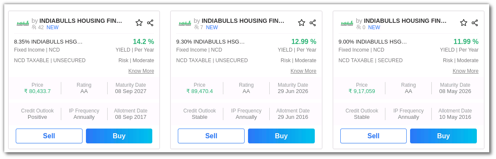
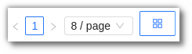

# Issuer Profile

## 1. What is an Issuer?

A legal entity that manages, registers, and sells securities to support its operations financially is an Issuer. There can be many types of Issuers - Corporations, Domestic or Foreign Governments and Investment trusts. Issuers develop securities such as Bonds, Debentures, G-Secs & NCDs. Issuers are legally responsible for reporting financial conditions, material developments, and other operational activities required by the jurisdiction's regulations.

The AlgoBulls Issuer Profile gives you a detailed view of the issuer’s name, bonds available, transactions, average yield and more. Check the Issuer profile [here](https://app.algobulls.com/issuer/15?displayMode=0&query=eyJjdXJyZW50UGFnZSI6MSwicGFnZVNpemUiOjh9).

## 2. Issuer Profile Summary

### i. Name

This section displays the Issuer Name and Logo.

### ii. Sector

You can view the sector the Issuer belongs to here.

### iii. Bio

A detailed summary of the Issuer.

### iv. Number of Bonds

View the number of Bonds available from the Issuer.

### v. Number of Transactions

The total number of transactions made on the bonds available from the Issuer.

### vi .Views

Number of people who have viewed the Issuer profile.

### vii. Average Yield

The average yield provided by the Issuer so far.

### viii. Search Bar

This search bar help you search for bonds that are developed by the issuer.

### ix. Filter

You can filter the bonds as per the yield, price, security, rating, IP Frequency and Taxation Criteria. You can also add the bond as favourite by using the ‘Favourite Mode’ toggle button. Click on apply filters to view the results.

### x. Sort

Sort the Bonds as per the Yield, Safety and Tenure. Click on Apply Sort to view the results.

### xi. Duration

You can also filter or search for bonds as per the duration period. Currently, the duration periods available are Any, 6 months, 1-5 years and 5+ years. Click on Apply Duration to view the results.

## 3. The Issuer Bond Cards

The Bond card includes the Issuer’s name, Security Name, Yield Per Year, Security and Taxation criteria. You can also view the price, rating, maturity date, Credit Outlook, IP Frequency and Allotment Date. You may also Buy or Sell the bond from the Bonds card. Click on the card to view more details.

### i. Pagination

You can view the bond cards in various page view modes, such as 4 Page/8 Page/12 Page. You can also view the Bond cards in the Regular Mode or List Mode.

