# Live Trading

<iframe width="560" height="315" src="https://www.youtube.com/embed/n7b-OEZZxSc" frameborder="0" allow="accelerometer; autoplay; encrypted-media; gyroscope; picture-in-picture" allowfullscreen></iframe>

## 1. Introduction
---

You can execute strategies to begin live trading in the Live Trading Mode. Switch the toggle button on the bottom left side of the website to Live Mode.

* Begin live trading with 100% automation in the **live trading mode**.

* Choose from multiple brokers & execute trades directly in your **broking** account.

* Monitor **live profit & loss** and fetch strategy execution **logs** in real time. There are no charges for fetching **logs**.

* Start & Stop your algo strategies in one click. Charges may be applicable for **start and stop**.

* Choose a strategy from the [Retail](https://app.algobulls.com/marketplace/category/retail), [Premium](https://app.algobulls.com/marketplace/category/premium) & [HNI](https://app.algobulls.com/marketplace/category/hni) marketplace now!

## 2. What is Live Mode?
---

The **Live Mode** is where you can execute strategies to begin live trading. Switch the toggle button on the bottom left side of the website to Live Mode. 

[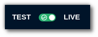](imgs/test_and_live5.png)

The choose strategy marketplace includes more than 150+ strategies that you can choose from; select a strategy, click execute and begin live trading. 

To avoid additional charges for services used in Live Trading, ensure you [subscribe to a plan](https://app.algobulls.com/wallet?defaultCategory=backtesting%26PaperTrading) from the Plans & Wallet section.

## 3. How to begin Live Trading?
---
Begin Live Trading on AlgoBulls with these 4 simple steps:   

**Step 1**

Switch to Live Mode 

**Step 2**

Select a strategy from the choose strategy section and click on execute. The strategy will be added to the portfolio & you will be redirected to the [My Portfolio](https://app.algobulls.com/portfolio) page.

**Step 3**

To start the chosen strategy click the start button from the Action field.

[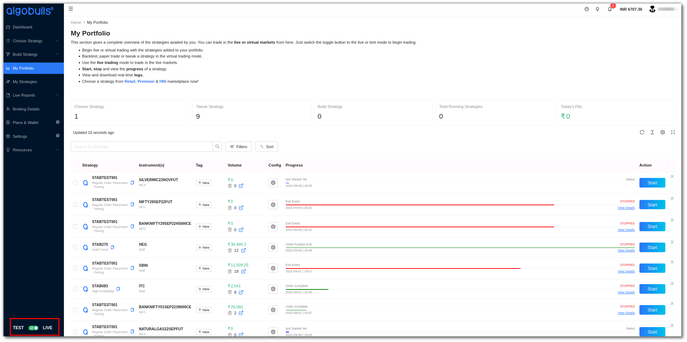](imgs/my_portfolio.png)

Select a broker, add the start and end time and Quantity/Lots. 

[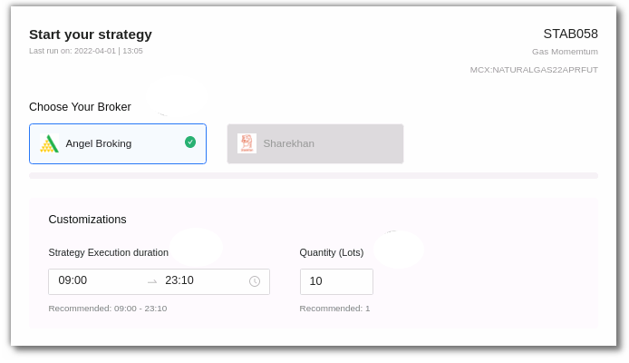](imgs/ptb14.png)

**Step 4**

Use the toggle button to activate the P&L Tracker. Add the Desired Profit and Risk Appetite here. Click on Save & Start. 

[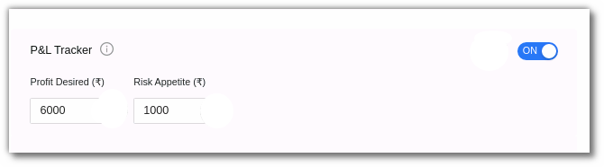](imgs/ptb15.png)

!!! note annotate "Note"

    * Please note that you will be charged for using these services, to get these charges waived off you can purchase a package with AlgoBulls instead.

!!! warning
    Even after completing all of the preceding steps mentioned above, trading may not begin for the following reasons:
    
    * Your broker account may be insufficiently funded.
    
    * A particular segment in your broker account has not yet been activated (This happens with new accounts, and though some brokers activate this by default, others may take 24 hours or more to do so).
    
    * Due to market volatility, your broker may have stopped accepting certain order requests on some of the scripts or stocks (If any such order type with such script/stock strategy is currently running in your AlgoBulls account, new orders for the same won't be displayed).
    
    * Certain order types are incompatible with certain brokers.
    
    * It's essential for your linked broker account to allow you to execute those orders. Not all strategies are accepted/allowed by every broker. This is because of broker permission issues.

    * The AlgoBulls platform has no control over the brokerage charges imposed by your broker once your trading begins. Before proceeding, please review all charges on the broker's end.

------------
Visit [algobulls.com](https://algobulls.com/).

The strategy may stop due to various reasons such as market closure, p&l achieved, or if there are any errors. 
To check errors, in the **progress field** click on the **view details** option and then click on **detailed logs** on the right side corner. These logs can also be downloaded at any time of the day unless you override it by starting the same strategy again.

## 4. How to apply tweaked strategy in Live Trading?
---

If you are happy with the strategy after its virtual trading results you can begin real money trading by simply switching to Live Mode. 

The backtested/paper traded strategy will be added to your [My Strategies](my-strategies.md) section where you can simply switch them to **Live Trading** from the toggle button. The strategy will be added to your portfolio in **Live Mode**.

## 5. Summary Bar
---

The **summary bar** in the portfolio section includes the following: 

**Choose Strategy**: Number of strategies from the Marketplace in your portfolio added by you.

**Tweak Strategy**:  Number of strategies that have been tweaked by you.

**Build Strategy**: Number of custom strategies that have been built by the AlgoBulls developer team for you. 

**Total Running Strategies**: The number of strategies that are currently active on your portfolio, especially from the ones mentioned above (During the market hours).

**Today’s P&L**: The total P&L value.

[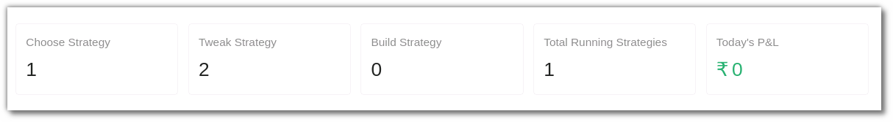](imgs/portfolio2.png)

## 6. Fields
---

My Portfolio includes the following fields: 

* **Strategy**: This field displays the strategy name and code.

* **Instrument(s)**: This includes the instrument on which the strategy is being run. 

* **Tag**: This is a user defined tag for the strategy. Users can tag different strategies under different tags.

* **Volume**: This includes the strategy volume. To get a detailed view you can also click the symbol highlighted in blue in the volume field that redirects you to the tradebook.

[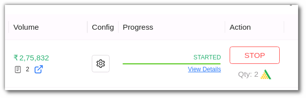](imgs/portfolio3.png)

[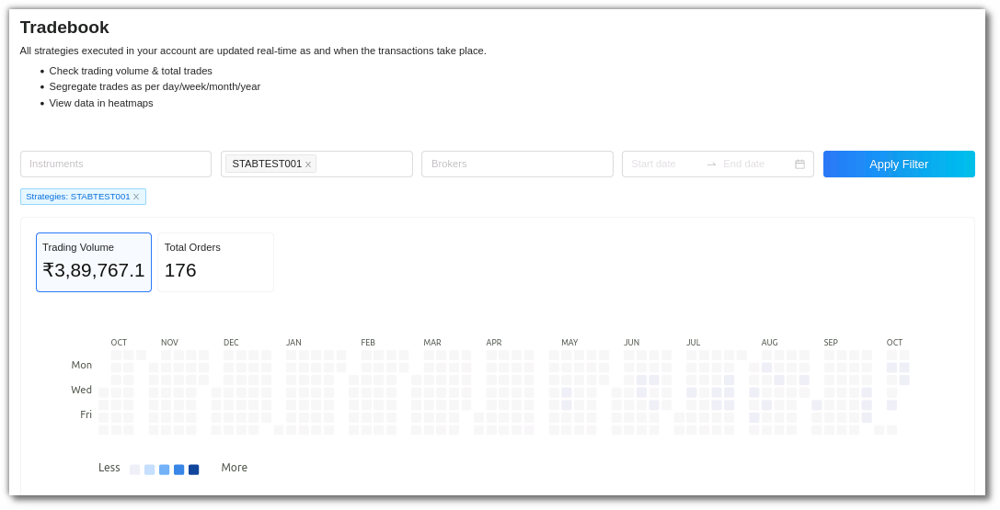](imgs/portfolio4.png)

* **Config**: You can view parameters and other configuration settings here. 
The strategy configuration field includes **instrument** and **strategy settings** such as general settings, strategy parameters, resume, exit and misc options. 

[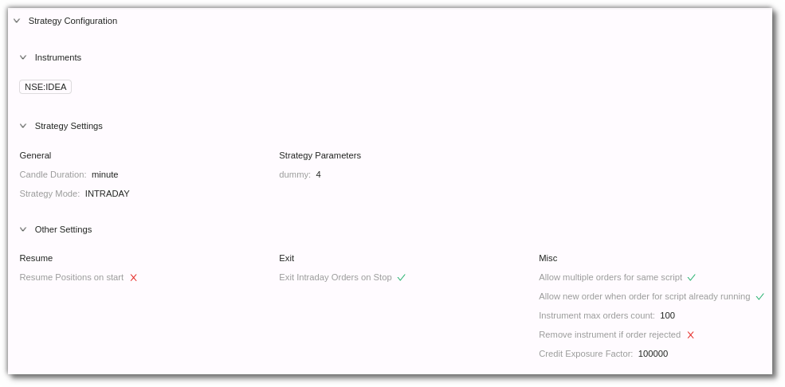](imgs/portfolio5.png)

* **Progress**: This includes the strategy progress status. You can view if the strategy is about to begin, has begun or has stopped here. You can also click on the view details section to get a real time progress update. 

[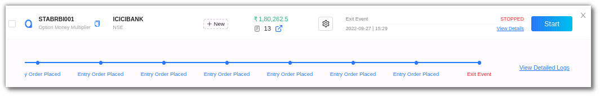](imgs/portfolio6.png)

* **Logs** - The log feature allows you to view the complete details of an order placed. In the **progress** field click on the **view details** option and then click  **detailed logs** on the right side corner. These logs can also be downloaded at any time of the day unless you override it by starting the same strategy again.

[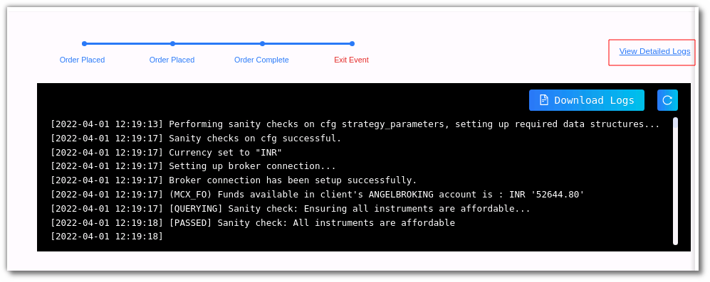](imgs/portfolio6.1.png)

* **Action** - he action field allows you to start or stop a strategy. To execute a strategy, click on **start**. When you click on the **start button** you will be able to choose multiple brokers and run the strategies simultaneously too.

[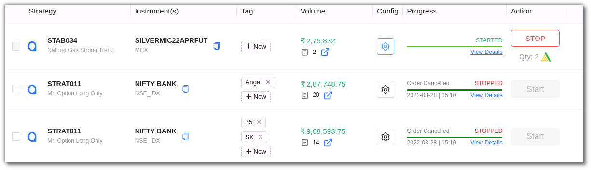](imgs/portfolio7.png)

## 7. Toolbar
---
The Dashboard toolbar includes the refresh, density, settings and full screen tools. 

**Refresh** - If you can't see an entry in the table (perhaps the most recent one), click Refresh to check again.

[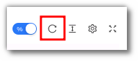](imgs/sc25.png)

**Density** - View data comfortably by choosing the density. The options include Larger, Middle and Compact. 

[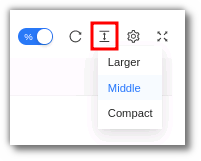](imgs/sc26.png)

**Settings** - Select the columns that you want to view in this settings option.

[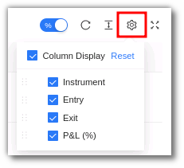](imgs/sc27.png)

**Full Screen** - With this option you will be able to view your current tab on the browser in full Screen. To go back to the normal viewing mode click on it again. This is similar to pressing F11 on most browsers and operating systems.

[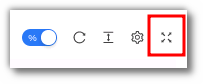](imgs/sc28.png)
