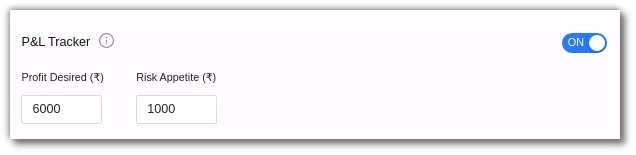
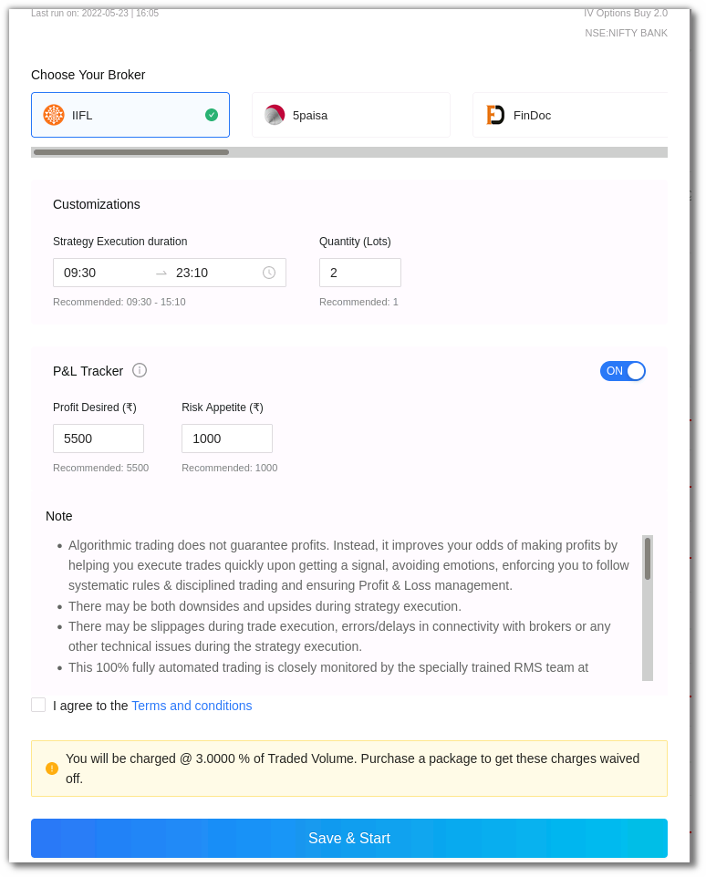

# P&L Tracker

<iframe width="560" height="315" src="https://www.youtube.com/embed/3f6iuMSCOLs" frameborder="0" allow="accelerometer; autoplay; encrypted-media; gyroscope; picture-in-picture" allowfullscreen></iframe>

## 1. Introduction: 

The P&L Tracker feature allows you to gain profit or limit losses at (or near) predefined values for your plan. You can access the P&L Tracker when you start a strategy in the **my portfolio** section in **test or live mode**. 

## 2. How to use the P&L Tracker?

In the **test or live mode**, select a strategy from the chosen marketplace and click on execute. The strategy will be added to your AlgoBulls portfolio. Click **start** in the action bar to start the strategy. 

Turn the P&L toggle button **ON** after adding the **date, duration, and lots** in the customization section, then enter the **desired profit and risk appetite** in the P&L Tracker.

Click on **save & start** after agreeing to the terms and conditions. The strategy will begin. 

!!! note annotate "Note"

    * The P&L **scan frequency** for **live trading and paper trading** is currently refreshed in **30 seconds**. This may change in the future.

[Choose a strategy](https://app.algobulls.com/marketplace) from the marketplace and begin trading now! 

## 3. Fields

**Profit Desired**: Enter the desired profit amount here. This is the maximum profit you would like to make from this strategy, after which you would like the strategy to stop. If the strategy exceeds this amount, all positions will be squared off and the strategy will stop the execution. 

**Risk Appetite**: Enter the risk appetite amount here. This is the most loss that you would like to bear in this strategy, after which you would like the strategy to stop.  If the strategy exceeds this amount, all positions will be squared off and the strategy will stop the execution. 

!!! note annotate "Note"

    * This feature is available for:

    i. Test Mode

    [Virtual Trading](https://help.algobulls.com/member/live-trading.html) (Backtesting & Paper Trading)

    ii. Live Mode

    [Live Trading](https://help.algobulls.com/member/virtual-trading.html) in Live Markets 

    * AlgoBulls Risk Management System will try its best to book your P&L at the given Profit Desired or limit it at the given Risk Appetite.

    * You can either enter both values or leave them blank. It is not allowed to enter one of the values while leaving the other value blank. In other words:

    * This feature can be turned ON by giving both values.

    * This feature can be turned OFF by keeping both values blank.

    * Turn OFF this feature by using the toggle button, if you want to keep both the values blank 

    * **For Live Trading**: These values are not guaranteed as there are various factors into play outside the control of AlgoBulls systems, like market liquidity, momentum, delays introduced due to network, and so on. For P&L tracker to function effectively, please do not run multiple strategies on the same instrument(s).

--------